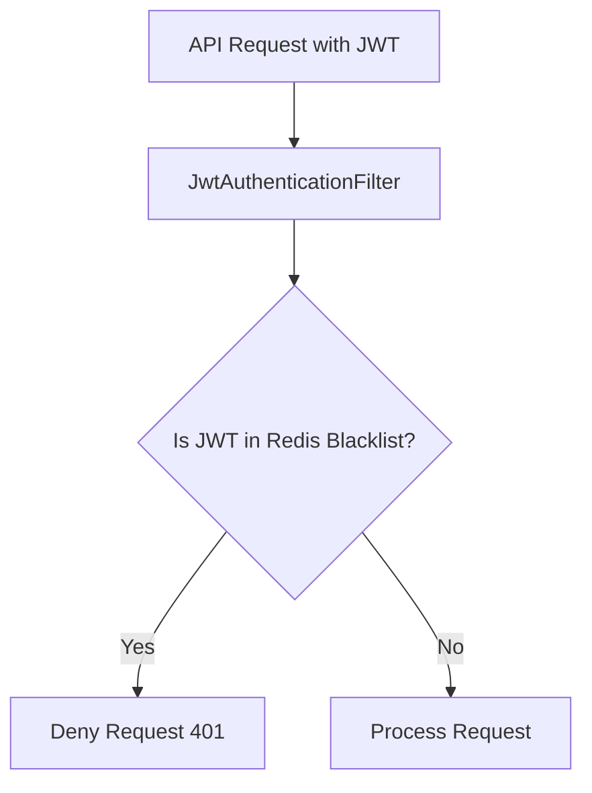

<Caching>
> Redis caching implementation for performance and stateful token management.

---

## Purpose
Redis is used as an in-memory data store to manage temporary, high-speed data that shouldn't burden the primary MySQL database, specifically focusing on authentication state.

---

## Overview
- **Token Blacklisting**: Storing invalidated JWTs.
- **Refresh Tokens**: Managing refresh token rotation and grace periods.
- **Speed**: In-memory access is exponentially faster than disk-based DB queries.

---

## Business Context
If a user logs out, their JWT is technically still valid until it expires. Redis stores the "logout" state efficiently so the system can block that token without hitting the MySQL database on every API request.

---

## Redis Key Patterns
| Pattern | Data Stored | TTL | Purpose |
|---|---|---|---|
| `auth:jwt:blacklist:{jti}` | The token's unique ID | Until token expiry | Blocks logged-out or compromised access tokens |
| `auth:refresh:{userId}` | Set of hashed refresh tokens | 7 days | Tracks valid refresh sessions for a user |
| `auth:refresh:grace:{hash}` | Old token hash | 10 seconds | Grace window for concurrent refresh requests (e.g., multiple tabs) |

---

## System Flow

---

## Backend Implementation
- **Spring Data Redis**: Used with `RedisTemplate` to interact with the Redis server.
- **TTL (Time to Live)**: Every key inserted into Redis has a TTL matching the token's expiration, meaning Redis automatically cleans itself up.

---

## Design Decisions
- **Why Redis for tokens?** The `JwtAuthenticationFilter` runs on *every single request*. If it queried MySQL to check if a token was blacklisted, it would cause a massive DB bottleneck. Redis handles this in microseconds.
- **Why a grace window?** If a frontend has 3 tabs open and they all attempt to refresh the token simultaneously, the first request invalidates the token. The other two would fail immediately. A 10-second grace window in Redis allows simultaneous requests to succeed with the new token.
- **What happens without Redis?** If Redis goes down, the system could either fail open (security risk: logged out tokens work) or fail closed (availability risk: no one can access APIs). Usually configured to fail closed or fallback to DB.

---

## Related Documents
- [../06_Backend/JWT.md](JWT.md)
- [../06_Backend/Performance.md](Performance.md)
