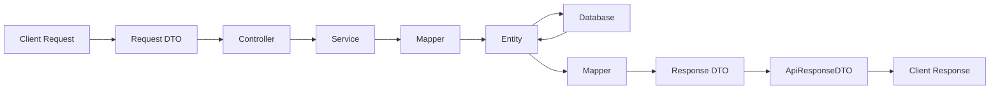

<DTOs>
> Data Transfer Objects: The boundary contracts between the API and the outside world.

---

## Purpose
DTOs (Data Transfer Objects) are used to encapsulate data sent to and from the API, ensuring that database entities are never exposed directly to the client.

---

## Overview
- **Request DTOs**: Carry data from the client to the server. Include validation annotations.
- **Response DTOs**: Carry formatted data from the server to the client.
- **ApiResponseDTO**: A generic envelope wrapping all responses.
- **ModelMapper**: Utility for converting between Entities and DTOs.

---

## Business Context
By separating DTOs from Entities, we can change our database schema (e.g., split a table) without breaking the API contract mobile or web apps depend on. We can also hide sensitive fields (like passwords) from API responses.

---

## DTO Architecture


---

## DTO Map
| DTO Family | Request DTO | Response DTO | Purpose |
|---|---|---|---|
| Auth | `LoginRequestDTO` | `AuthResponseDTO` | Login credentials and token response |
| Policy | `PolicyCreateDTO` | `PolicyDetailDTO` | Buying and viewing policies |
| Claim | `ClaimSubmitDTO` | `ClaimResponseDTO` | Filing and tracking claims |

---

## Backend Implementation
- **ModelMapper**: Configured as a Spring Bean to map fields with matching names between objects.
- **Validation Annotations**: Request DTOs use Jakarta Validation (e.g., `@NotBlank`, `@Email`).
- **ApiResponseDTO**: 
  ```java
  public class ApiResponseDTO<T> {
      private boolean success;
      private String message;
      private T data;
  }
  ```

---

## Design Decisions
- **Why DTOs instead of Entities?** Prevents accidental data exposure (e.g., sending hashed passwords to the frontend). Breaks tight coupling between DB schema and API contract. Prevents infinite recursion in JSON serialization of bidirectional relationships.
- **Why separate request/response DTOs?** A request to create a user needs a password. The response showing the user must NOT have a password, but might include an auto-generated ID.
- **Why ModelMapper?** Reduces manual getter/setter boilerplate when transferring data between identical fields.

---

## Code References
| Component | Path |
|---|---|
| ApiResponseDTO | `com.insurance.demo.dto.ApiResponseDTO` |
| DtoMapperConfig | `com.insurance.demo.config.ModelMapperConfig` |

---

## Related Documents
- [../06_Backend/Validation.md](Validation.md)
