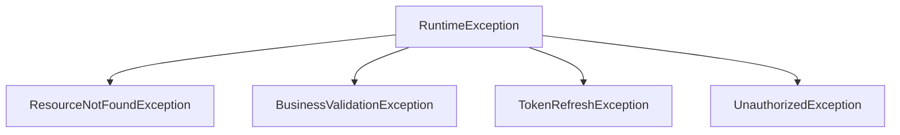

<Exception Handling>
> Centralized and standardized error management.

---

## Purpose
To intercept all exceptions thrown by the application, log them appropriately, and return a consistent, user-friendly JSON response to the client.

---

## Overview
- **GlobalExceptionHandler**: Uses `@RestControllerAdvice`.
- **Standardized Format**: Returns `ErrorResponseDTO`.
- **Custom Exceptions**: Specific exceptions for business logic failures.

---

## Business Context
When an API call fails, the frontend needs to know *why* in a predictable format to display meaningful error messages to the user, rather than showing a generic server error or raw stack trace.

---

## Exception Hierarchy


---

## HTTP Status Mapping
| Exception | HTTP Status | Example Message |
|---|---|---|
| `ResourceNotFoundException` | 404 Not Found | "Policy with ID 123 not found" |
| `MethodArgumentNotValidException` | 400 Bad Request | "Email format is invalid" |
| `BusinessValidationException` | 409 Conflict / 400 | "Cannot claim on expired policy" |
| `TokenRefreshException` | 401 Unauthorized | "Refresh token expired" |
| `Exception` (catch-all) | 500 Internal Server Error | "An unexpected error occurred" |

---

## Backend Implementation
- **@RestControllerAdvice**: AOP-based interception of exceptions thrown by any controller.
- **@ExceptionHandler**: Methods inside the advice class targeting specific exception classes.
- **ErrorResponseDTO**:
  ```java
  public class ErrorResponseDTO {
      private String errorCode;
      private String message;
      private LocalDateTime timestamp;
  }
  ```

---

## Design Decisions
- **Why a global handler?** Prevents repetitive `try-catch` blocks in every controller method.
- **Why standard error format?** Allows frontend interceptors (like Axios) to reliably read `error.response.data.message` for toast notifications.

---

## Interview Notes
1. **How do you handle exceptions globally in Spring Boot?** Using `@ControllerAdvice` or `@RestControllerAdvice` combined with `@ExceptionHandler` methods.
2. **What is the difference between `@ControllerAdvice` and `@RestControllerAdvice`?** `@RestControllerAdvice` automatically applies `@ResponseBody`, meaning the returned object is serialized to JSON.
3. **How do you handle validation errors?** By catching `MethodArgumentNotValidException`, extracting the field errors from the `BindingResult`, and returning a 400 status.
4. **Why not return stack traces to the client?** It exposes internal application structure and potential vulnerabilities to attackers.

---

## Related Documents
- [../06_Backend/Validation.md](Validation.md)
