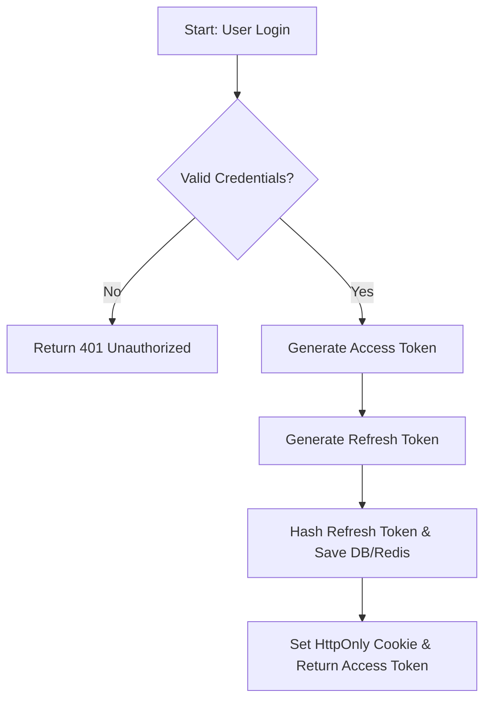
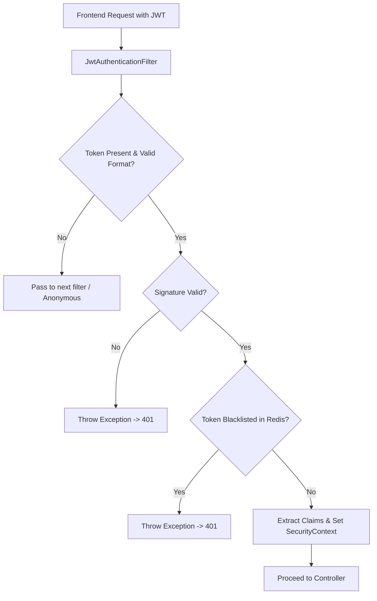
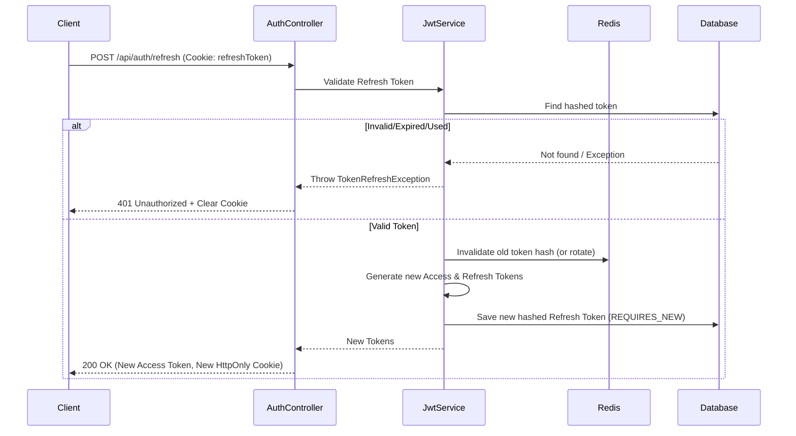

> The core mechanism for stateless authentication and authorization in InsuranceFlow.

---

## Purpose
JWT (JSON Web Token) is used to securely transmit the user's identity and roles between the frontend and backend without requiring server-side session state for every API request. This document explains how tokens are generated, validated, and managed.

---

## Overview
- **Access Token**: Short-lived (15 mins default, 60s in dev), stateless, sent in `Authorization: Bearer <token>`.
- **Refresh Token**: Long-lived (7 days), stored securely in an HttpOnly cookie, rotated on every use, and hashed in the database/Redis.
- **Stateless Auth**: The backend does not store active access tokens; it verifies their signature cryptographically.
- **Blacklisting**: Invalidated or logged-out access tokens are stored in Redis until their expiration to prevent reuse.

---

## Business Context
In a modern web application, users need to remain logged in seamlessly without the server storing massive amounts of session data in memory. JWT allows InsuranceFlow to scale easily while maintaining high security. When a user logs in, they receive an access token for immediate API calls and a secure refresh token to silently obtain new access tokens when the old one expires.

---

## Feature Flow

---

## System Flow

---

## Sequence Diagram

---

## Database Design
| Table | Column | Type | Description |
|---|---|---|---|
| refresh_tokens | id | BIGINT | Primary key |
| refresh_tokens | token_hash | VARCHAR | SHA-256 hash of the token |
| refresh_tokens | user_id | BIGINT | Foreign key to users table |
| refresh_tokens | expiry_date | TIMESTAMP | When token expires |

*Why this design?* Hashing refresh tokens prevents a database breach from exposing raw, usable tokens. 

---

## API Documentation (if applicable)
### Refresh Token Endpoint
- **Method**: POST
- **URL**: `/api/auth/refresh`
- **Auth**: None (Requires HttpOnly cookie)
- **Request body**: None
- **Response**: `{"accessToken": "eyJ..."}`
- **Errors**: `401 Unauthorized` (INVALID_REFRESH_TOKEN)

---

## Backend Implementation
- **JwtAuthenticationFilter**: Intercepts requests, extracts token, verifies signature, sets `SecurityContext`.
- **JwtService**: Handles generating tokens, extracting claims, validating expiration.
- **RefreshTokenService**: Manages the lifecycle of refresh tokens (creation, validation, deletion).

---

## Validation Rules
| Input | Rule | Why | Error Message |
|---|---|---|---|
| Access Token | Signature must match | Prevent tampering | TOKEN_INVALID |
| Access Token | Expiration date > now | Prevent using old tokens | TOKEN_EXPIRED |
| Access Token | JTI not in Redis blacklist | Prevent using logged out tokens | TOKEN_BLACKLISTED |

---

## Error Handling
- **TOKEN_INVALID**: Malformed or tampered token.
- **TOKEN_EXPIRED**: Access token lifetime ended.
- **INVALID_REFRESH_TOKEN**: Refresh token used, expired, or tampered.
- **Frontend Behavior**: On 401 due to access token expiry, Axios interceptor calls `/api/auth/refresh`. If that fails, redirects to `/login`.

---

## Design Decisions
- **Why HS256?** Symmetric encryption is faster and sufficient since our authorization server and resource server are the same application.
- **Why tokenVersion claim?** Allows invalidating all active tokens for a user (e.g., password reset) by incrementing their version in the DB.
- **Why HttpOnly cookie for refresh?** Protects against XSS attacks. JavaScript cannot read the token.
- **Why hash at rest?** If the database is compromised, attackers cannot use the refresh tokens.
- **Why REQUIRES_NEW transaction for rotation?** Ensures the old token is marked as consumed immediately, even if the parent request fails, preventing replay attacks.
- **Cleanup Scheduler**: A daily cron job (`02:00 AM`) deletes expired refresh tokens from the DB to prevent bloat.

---

## Security (if applicable)
JWT is central to our stateless authentication model. Redis is used to store logged-out tokens to overcome the limitation that standard JWTs cannot be invalidated before they expire.

---

## Code References
| Component | Path |
|---|---|
| JwtService | `com.insurance.demo.security.JwtService` |
| JwtAuthenticationFilter | `com.insurance.demo.security.JwtAuthenticationFilter` |

---

## Interview Notes
1. **What is JWT?** A stateless, self-contained token standard containing header, payload, and signature.
2. **Why use JWT instead of sessions?** Scales better horizontally since no server-side state is required for access validation.
3. **How do you handle JWT logout?** We add the token's unique ID (JTI) to a Redis blacklist until its expiration time.
4. **Why is the refresh token in an HttpOnly cookie?** To prevent JavaScript access, mitigating XSS attacks.
5. **How does token rotation work?** When a refresh token is used, it is invalidated and a new one is issued. If an old one is reused, we can detect a potential theft.
6. **Why hash refresh tokens in the database?** To prevent attackers from using them if they gain database access.
7. **What is the `tokenVersion` claim?** It's a number stored in the user record and token payload. If they differ, the token is invalid (useful for global logouts).
8. **Why `REQUIRES_NEW` for token consumption?** It forces the token update to commit immediately, reducing race conditions during concurrent refresh requests.

---

## Related Documents
- [../06_Backend/Security.md](Security.md)
- [../06_Backend/Caching.md](Caching.md)
