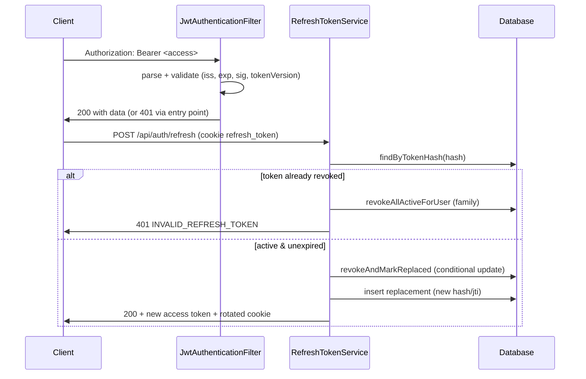

# JWT & Token Management

## Purpose

This document is the single source of truth for access-token and refresh-token mechanics: the `JwtService` claims and validation, the `JwtAuthenticationFilter` flow, refresh-token storage and rotation, reuse detection with family revocation, cookie handling, and the cleanup scheduler. Endpoint contracts that use these tokens are in the Authentication API document.

## Overview

The application uses a two-token model. The access token is a short-lived HS256-signed JWT sent as `Authorization: Bearer <token>` on every API call. The refresh token is an opaque 256-bit random value stored in the database as a SHA-256 hash and delivered only as an HTTP-only cookie scoped to `/api/auth`. Refresh is rotation-based: every refresh call invalidates the presented token and issues a new one, and presenting a rotated token is treated as a replay that revokes the user's entire session family.

## Business Context

The access token carries a `tokenVersion` claim so that password resets, deactivation, and admin status changes can invalidate all outstanding tokens without a server-side blacklist: the filter reloads the user on each request and compares the claim against the user's current version. The refresh token is a database-backed opaque value rather than a JWT so that rotation, revocation, and reuse detection can be atomic database operations, and the raw value never appears in logs or JSON bodies (only its SHA-256 hash is stored).

## Technical Design

### Access token (`JwtService`)

- Algorithm: HS256 (`Keys.hmacShaKeyFor`); the signing key is the `app.security.jwt.secret` value, which must be at least 32 characters.
- Claims: `sub` (email), `iss` (`insurance-policy-claim-management-system`), `iat`, `exp` (default 15 minutes; overridden to 60 seconds by `app.security.jwt.expiration-ms=60000` in `application.properties`), `jti` (UUID), `role` (informational only, first authority), `tokenVersion`.
- Validation in `parseClaims` is a single pass: signature, issuer (`requireIssuer`), and expiry, with `clockSkewSeconds` (default 30) tolerance.
- `isTokenValid` additionally checks that the subject matches the loaded user and that the claim `tokenVersion` equals the user's current `tokenVersion`.
- The `role` claim is informational; authorization decisions always come from authorities loaded from the database (`AppUserDetails`).

### Access-token filter (`JwtAuthenticationFilter`)

1. Skips `/api/auth/`, `/api/public/`, `/swagger-ui`, `/v3/api-docs` via `shouldNotFilter`.
2. Reads `Authorization`; if absent or not `Bearer `, passes through.
3. Parses claims, loads the user via `CustomUserDetailsService`, and if `isTokenValid` sets a `UsernamePasswordAuthenticationToken` (authorities = user authorities) in the `SecurityContext`.
4. On `ExpiredJwtException`, `JwtException`, or any other failure it logs `TOKEN_INVALID` via `SecurityAuditLogger` and continues unauthenticated so the security chain can produce the proper 401.

### Refresh token (`RefreshTokenService`)

- Generation: 32 random bytes, Base64-url encoded without padding; only the SHA-256 hex hash and a `jti` are persisted.
- Storage: `refresh_tokens` row with `user`, `tokenHash`, `jti`, `expiresAt` (default 7 days), `revoked`, `tokenVersion`, `replacedBy`.
- Rotation (`rotate`): loads the token by hash. If the token is already revoked it is a replay: the entire session family is revoked in a `REQUIRES_NEW` transaction and `REFRESH_REUSE_DETECTED` is logged. Expired tokens, deactivated users, and `tokenVersion` mismatch also revoke the family and reject.
- Atomic claim: `claimAndIssue` runs in its own `REQUIRES_NEW` transaction and executes `revokeAndMarkReplaced` — a conditional `UPDATE ... WHERE revoked = false AND expiresAt > now`. At most one concurrent request wins; losers observe zero rows and are handled as replays. A losing request revokes the family in a separate `REQUIRES_NEW` transaction to avoid the row-lock self-deadlock that occurred when family revocation ran in the same transaction as the claim.
- Logout (`revoke`): flips `revoked = true` on the presented token and logs `LOGOUT`.
- `revokeAllForUser`: marks all active tokens for a user revoked (`revokeAllActiveForUser`), used by admin deactivation.
- Token concurrency is additionally serialized by the pessimistic write lock in `AppUserRepository` used by the auth flow.

### Refresh cookie (`RefreshTokenCookieManager`)

- Cookie name `refresh_token`, `HttpOnly`, `Path=/api/auth` (only sent to refresh/logout endpoints), `SameSite=Lax`, `Max-Age` = refresh TTL in seconds, `Secure` per `app.security.jwt.refresh-cookie-secure` (default false).
- The raw refresh token is set on the cookie by the controller from the `@JsonIgnore` field of `LoginResponseDTO`/`RefreshResponseDTO`; it is never serialized to JSON.
- `clearCookie` removes it on logout.

### Cleanup scheduler (`RefreshTokenCleanupScheduler`)

- Runs daily at 02:00 (`@Scheduled(cron = "0 0 2 * * *")`, enabled by `@EnableScheduling` on `DemoApplication`).
- Calls `purgeStale(now, retention)`: deletes expired tokens immediately and revoked tokens older than a 30-day retention window; logs `REFRESH_TOKEN_PURGED` when rows are deleted.

### Lifecycle sequence

## Workflow

1. Login validates credentials, increments nothing, and returns `LoginResponseDTO` (access token in body, refresh token only as a cookie).
2. Every API call authenticates via `JwtAuthenticationFilter`.
3. On access-token expiry the client calls refresh; the service rotates the refresh token, sets the new cookie, and returns a fresh access token.
4. Any replay of a rotated token revokes the user's whole session family; the user must log in again.
5. Password reset or admin deactivation increments `tokenVersion`, invalidating all outstanding access tokens on next use.

## Code References

- `insurance-policy-claim-management-system/src/main/java/com/insurance/demo/security/JwtService.java`
- `insurance-policy-claim-management-system/src/main/java/com/insurance/demo/security/JwtAuthenticationFilter.java`
- `insurance-policy-claim-management-system/src/main/java/com/insurance/demo/security/RefreshTokenService.java`
- `insurance-policy-claim-management-system/src/main/java/com/insurance/demo/security/CustomUserDetailsService.java`
- `insurance-policy-claim-management-system/src/main/java/com/insurance/demo/security/AppUserDetails.java`
- `insurance-policy-claim-management-system/src/main/java/com/insurance/demo/config/RefreshTokenCookieManager.java`
- `insurance-policy-claim-management-system/src/main/java/com/insurance/demo/config/RefreshTokenCleanupScheduler.java`
- `insurance-policy-claim-management-system/src/main/java/com/insurance/demo/repository/RefreshTokenRepository.java`
- `insurance-policy-claim-management-system/src/main/java/com/insurance/demo/repository/AppUserRepository.java`
- `insurance-policy-claim-management-system/src/main/java/com/insurance/demo/dto/response/LoginResponseDTO.java`
- `insurance-policy-claim-management-system/src/main/java/com/insurance/demo/dto/response/RefreshResponseDTO.java`
- `insurance-policy-claim-management-system/src/test/java/com/insurance/demo/RefreshTokenIntegrationTest.java`
- `insurance-policy-claim-management-system/src/test/java/com/insurance/demo/JwtSecurityIntegrationTest.java`

Related: [Security](Security.md), [Authentication API](../03_API/Authentication_API.md)
