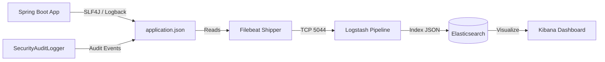

> Observability, structured logging pipeline, and ELK Stack (Elasticsearch, Logstash, Kibana) integration.

---

## Purpose
To track application behavior, maintain an immutable security audit trail, and aggregate structured JSON logs for centralized monitoring and debugging in production environments.

---

## Overview
- **Structured JSON Logging**: Replaces unstructured plain text with machine-readable JSON using `logstash-logback-encoder`.
- **Security Audit Logger**: Dedicated event logger tracking sensitive operations (`LOGIN_SUCCESS`, `LOGIN_FAILED`, `LOGOUT`, `CLAIM_APPROVED`, `POLICY_ISSUED`).
- **ELK & Filebeat Pipeline**: Automated log shipping to Elasticsearch for real-time visualization and filtering in Kibana.

---

## Architecture Flow



---

## Technical Implementation

### 1. Logback Configuration (`logback-spring.xml`)
The Spring Boot backend outputs logs as structured JSON containing timestamp, thread name, log level, logger name, message, stack traces, and custom MDC fields:

```xml
<configuration>
    <appender name="JSON_FILE" class="ch.qos.logback.core.rolling.RollingFileAppender">
        <file>logs/application.json</file>
        <rollingPolicy class="ch.qos.logback.core.rolling.TimeBasedRollingPolicy">
            <fileNamePattern>logs/application-%d{yyyy-MM-dd}.json</fileNamePattern>
            <maxHistory>30</maxHistory>
        </rollingPolicy>
        <encoder class="net.logstash.logback.encoder.LogstashEncoder">
            <includeMdcKeyName>userId</includeMdcKeyName>
            <includeMdcKeyName>traceId</includeMdcKeyName>
        </encoder>
    </appender>
    <root level="INFO">
        <appender-ref ref="JSON_FILE" />
    </root>
</configuration>
```

---

## Security Audit Logging

The `SecurityAuditLogger` component records critical authentication and financial compliance events with dedicated tags:

```java
@Component
@Slf4j
public class SecurityAuditLogger {
    public static final String LOGIN_SUCCESS = "SECURITY_AUDIT: LOGIN_SUCCESS";
    public static final String LOGIN_FAILED = "SECURITY_AUDIT: LOGIN_FAILED";
    public static final String LOGOUT = "SECURITY_AUDIT: LOGOUT";
    public static final String CLAIM_DECISION = "SECURITY_AUDIT: CLAIM_DECISION";

    public void logEvent(String eventType, String details) {
        log.info("[AUDIT] {} | {}", eventType, details);
    }
}
```

### Audited Events Table
| Event Key | Trigger Condition | Logged Attributes |
|:---|:---|:---|
| `LOGIN_SUCCESS` | User credentials valid, JWT generated | `userId`, `role`, `timestamp` |
| `LOGIN_FAILED` | Bad password or user not found | `email`, `reason`, `IP` |
| `LOGOUT` | User logs out or invalidates all sessions | `userId`, `tokenHash` |
| `CLAIM_DECISION` | Admin approves or rejects a claim | `claimId`, `adminId`, `decision`, `amount` |
| `POLICY_PURCHASED` | Policy created in PENDING_PAYMENT | `policyId`, `customerId`, `planId` |

---

## ELK Stack Components & Roles

| Component | Port | Role in Architecture |
|:---|:---:|:---|
| **Spring Boot / Logback** | `8081` | Generates JSON logs with timestamps, levels, and audit tags. |
| **Filebeat** | Internal | Lightweight log harvester watching `logs/*.json` and forwarding to Logstash. |
| **Logstash** | `5044` | Ingestion engine that parses, filters, and enriches log events before sending to Elasticsearch. |
| **Elasticsearch** | `9200` | Distributed NoSQL search and analytics engine storing and indexing JSON log documents. |
| **Kibana** | `5601` | Web dashboard for querying logs, filtering errors, and visualizing security event spikes. |

---

## Design Decisions

1. **Why structured JSON instead of plain-text strings?**  
   Plain-text logs require complex regular expressions to parse. JSON logs are natively indexed by Elasticsearch, allowing instant filtering by fields (e.g., `level: ERROR AND userId: 42`).
2. **Why separate Filebeat and Logstash?**  
   Filebeat is extremely lightweight (Go binary) and runs on the app host with low memory consumption. Logstash performs heavy transformations and runs on a dedicated service.
3. **Why rolling file policy?**  
   Rotates log files daily and retains 30 days of history, preventing disk full crashes.

---

## Interview Notes
1. **Q: What is the benefit of using ELK over checking console logs?**  
   **A:** In microservices or production environments with multiple instances, checking console logs on individual servers is impossible. ELK centralizes logs from all instances into a searchable Kibana dashboard.
2. **Q: How does `SecurityAuditLogger` help with compliance?**  
   **A:** It creates an undisputed, time-stamped audit trail for critical security events (logins, logouts, claim payouts) ensuring accountability and non-repudiation.
3. **Q: What is Mapped Diagnostic Context (MDC)?**  
   **A:** A thread-local map provided by SLF4J that attaches contextual metadata (like `userId` or `traceId`) to every log entry emitted during a request.

---

## Related Documents
- `../06_Backend/Security.md`
- `../06_Backend/Exception_Handling.md`
- `../11_Knowledge_Base/ELK_Stack_and_Kibana.md`
