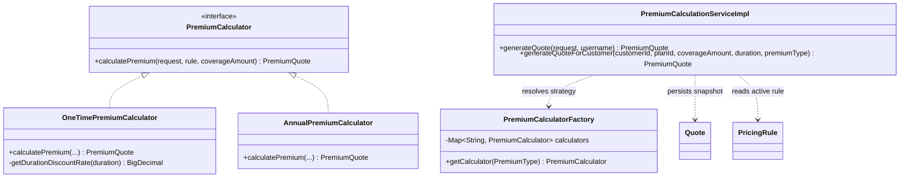

# Premium Calculation Service

## Purpose

This document is the single source of truth for the premium calculation engine: the strategy-pattern design, the exact formulas for one-time and annual premiums, the quote orchestration flow, and quote persistence. The domain meaning of the inputs (base risk rate, GST, coverage) is defined in the Premium Calculation business document; this document describes how the engine implements it.

## Overview

Premium calculation is isolated in `com.insurance.demo.service.strategy`. `PremiumCalculator` is the strategy interface; `OneTimePremiumCalculator` and `AnnualPremiumCalculator` implement the two premium-type formulas and are registered as Spring beans named `ONE_TIME_CALCULATOR` and `ANNUAL_CALCULATOR`. `PremiumCalculatorFactory` resolves the right strategy by `premiumType.name() + "_CALCULATOR"`. `PremiumCalculationServiceImpl` validates the request, loads the active pricing rule, delegates to the calculator, and persists a `Quote` with a 30-minute expiry before returning a `PremiumQuote`.

## Business Context

Pricing rules are versioned per plan (`PricingRule`, status `ACTIVE`/`INACTIVE`), and quotes must snapshot the exact rule and plan version used so that a later purchase is immune to rule changes. The one-time vs annual distinction is a real actuarial difference: a one-time premium pays the full commitment up front and earns a duration-based discount, whereas an annual premium is the per-year cost with no lump-sum discount. The factory pattern keeps these two formulas decoupled from the orchestration logic so adding a new premium type requires only a new strategy bean.

## Technical Design

### Strategy selection

- `PremiumCalculator` interface: `calculatePremium(PremiumCalculationRequest request, PricingRule rule, BigDecimal coverageAmount)` returns a `PremiumQuote`.
- `PremiumCalculatorFactory` holds a `Map<String, PremiumCalculator>` of all Spring-managed calculators and resolves by bean name; unknown types raise `IllegalStateException`.
- Bean names: `ONE_TIME_CALCULATOR`, `ANNUAL_CALCULATOR`.

### Shared formula (both strategies)

All monetary values are rounded half-up to whole rupees.

1. Base premium: `coverageAmount x baseRiskRate` (from the active `PricingRule`).
2. Processing fee: `rule.processingFee` (fixed, rounded).
3. Taxable amount (per year): `basePremium + processingFee`.
4. GST (per year): `taxableAmount x gst / 100`.
5. Annual premium: `taxableAmount + gst`.
6. Total commitment over the full duration: `annualPremium x duration`.

### One-time formula (`OneTimePremiumCalculator`)

- Computes the duration-based discount on the total commitment, then:
  `totalPremium = totalCommitment - discountAmount`.
- `discountAmount = totalCommitment x discountRate`.
- Discount rate by duration: 1 -> 0%, 2 -> 2%, 3 -> 5%, 5 -> 8%, 7 -> 10%, 10 -> 12%, 15 -> 15%, 20 -> 18%, otherwise 20%.
- The quote exposes `discountPercentage` and `oneTimeDiscount` (both equal the computed discount) for the UI.

### Annual formula (`AnnualPremiumCalculator`)

- No lump-sum discount: `discountPercentage`, `discountAmount`, and `oneTimeDiscount` are all zero.
- `totalPremium = annualPremium` (the per-year cost the customer pays each year), while `totalCommitment` still reflects the full-duration total for reference.

### Orchestration (`PremiumCalculationServiceImpl`)

`generateQuoteInternal` performs, in order:

1. Load the customer: by authenticated username for `generateQuote` (customer flow) or by `customerId` for `generateQuoteForCustomer` (admin flow).
2. Load the plan; reject if not found, inactive, or its product is inactive.
3. Validate the requested `duration` is in `plan.allowedDurations` and `premiumType` equals `plan.supportedPremiumType`.
4. Resolve the coverage: the request `coverageAmount` must exactly match an active `CoverageOption` of the plan.
5. Load the latest active pricing rule (`findByPolicyPlanIdAndStatusOrderByIdDesc`, first element); reject if none.
6. Select the calculator from the factory and compute the `PremiumQuote`.
7. Persist a `Quote` snapshot: customer, plan, plan version, pricing rule id, coverage, duration, premium type, risk rate, processing fee, GST, premium (annual premium), total (total premium), status `CREATED`, expiry 30 minutes from now.
8. Return the `PremiumQuote` populated with `quoteId`, `expiresAt`, and `status`.

Quote purchase transitions the quote to `USED` (one-time use) and is part of the policy purchase transaction, handled by the policy flow.

## Workflow

1. The customer calls the calculate endpoint (or admin calls quote generation); the controller validates the request DTO.
2. `PremiumCalculationServiceImpl` validates plan/product/coverage/duration/premium-type and loads the latest active pricing rule.
3. The factory selects the calculator; the formula produces the `PremiumQuote` breakdown.
4. A `Quote` row (status `CREATED`, 30-minute expiry) is persisted for later purchase.
5. Purchase consumes the quote; the policy flow marks it `USED`.

## Code References

- `insurance-policy-claim-management-system/src/main/java/com/insurance/demo/service/strategy/PremiumCalculator.java`
- `insurance-policy-claim-management-system/src/main/java/com/insurance/demo/service/strategy/OneTimePremiumCalculator.java`
- `insurance-policy-claim-management-system/src/main/java/com/insurance/demo/service/strategy/AnnualPremiumCalculator.java`
- `insurance-policy-claim-management-system/src/main/java/com/insurance/demo/service/strategy/PremiumCalculatorFactory.java`
- `insurance-policy-claim-management-system/src/main/java/com/insurance/demo/serviceimpl/PremiumCalculationServiceImpl.java`
- `insurance-policy-claim-management-system/src/main/java/com/insurance/demo/dto/PremiumCalculationRequest.java`
- `insurance-policy-claim-management-system/src/main/java/com/insurance/demo/dto/AdminPremiumCalculationRequest.java`
- `insurance-policy-claim-management-system/src/main/java/com/insurance/demo/dto/PremiumQuote.java`
- `insurance-policy-claim-management-system/src/main/java/com/insurance/demo/dto/QuotePurchaseRequest.java`
- `insurance-policy-claim-management-system/src/main/java/com/insurance/demo/model/Quote.java`
- `insurance-policy-claim-management-system/src/main/java/com/insurance/demo/repository/PricingRuleRepository.java`

Related: [Premium Calculation](../02_Business_Domain/Premium_Calculation.md), [Services](Services.md), [Validation](Validation.md)
