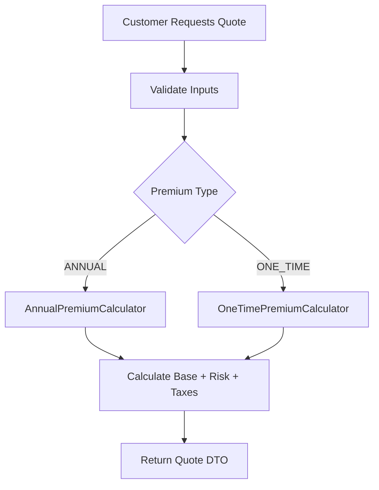
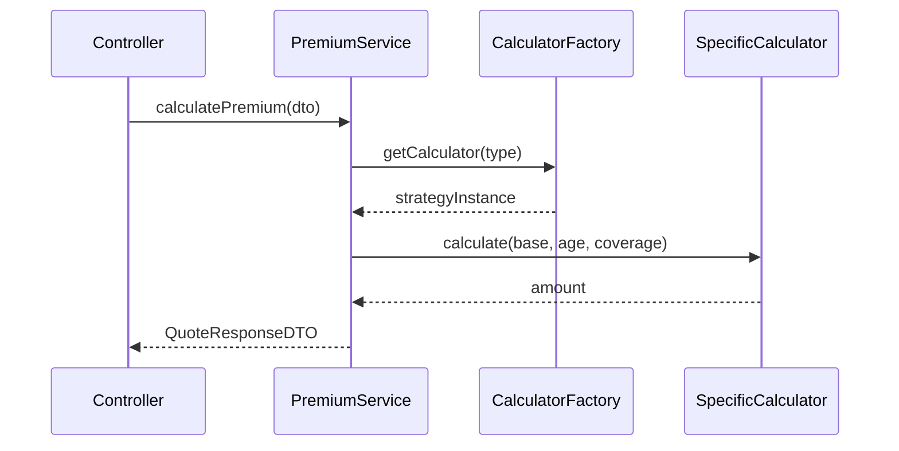

> Strategy pattern implementation for dynamic and accurate insurance premium calculation.

---

## Purpose
To accurately calculate insurance premiums based on product type, user age, coverage amount, and selected premium type (One-Time vs Annual). This ensures the business charges the correct amount before issuing a policy.

---

## Overview
- **Strategy Pattern**: Different calculators for different premium types.
- **Preview vs Final**: Previews are fast estimates for the UI; final calculations are authoritative before payment.
- **Validation**: Strict checks on age limits and coverage bounds.

---

## Business Context
Customers need to see how much an insurance policy will cost before committing. The calculation rules vary significantly between Health, Motor, Life, and Travel insurance, and depend on whether they pay upfront (One-Time) or yearly (Annual).

---

## Feature Flow

---

## Sequence Diagram

---

## Backend Implementation
- **PremiumCalculator (Interface)**: Defines `calculate(...)`.
- **AnnualPremiumCalculator / OneTimePremiumCalculator**: Implementations.
- **PremiumCalculatorFactory**: Returns the correct implementation based on the `PremiumType` enum.
- **generateQuoteInternal()**: The core method that orchestrates validation, fetching product details, determining the strategy, and creating the Quote entity.

---

## Business Rules
| Rule | Why it exists |
|---|---|
| Age Limits | Specific products (e.g., Life) have min/max age limits for risk mitigation. |
| Coverage Bounds | Products have a `minCoverage` and `maxCoverage` to limit company liability. |
| One-Time Discount | One-time payments may include a slight discount compared to annual over time, depending on configuration. |
| Payment Exact Match | User payment must EXACTLY match `calculatedPremium`. No partial payments. |

---

## Design Decisions
- **Why Service Interface + Impl?** Allows easy mocking in tests and swapping out the core service implementation if business logic undergoes a massive overhaul.
- **Why Strategy Injection?** Prevents massive `switch` or `if-else` blocks when adding new premium calculation rules. We can just add a new class implementing `PremiumCalculator`.
- **Preview vs Authoritative**: `calculatePreview` does not save to the DB; it just returns a number. `generateQuote` saves a Quote entity with a 30-min expiry, ensuring the price is locked and verifiable during the payment phase.

---

## Interview Notes
1. **What design pattern is used here?** The Strategy Pattern.
2. **Why use the Strategy Pattern?** It encapsulates the specific calculation algorithms and makes the system open for extension but closed for modification (OCP).
3. **How does Spring handle strategy injection?** We inject a `List<PremiumCalculator>` or a `Map<String, PremiumCalculator>` into the factory, and Spring automatically wires all beans implementing the interface.
4. **What is the difference between a quote preview and a real quote?** Preview is transient and stateless. A real quote is persisted, has a status (CREATED), and an expiration time.
5. **How do you ensure exact payment?** The payment service fetches the locked Quote entity by ID and strictly compares the payment amount with the Quote's `calculatedPremium`.

---

## Related Documents
- [../06_Backend/Services.md](Services.md)
