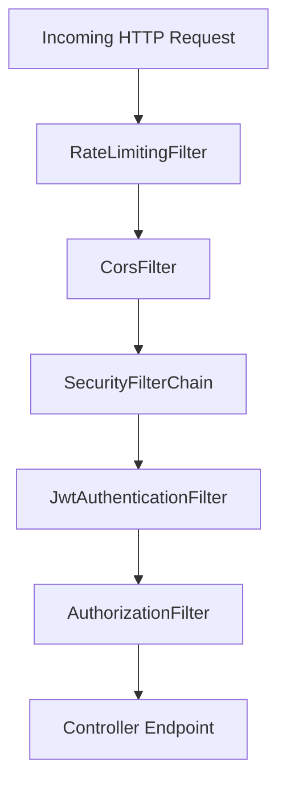

> Comprehensive security configuration and defense-in-depth mechanisms for InsuranceFlow.

---

## Purpose
This document explains the security architecture of the Spring Boot backend, covering authentication, authorization, protection against common web vulnerabilities, and request filtering.

---

## Overview
- **Filter Chain**: Custom security filters applied to every request.
- **RBAC**: Role-Based Access Control enforcing `ROLE_ADMIN`, `ROLE_INTERNAL_STAFF`, and `ROLE_CUSTOMER`.
- **Passwords**: Hashed using BCrypt.
- **Protection**: CORS configured, CSRF disabled for stateless API, rate limiting enabled.

---

## Business Context
Insurance data is highly sensitive. The application must ensure that customers only see their own policies, staff can manage claims, and admins can configure the system, while protecting against brute-force, XSS, and CSRF attacks.

---

## System Flow

---

## Security Rules Table
| Endpoint Pattern | HTTP Method | Required Role |
|---|---|---|
| `/api/auth/**` | POST | Permit All |
| `/api/admin/**` | ALL | `ROLE_ADMIN` |
| `/api/staff/**` | ALL | `ROLE_INTERNAL_STAFF`, `ROLE_ADMIN` |
| `/api/customer/**` | ALL | `ROLE_CUSTOMER` |
| `/api/public/**` | GET | Permit All |

---

## Backend Implementation
- **SecurityConfig**: Defines the filter chain, CORS settings, and route authorizations.
- **BCrypt**: Uses a work factor of 10. Hashing makes passwords irreversible; the work factor slows down brute-force attacks.
- **Bucket4j**: Rate limiting implemented per IP + Email combination.
- **DataInitializer**: Seeds the initial admin account (`admin@insurance.com` / `Admin@123`) if no admin exists on startup.

---

## Design Decisions
- **Why disable CSRF for APIs?** Because we use stateless Bearer tokens for authentication, which are not subject to CSRF. However, if any endpoint relies solely on cookies, we use `CookieCsrfOriginFilter`.
- **Why Bucket4j?** Provides efficient token-bucket algorithm rate limiting without heavy external dependencies, although Redis can be used for distributed rate limiting.
- **Why CORS restrictions?** Only allows the frontend dev server (`http://localhost:5173`) and specific production domains to interact with the API, with `credentials=true` for the HttpOnly refresh cookie.
- **Security Headers**: HSTS, CSP, and X-Frame-Options are configured to prevent framing (clickjacking) and enforce secure connections.

---

## Code References
| Component | Path |
|---|---|
| SecurityConfig | `com.insurance.demo.config.SecurityConfig` |

---

## Interview Notes
1. **How is security configured in Spring Boot 3+?** By defining a `SecurityFilterChain` bean instead of extending `WebSecurityConfigurerAdapter`.
2. **What is BCrypt and why use it?** A password hashing function that includes a salt and a configurable work factor to resist dictionary and brute-force attacks.
3. **How do you prevent brute force on login?** We use Bucket4j to rate limit login attempts based on IP and email, and lock the account after 5 failed attempts.
4. **Why is CSRF disabled?** Our primary auth is via Authorization header (stateless), not session cookies, making standard CSRF attacks ineffective.
5. **How does CORS work in this app?** We globally configure allowed origins, methods, and headers, and explicitly allow credentials so the frontend can send the HttpOnly refresh cookie.
6. **What does the DataInitializer do?** It runs on startup and creates a default admin user if the database has no admin users, ensuring system accessibility.

---

## Related Documents
- [../06_Backend/JWT.md](JWT.md)
