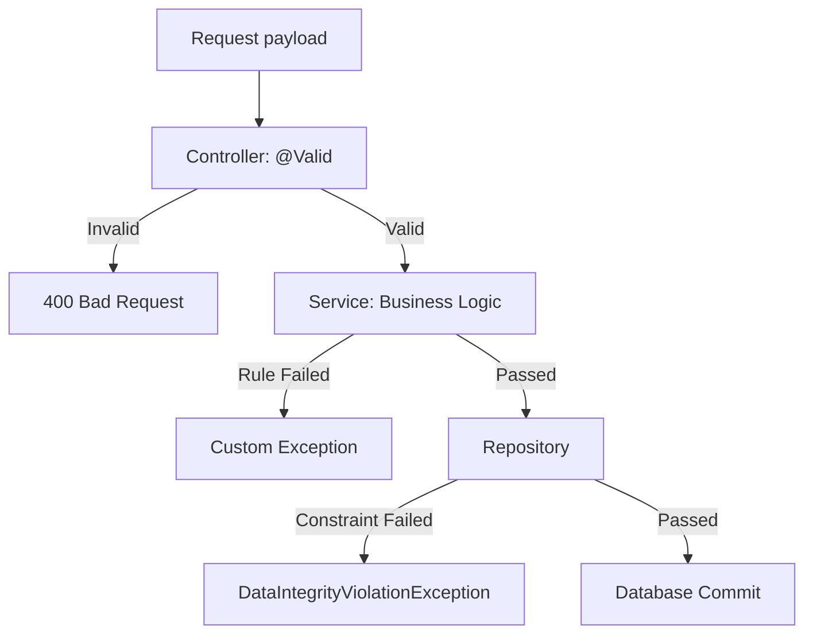

> Multi-layered validation ensuring data integrity and business rule compliance.

---

## Purpose
To ensure that all incoming data is structurally correct and logically valid before processing or storing it in the database.

---

## Overview
- **Controller Layer**: Structural validation via Jakarta Bean Validation (`@Valid`).
- **Service Layer**: Logical/Business validation (e.g., check if a policy is active).
- **Database Layer**: Constraints (e.g., unique keys, non-null columns).

---

## Business Context
Invalid data causes system crashes and financial discrepancies. For example, a user should not be able to submit a claim for an expired policy, and a password must meet complexity requirements.

---

## Validation Layers

---

## Validation Rules
| Field / Action | Rule | Why | Error Message / Exception |
|---|---|---|---|
| Email | `@Email`, `@NotBlank` | Must be contactable | "Invalid email format" |
| Password | `@Size(min=8)` | Basic security | "Password must be at least 8 chars" |
| Submit Claim | Policy must be ACTIVE | Cannot claim on expired policies | `InvalidPolicyStateException` |
| Calculate Premium | Age within product limits | Risk parameters | `BusinessValidationException` |

---

## Backend Implementation
- **Jakarta Annotations**: Used in Request DTOs (`@NotNull`, `@Min`, `@Max`, `@Pattern`).
- **@Valid**: Placed in Controller method parameters. Triggers `MethodArgumentNotValidException` if validation fails.
- **Programmatic Checks**: In services, using `if` statements throwing custom runtime exceptions.

---

## Design Decisions
- **Why two layers of validation?** Controller validation handles *format* (is this a valid email string?). Service validation handles *state and context* (is this email already registered in the DB?). Mixing them causes bloated controllers.

---

## Code References
| Component | Path |
|---|---|
| GlobalExceptionHandler | `com.insurance.demo.exception.GlobalExceptionHandler` |

---

## Related Documents
- [../06_Backend/Exception_Handling.md](Exception_Handling.md)
