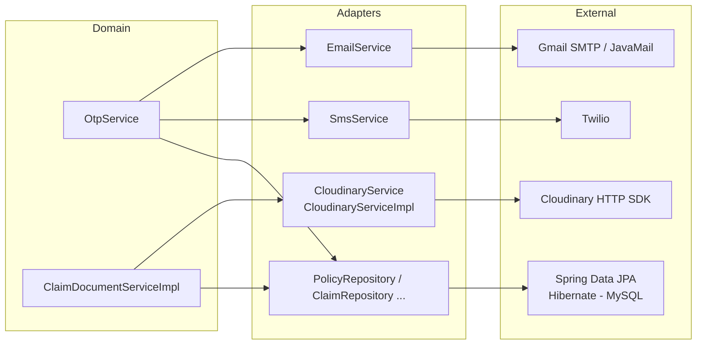

# Adapter Pattern

> The Adapter pattern in this project: `CloudinaryService`, `EmailService`, `SmsService`, and the Spring Data repositories shield the domain from external systems.

## Purpose

This document is the single source of truth for how the application isolates its business logic from external systems. It maps each external system (Cloudinary HTTP SDK, JavaMail/SMTP, Twilio, Spring Data JPA) to the adapter class that wraps it, the interface the adapter exposes, and how the rest of the application depends only on that adapter. Service-layer details are in the services document; the claim document-upload flow is in the claim workflow document.

## Overview

The Adapter pattern converts the interface of an external component into an interface the client expects, so that replacing the external component does not ripple through the business code. In this project there are four external integration seams:

1. **Cloudinary** (file hosting) — wrapped by `CloudinaryService` / `CloudinaryServiceImpl`.
2. **JavaMail / Gmail SMTP** (email) — wrapped by `EmailService`.
3. **Twilio** (SMS) — wrapped by `SmsService`.
4. **Spring Data JPA / Hibernate / MySQL** (persistence) — wrapped by the repository interfaces.

In every case the domain code (services, business rules) depends on the adapter's own contract, never on the external SDK type.

## Business Context

Three of these integrations exist to serve authentication and claims:

- **OTP delivery** — registration and staff onboarding verify identity via a dual channel (email + SMS). The OTP orchestration in `OtpService` must not know whether mail goes through SMTP or a provider API, or whether SMS is Twilio or a different gateway.
- **Claim documents** — customers attach supporting documents to a claim (JPEG/PNG/PDF, max 10 MB), which are stored in Cloudinary; the claim workflow requires at least one document per claim (see [Claim Workflow](../02_Business_Domain/Claim_Workflow.md)).
- **Persistence** — every aggregate must read and write rows without leaking SQL or Hibernate details into services.

The adapters keep the business rules stable while the external world (SDK versions, providers, schema changes) changes underneath.

## Technical Design

### Adapter inventory

| External system | Adapter class | Interface exposed | Consumers |
| --- | --- | --- | --- |
| Cloudinary HTTP SDK (`com.cloudinary.Cloudinary`) | `CloudinaryServiceImpl` (`@Service`) | `CloudinaryService` (`uploadFile(MultipartFile)`, `deleteFile(String)`) | `ClaimDocumentServiceImpl` |
| JavaMail / `JavaMailSender` (Spring's wrapper over `jakarta.mail`) | `EmailService` (`@Service`, concrete class) | `sendOtp(toEmail, otp, isStaff)` | `OtpService` |
| Twilio SDK (`com.twilio.rest.api.v2010.account.Message`) | `SmsService` (`@Service`, concrete class) | `sendOtp(toPhone, otp)` | `OtpService` |
| Spring Data JPA / Hibernate / MySQL | Repository interfaces (`PolicyRepository`, `ClaimRepository`, ...) | Derived-query and `@Lock`/`@Modifying` methods per aggregate | All service implementations |

### Cloudinary adapter

`CloudinaryConfig` (`@Configuration`) builds the SDK bean from `cloudinary.*` properties (`cloud_name`, `api_key`, `api_secret`). `CloudinaryServiceImpl` wraps that bean behind the `CloudinaryService` interface:

```java
@Service
@AllArgsConstructor
public class CloudinaryServiceImpl implements CloudinaryService {
    private final Cloudinary cloudinary;

    public Map<String, Object> uploadFile(MultipartFile file) throws IOException {
        Map<String, Object> result =
            (Map<String, Object>) cloudinary.uploader()
                .upload(file.getBytes(), Map.of("folder", "insurance_claims"));
        return result;
    }

    public void deleteFile(String publicId) throws IOException {
        cloudinary.uploader().destroy(publicId, Map.of());
    }
}
```

`ClaimDocumentServiceImpl` holds only the `CloudinaryService` field (constructor-injected via `@RequiredArgsConstructor`) and calls `cloudinaryService.uploadFile(file)`, then stores `secure_url` as the document reference on `ClaimDocument`. If Cloudinary were replaced with a different object store, only `CloudinaryConfig` and `CloudinaryServiceImpl` would change.

Honest caveat: the adapter returns the SDK's raw `Map<String, Object>` metadata, so the consumer still reads Cloudinary-specific keys (`secure_url`). A stronger adapter would expose a domain-typed result. This is noted under Future Improvements.

### Email adapter

`EmailService` wraps Spring's `JavaMailSender` (itself an abstraction over the JavaMail `jakarta.mail` API). It builds a `MimeMessage` with a styled HTML body, reads the sender from `spring.mail.username` and the verification link base from `app.frontend.url`, and fails fast with `IllegalStateException` if the sender is not configured. `OtpService` depends only on `EmailService.sendOtp(...)`.

### SMS adapter

`SmsService` wraps the Twilio SDK (`Twilio.init`, `Message.creator(...).create()`), reading `app.twilio.account-sid`, `app.twilio.auth-token`, and `app.twilio.from-phone`. It degrades gracefully: when Twilio is not configured it logs a warning and skips sending, so local development does not break. `OtpService` depends only on `SmsService.sendOtp(...)`.

### Persistence adapter (repositories)

The repository interfaces in `com.insurance.demo.repository` (for example `PolicyRepository extends JpaRepository<Policy, Long>`) are the adapters for persistence. The service layer depends on the repository interface; the Spring Data JPA infrastructure generates the concrete proxy that speaks Hibernate and JDBC to MySQL. Repositories also carry domain-specific queries — `existsByCustomerIdAndPolicyPlanIdAndPolicyStatusIn`, `sumActiveClaimsByPolicyId`, `@Lock(LockModeType.PESSIMISTIC_WRITE)`, `@Modifying` updates — so services never write SQL or touch `EntityManager`. Replacing the database or ORM would only require new repository implementations behind the same interfaces.

### Why the adapters matter for OTP and claims

`OtpService` orchestrates both channels without importing Cloudinary, Twilio, or JavaMail classes. `ClaimDocumentServiceImpl` uploads files and persists document rows without importing the Cloudinary SDK. This is what keeps the security-critical and money-critical business rules independent of vendor code.

## Workflow

1. **OTP:** `OtpService.createAndSendOtp` builds and saves an `OtpVerification`, then calls `emailService.sendOtp(...)` and `smsService.sendOtp(...)`. Each adapter formats and delivers its own channel; neither throws business logic back at the caller except configuration errors.
2. **Claim upload:** the customer submits a claim with documents; `ClaimDocumentServiceImpl` validates type/size, calls `cloudinaryService.uploadFile(file)` for each file, and stores the returned `secure_url` as `documentReference` on each `ClaimDocument`.
3. **Persistence:** every service persists and reads aggregates exclusively through injected repository interfaces.

## Code References

- `insurance-policy-claim-management-system/src/main/java/com/insurance/demo/service/CloudinaryService.java`
- `insurance-policy-claim-management-system/src/main/java/com/insurance/demo/serviceimpl/CloudinaryServiceImpl.java`
- `insurance-policy-claim-management-system/src/main/java/com/insurance/demo/config/CloudinaryConfig.java`
- `insurance-policy-claim-management-system/src/main/java/com/insurance/demo/verification/EmailService.java`
- `insurance-policy-claim-management-system/src/main/java/com/insurance/demo/verification/SmsService.java`
- `insurance-policy-claim-management-system/src/main/java/com/insurance/demo/verification/OtpService.java`
- `insurance-policy-claim-management-system/src/main/java/com/insurance/demo/serviceimpl/ClaimDocumentServiceImpl.java`
- `insurance-policy-claim-management-system/src/main/java/com/insurance/demo/repository/PolicyRepository.java` (representative repository)
- `insurance-policy-claim-management-system/src/main/java/com/insurance/demo/model/ClaimDocument.java`

## Diagrams



## Best Practices

- **Never import SDK types in business services.** Services import the adapter interface; SDK classes appear only in `config` and the adapter implementation.
- **Constructor-inject the adapters.** `OtpService`, `ClaimDocumentServiceImpl`, and `CloudinaryServiceImpl` all receive their collaborators through constructors (Lombok `@RequiredArgsConstructor` / `@AllArgsConstructor`), which also makes them substitutable in tests.
- **Fail fast on missing configuration** where delivery is mandatory (`EmailService` throws when the sender is absent), but **degrade gracefully** where it is optional (`SmsService` skips when Twilio is unconfigured).
- **Hide third-party SDK beans behind `@Configuration`.** `CloudinaryConfig` is the only place `com.cloudinary.Cloudinary` is constructed; nobody else should build one.
- **Keep the business-rule validation outside the adapter.** File type/size checks stay in `ClaimDocumentServiceImpl`, not in the Cloudinary adapter, so rules change independently of the vendor.

## Future Improvements

- Strengthen the Cloudinary adapter by returning a domain-typed result (for example a `DocumentReference` value object) instead of the raw SDK `Map`, so consumers stop reading `secure_url` directly.
- Consider a common `NotificationChannel` abstraction over `EmailService` and `SmsService` so the OTP flow can be tested with an in-memory channel and future channels (WhatsApp, push) slot in; this mirrors the strategy thinking in [Strategy](Strategy.md).
- Revisit `EmailService` and `SmsService` as interface + implementation pairs if a second implementation of either channel is ever needed; today the concrete `@Service` classes are sufficient.
- Track against future enhancements: `../10_Evaluation/Future_Enhancements.md`.

Related: [Services](../06_Backend/Services.md), [Claim Workflow](../02_Business_Domain/Claim_Workflow.md), [Dependency Injection](Dependency_Injection.md), [SOLID](SOLID.md)
