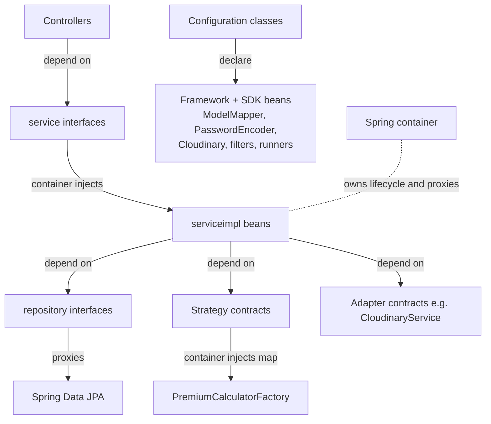

# Dependency Injection Pattern

> Dependency injection in this project: constructor injection as the norm, interfaces separated from implementations, `@Configuration` beans, and the Spring container as the object graph owner.

## Purpose

This document is the single source of truth for how the backend achieves dependency injection: the injection style used across the codebase, how service contracts are separated from their implementations, the `@Configuration` classes that declare beans, and why this design enables the integration tests. Package layout is covered in the package-structure document and the service inventory in the services document; both are referenced, not restated.

## Overview

The backend is a Spring Boot application where the container owns object creation and wiring. Services depend on *abstractions* — interfaces in `com.insurance.demo.service`, repository interfaces in `com.insurance.demo.repository`, strategy contracts in `com.insurance.demo.service.strategy` — and the container injects the concrete beans (implementations in `com.insurance.demo.serviceimpl`, JPA repository proxies, strategy calculators). Most collaborators are delivered through constructors; a small set of `@Configuration` classes declare the framework-level beans that Spring Boot does not auto-create.

## Business Context

The system is large enough (fourteen service contracts, sixteen entities, ten external integration points) that manual wiring would be unmaintainable, and the security-sensitive flows (JWT, OTP, refresh-token rotation, rate limiting) depend on precisely ordered object graphs. Declarative injection means:

- every dependency is visible in the constructor signature (no hidden `new` in business code);
- beans are singletons by default, so stateless services are shared safely;
- cross-cutting concerns (`@Transactional`, security filters) are applied to the injected beans by the container's proxies;
- tests can start the real application context and exercise the full object graph, which is exactly what the integration tests do.

## Technical Design

### Injection style: constructor injection as the norm

The dominant pattern is constructor injection, most often generated by Lombok:

- `PolicyServiceImpl`, `ClaimDocumentServiceImpl`, `OtpService`, and most other implementations use `@RequiredArgsConstructor` over `private final` fields.
- `CloudinaryServiceImpl` uses `@AllArgsConstructor`.
- Non-Lombok classes such as `JwtService`, `RateLimitFilter`, `PremiumCalculatorFactory`, and `SecurityConfig` declare explicit constructors or method parameters and receive their dependencies there.

Notable exception (documented honestly): `PremiumCalculationServiceImpl` and `PremiumCalculationController` still use field injection with `@Autowired`. This works, but it is the one inconsistency against the constructor-injection norm and is called out under Future Improvements.

### Interfaces separated from implementations

The `service`/`serviceimpl` split is the backbone of the pattern:

- `com.insurance.demo.service` holds the contracts (`AuthService`, `PolicyService`, `ClaimService`, `CloudinaryService`, ...) and the strategy subpackage with `PremiumCalculator` + `PremiumCalculatorFactory`.
- `com.insurance.demo.serviceimpl` holds the `@Service` implementations.

Controllers depend only on the interfaces; Spring resolves the implementation bean at runtime. The same idea extends to persistence: repositories are interfaces (`PolicyRepository`, `ClaimRepository`) and the container injects Spring Data JPA proxies, and to media storage: services depend on `CloudinaryService`, not on `CloudinaryServiceImpl`. See [Package Structure](../06_Backend/Package_Structure.md) for the full package map.

### `@Configuration` beans

The `config` package declares the beans that need explicit wiring:

| `@Configuration` class | Beans declared | Purpose |
| --- | --- | --- |
| `AppConfig` | `ModelMapper` | Shared DTO <-> entity mapper used across services |
| `SecurityConfig` | `PasswordEncoder` (BCrypt), `AuthenticationProvider`, `AuthenticationManager`, `RateLimitFilter`, `CookieCsrfOriginFilter`, filter registrations | Security filter chain and its collaborators |
| `DataInitializer` | `CommandLineRunner` (seeds the default admin) | Startup seeding, controlled by `app.security.seed-admin.enabled` |
| `CloudinaryConfig` | `Cloudinary` SDK bean | Built from `cloudinary.*` properties |
| `CorsConfig`, `OpenApiConfig` | CORS and OpenAPI configuration | HTTP and documentation surface |
| `AppSecurityProperties` | `@ConfigurationProperties(prefix = "app.security")` | Type-safe property binding for JWT, rate-limit, CORS, seeding, swagger |

Note how filters illustrate the container's role beyond plain construction: `SecurityConfig` builds `RateLimitFilter` as a bean, wires it into the security chain *and* registers a `FilterRegistrationBean` that disables its servlet-container auto-registration so ordering is controlled in exactly one place. The container coordinates lifecycle so the two registrations stay consistent.

### What the container does

- Creates singletons and resolves constructor dependencies (including `Map<String, PremiumCalculator>` collection injection, exploited by the factory; see [Factory](Factory.md)).
- Applies declarative proxies: `@Transactional` boundaries, security, method-level access control.
- Binds properties into typed objects (`AppSecurityProperties`) and environment keys into `@Value` fields (`spring.mail.username`, `app.twilio.*`, `cloudinary.*`).
- Assembles the servlet filter chain and schedules (`@EnableScheduling` for refresh-token cleanup).

### How DI enables the integration tests

`JwtSecurityIntegrationTest` and `RefreshTokenIntegrationTest` are `@SpringBootTest` classes that boot the real application context, `@Autowired` real beans (repositories, services, `PasswordEncoder`), and drive `MockMvc` with the security filter chain attached. Because every dependency is injected, the tests get a faithful slice of the production graph — including the filters, the JWT service, and the DB-backed repositories — rather than hand-stubbed mocks. Beans such as `RefreshToken` and `OtpVerification` are also built with Lombok builders in test setup, tying the injection story together with the builder story in [Builder](Builder.md).

## Workflow

1. Spring Boot scans `com.insurance.demo`; `@Component`/`@Service`/`@Repository`/`@Configuration` classes are registered as bean definitions.
2. The container resolves each bean's constructor (or field) dependencies, instantiating collaborators first and injecting them.
3. Configuration beans (`AppConfig`, `SecurityConfig`, `CloudinaryConfig`, `DataInitializer`, ...) provide the framework-level and SDK beans.
4. Repositories are materialized as Spring Data JPA proxies; `DataInitializer` seeds the admin on startup (if enabled).
5. At runtime, controllers call service interfaces; the container routes to the singleton implementation proxies.

## Code References

- `insurance-policy-claim-management-system/src/main/java/com/insurance/demo/config/AppConfig.java`
- `insurance-policy-claim-management-system/src/main/java/com/insurance/demo/config/SecurityConfig.java`
- `insurance-policy-claim-management-system/src/main/java/com/insurance/demo/config/DataInitializer.java`
- `insurance-policy-claim-management-system/src/main/java/com/insurance/demo/config/CloudinaryConfig.java`
- `insurance-policy-claim-management-system/src/main/java/com/insurance/demo/config/AppSecurityProperties.java`
- `insurance-policy-claim-management-system/src/main/java/com/insurance/demo/config/RateLimitFilter.java`
- `insurance-policy-claim-management-system/src/main/java/com/insurance/demo/serviceimpl/PolicyServiceImpl.java` (representative `@RequiredArgsConstructor` service)
- `insurance-policy-claim-management-system/src/main/java/com/insurance/demo/serviceimpl/CloudinaryServiceImpl.java`
- `insurance-policy-claim-management-system/src/main/java/com/insurance/demo/security/JwtService.java`
- `insurance-policy-claim-management-system/src/main/java/com/insurance/demo/service/strategy/PremiumCalculatorFactory.java`
- `insurance-policy-claim-management-system/src/test/java/com/insurance/demo/JwtSecurityIntegrationTest.java`
- `insurance-policy-claim-management-system/src/test/java/com/insurance/demo/RefreshTokenIntegrationTest.java`

## Diagrams

## Best Practices

- **Prefer constructor injection.** It makes dependencies explicit, enables final fields, and fails fast at context startup when a dependency is missing.
- **Code to interfaces.** Everything downstream of a controller depends on a `service` or `repository` interface; implementations can be swapped or proxied without changing callers.
- **Keep `@Configuration` for framework beans.** Third-party SDK beans (`Cloudinary`) and infrastructure (`ModelMapper`, `PasswordEncoder`, filters) belong in `@Configuration`, not scattered `new` calls.
- **Let the container own singletons.** Stateless services and adapters are safe to share; do not hand-wire or re-instantiate them in business code.
- **Use Lombok to keep constructor injection terse.** `@RequiredArgsConstructor` over `final` fields is the codebase norm; keep field injection out of new code.

## Future Improvements

- Replace the remaining `@Autowired` field injection in `PremiumCalculationServiceImpl` and `PremiumCalculationController` with constructor injection so the norm is uniform (and `PremiumCalculationServiceImpl` becomes final-field based, matching `@RequiredArgsConstructor` conventions).
- Consider `@Validated` on constructor-injected beans for cross-cutting validation, and a dedicated `@Configuration` split if `SecurityConfig` grows further.
- Track against future enhancements: `../10_Evaluation/Future_Enhancements.md`.

Related: [Package Structure](../06_Backend/Package_Structure.md), [Services](../06_Backend/Services.md), [Factory](Factory.md), [Adapter](Adapter.md), [SOLID](SOLID.md)
