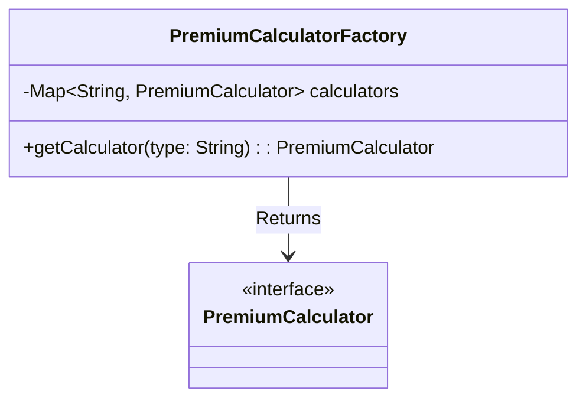

</Agent System Instructions>
<Factory Pattern>
> Dynamic bean routing and instantiation.

---

## Purpose
Explains how the Factory Pattern is used alongside the Strategy Pattern to dynamically provide the correct algorithm implementation at runtime based on the product type.

---

## Overview
- Avoids manual instantiation (`new AnnualPremiumCalculator()`).
- Leverages Spring's dependency injection to map string names to bean instances.
- Centralizes object creation logic.

---

## Business Context
When a user requests a quote for a Motor policy, the system must instantly know to route that calculation to the Annual strategy. The Factory abstracts away the "how do I find the right calculator" logic.

> **Analogy**: Like walking into a large warehouse and asking the front desk (the Factory) for "Tool A". The front desk knows exactly which aisle it's in and hands it to you.

---

## Backend Implementation

### Class Diagram

### Spring Auto-Registration
Instead of hardcoding a map, we inject `Map<String, PremiumCalculator>` into the factory. Spring automatically populates this map where the Key is the Bean name (e.g., `"annualPremiumCalculator"`) and the Value is the instance.

---

## Design Decisions
- **Why Factory? Why not a simple if-else?**  
  A simple if-else requires modification every time a new product type is added. The Spring-powered Factory dynamically registers any new class that implements the interface.
- **What does it enable?**  
  True decoupling. The service generating the quote has zero knowledge of how many calculators exist or what their names are.

---

## Interview Notes
1. **How does Spring inject a Map of beans?**  
   Spring automatically looks for all beans implementing the interface. It uses the bean name (typically the class name camelCased) as the key, and the bean instance as the value.
2. **Is this a GoF Abstract Factory?**  
   No, it's a Simple Factory or Factory Method. It creates/returns instances of a single interface.
3. **What happens if an unknown type is requested?**  
   The factory throws an `IllegalArgumentException` or a custom `UnsupportedProductException`.
4. **Why use Spring to manage the Factory?**  
   So the strategies themselves can have dependencies injected into them (e.g., Repositories) by the Spring container.
5. **How does this complement the Strategy pattern?**  
   The Factory *selects* the tool; the Strategy *is* the tool.

---

## Code References
| Component | Path |
|-----------|------|
| Factory | `com.insurance.demo.factory.PremiumCalculatorFactory` |

---

## Related Documents
- `../07_Design_Patterns/Strategy.md`
