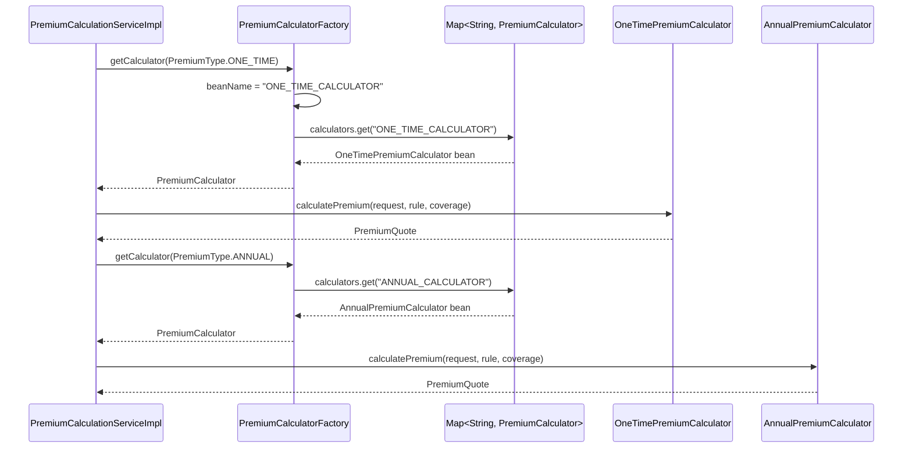

# Factory Pattern

> The Simple Factory, demonstrated by `PremiumCalculatorFactory`: one object knows how to create-and-select the right strategy from a family of implementations.

## Purpose

This document is the single source of truth for the Factory concept in this codebase. It explains the Simple Factory used to resolve premium calculators, how it maps the `PremiumType` enum to a concrete strategy, and how it differs from Spring's own bean factory and component-based dependency injection. Formula and orchestration details live in the premium calculation deep-dive and are referenced, not restated.

## Overview

A factory encapsulates object creation and selection so that callers depend on an abstraction rather than on concrete classes. This project uses the simplest flavour — a **Simple Factory** (also called static/parameterized factory, here instance-based): a single class, `PremiumCalculatorFactory`, whose `getCalculator(PremiumType)` method returns the right `PremiumCalculator` implementation. It does not instantiate the strategies itself; it queries the Spring container's collection of already-managed strategy beans.

The factory sits in `com.insurance.demo.service.strategy` and is the only component that ever maps `PremiumType` to an implementation. `PremiumCalculationServiceImpl` (and anything else that needs a premium quote) depends on the factory or the `PremiumCalculator` interface — never on the concrete calculators.

## Business Context

The domain defines exactly two premium models, `ONE_TIME` and `ANNUAL`, but that set is expected to evolve with the product catalogue. Centralizing the mapping between the business concept (`PremiumType`) and its implementation keeps the selection rule in one place: to add a model, you register a new calculator bean and the factory picks it up without modification. This directly supports the Open/Closed principle discussed in [SOLID](SOLID.md).

## Technical Design

### How `PremiumCalculatorFactory` works

```java
@Component
public class PremiumCalculatorFactory {

    private final Map<String, PremiumCalculator> calculators;

    @Autowired
    public PremiumCalculatorFactory(Map<String, PremiumCalculator> calculators) {
        this.calculators = calculators;
    }

    public PremiumCalculator getCalculator(PremiumType premiumType) {
        String beanName = premiumType.name() + "_CALCULATOR";
        return Optional.ofNullable(calculators.get(beanName))
                .orElseThrow(() -> new IllegalStateException(
                        "No premium calculator found for type: " + premiumType));
    }
}
```

Key mechanics, verified in code:

1. The two calculators are registered with explicit bean names matching the enum: `@Component("ONE_TIME_CALCULATOR")` and `@Component("ANNUAL_CALCULATOR")`.
2. Spring collects every bean assignable to `PremiumCalculator` into a `Map<String, PremiumCalculator>` keyed by bean name and injects it into the constructor. This is Spring's built-in **collection injection** — no registration list is maintained manually.
3. `getCalculator` derives the expected bean name as `premiumType.name() + "_CALCULATOR"` (so `PremiumType.ONE_TIME` → `"ONE_TIME_CALCULATOR"`) and looks it up.
4. An unknown or unregistered type raises `IllegalStateException`, making misconfiguration fail fast with a clear message.

The mapping is therefore: `PremiumType` enum constant → bean name (string convention) → `PremiumCalculator` bean. The naming convention is the contract between the enum and the bean names; both calculators must follow it for the factory to resolve correctly.

### The switch question

The factory contains no `switch` or `if/else` on the enum. The only branching anywhere in the premium path is bean-name resolution inside the factory; neither `PremiumCalculationServiceImpl` nor the calculators branch on premium type. If a switch were needed (for example to special-case a new type), this factory is the single legitimate place for it.

### Simple Factory vs. Spring's bean factory

These are two different layers and both are in play:

| Concern | Spring's bean factory / container | `PremiumCalculatorFactory` |
| --- | --- | --- |
| What it is | The IoC container (Spring's `BeanFactory`/`ApplicationContext`) | A small application-level `@Component` |
| Responsibility | Bean lifecycle, instantiation, wiring, proxying, scopes | Selection of the *right* existing bean from a family |
| Creation | Creates and caches singleton beans | Does not create beans; returns container-managed ones |
| Scope of knowledge | Entire application context | Just the `PremiumCalculator` family |
| Failure behaviour | Miswiring fails at context startup | Unknown enum type fails at call time with `IllegalStateException` |

Because strategies are stateless singletons, `PremiumCalculatorFactory` is a **selection** factory rather than a **construction** factory. This is idiomatic Spring: let the container own object creation, and let application factories own the business-level selection logic. A GoF Abstract Factory or Factory Method would add indirection this codebase does not need, since there is exactly one family and one selection key today.

## Workflow

1. `PremiumCalculationServiceImpl` finishes request validation and resolves the active pricing rule.
2. It calls `calculatorFactory.getCalculator(premiumType)`.
3. The factory computes the bean name `premiumType.name() + "_CALCULATOR"` and returns the matching `PremiumCalculator` from the injected map, or throws `IllegalStateException`.
4. The service invokes `calculatePremium(...)` on the returned strategy and continues with quote persistence.

The full quote-generation workflow is in [Premium Calculation Service](../06_Backend/Premium_Calculation_Service.md).

## Code References

- `insurance-policy-claim-management-system/src/main/java/com/insurance/demo/service/strategy/PremiumCalculatorFactory.java`
- `insurance-policy-claim-management-system/src/main/java/com/insurance/demo/service/strategy/PremiumCalculator.java`
- `insurance-policy-claim-management-system/src/main/java/com/insurance/demo/service/strategy/OneTimePremiumCalculator.java`
- `insurance-policy-claim-management-system/src/main/java/com/insurance/demo/service/strategy/AnnualPremiumCalculator.java`
- `insurance-policy-claim-management-system/src/main/java/com/insurance/demo/serviceimpl/PremiumCalculationServiceImpl.java`
- `insurance-policy-claim-management-system/src/main/java/com/insurance/demo/enums/PremiumType.java`

## Diagrams



## Best Practices

- **One selection point per family.** All `PremiumType` → implementation mapping lives in the factory; nothing else should resolve a calculator.
- **Use the container's collection injection.** Injecting `Map<String, PremiumCalculator>` means adding a strategy requires no factory edit, which is the whole point.
- **Name beans after the domain enum.** The `_CALCULATOR` naming convention is simple and greppable; document it wherever new calculators might be added (this file and the deep-dive).
- **Fail fast on unknown types.** Throwing `IllegalStateException` on an unresolvable premium type surfaces configuration errors immediately instead of silently producing wrong prices.
- **Keep the factory thin.** It selects; it does not compute. Formula logic stays in the strategies.
- **Do not confuse layers.** Spring's bean factory solves lifecycle and wiring; an application factory solves business-level selection. Each solves a different problem.

## Future Improvements

- If a premium type ever needs its own constructor dependencies, keep the Simple Factory shape but move creation to `@Bean` factory methods in a `@Configuration` class rather than `@Component` scanning.
- Consider validating the enum-to-bean mapping at startup (for example an `ApplicationRunner` that resolves every declared `PremiumType`) to catch naming drift before the first request.
- Track against future enhancements: `../10_Evaluation/Future_Enhancements.md`.

Related: [Strategy](Strategy.md), [SOLID](SOLID.md), [Dependency Injection](Dependency_Injection.md), [Premium Calculation Service](../06_Backend/Premium_Calculation_Service.md)
