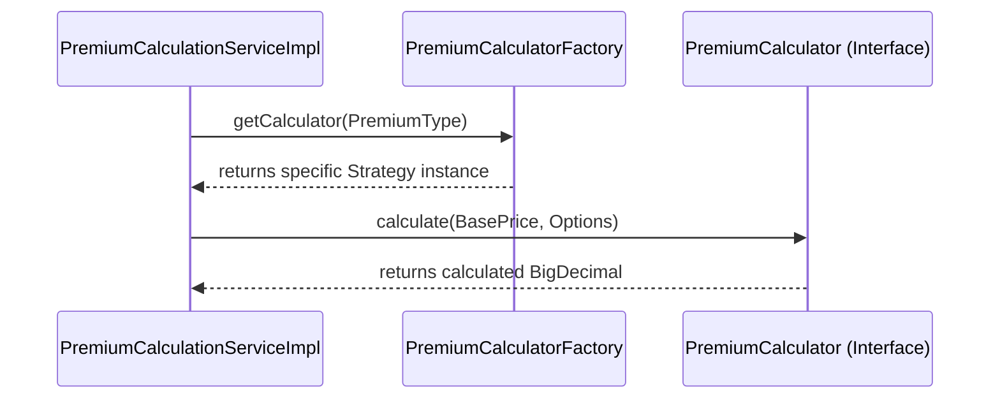
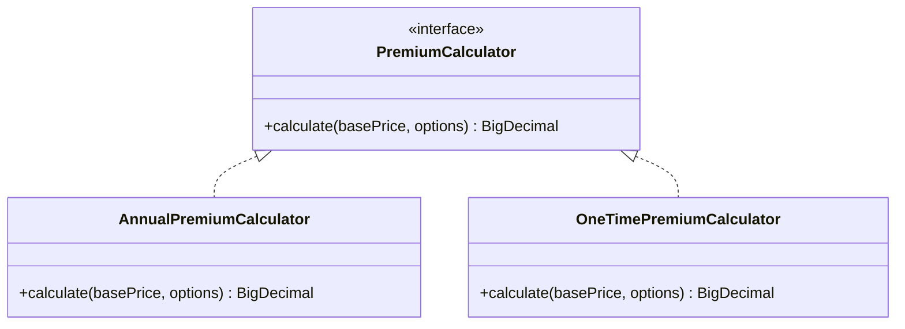

> Dynamic premium calculation algorithms.

---

## Purpose
Explains how the Strategy Pattern is used to calculate insurance premiums differently based on the product type (Annual vs. One-Time) without polluting the codebase with massive `if/else` blocks.

---

## Overview
- Defines a common `PremiumCalculator` interface.
- Implements specific strategies: `AnnualPremiumCalculator` and `OneTimePremiumCalculator`.
- Enables Open/Closed principle: new pricing models can be added without changing existing code.

---

## Business Context
Different insurance products are billed differently. Travel insurance is typically a one-time calculation based on trip duration. Health insurance is an annual calculation based on age and coverage. Trying to fit both into one method creates rigid, fragile code.

> **Analogy**: Like choosing between an annual gym membership vs a day pass. Both get you into the gym (the goal), but the way the cost is calculated is entirely different.

---

## System Flow

---

## Backend Implementation

### With vs Without Strategy Pattern

| Without Strategy Pattern | With Strategy Pattern |
|--------------------------|-----------------------|
| Massive `switch` or `if/else` statement in Service. | Service delegates to the Interface. |
| Hard to test (requires setting up all scenarios). | Easy to test each calculator in isolation. |
| Adding a new product requires modifying core service. | Adding a new product means creating a new class. |

### Class Diagram

---

## Design Decisions
- **Why Strategy here specifically?**  
  Insurance pricing algorithms change frequently due to regulations or business needs. Encapsulating these algorithms into strategies isolates changes.
- **What would the code look like without it?**  
  `PremiumCalculationServiceImpl` would have a 500-line method checking `if (type == ANNUAL) { ... } else if (type == ONETIME) { ... }`, violating the Single Responsibility and Open/Closed principles.

---

## Interview Notes
1. **What is the Strategy Pattern?**  
   It defines a family of algorithms, encapsulates each one, and makes them interchangeable at runtime based on context.
2. **How did you implement it in Spring?**  
   I created an interface, implemented it in multiple `@Component` classes, and used a Factory to inject the correct one based on an Enum/String.
3. **What SOLID principle does this satisfy?**  
   Open/Closed Principle (OCP). We can add a `MonthlyPremiumCalculator` by adding a new class without modifying the existing service.
4. **How do you test this?**  
   Unit test each strategy class individually with boundary values, then mock the factory in the service test.
5. **Can strategies share code?**  
   Yes, by using an abstract base class that implements the interface and holds shared logic (Template Method pattern).
6. **How does the client know which strategy to use?**  
   The client (Service) asks a Factory, passing the `ProductType` as the key.

---

## Code References
| Component | Path |
|-----------|------|
| Interface | `com.insurance.demo.strategy.PremiumCalculator` |
| Concrete A| `com.insurance.demo.strategy.AnnualPremiumCalculator` |
| Concrete B| `com.insurance.demo.strategy.OneTimePremiumCalculator` |

---

## Related Documents
- `../07_Design_Patterns/Factory.md`
- `../07_Design_Patterns/SOLID.md`
