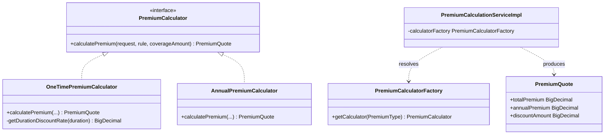

# Strategy Pattern

> The general strategy pattern, demonstrated by the premium-calculation engine: interchangeable algorithms behind one interface, selected at runtime by a factory.

## Purpose

This document is the single source of truth for the *concept* of the Strategy pattern as applied in this codebase. It explains what the pattern is, why it was chosen for premium calculation, the participants involved, and where else the same shape could be reused. The exact actuarial formulas and quote orchestration are already documented in the premium calculation deep-dive and are referenced rather than duplicated here.

## Overview

The Strategy pattern defines a family of algorithms, encapsulates each one behind a common interface, and lets the caller swap them at runtime without changing the calling code. In this project the varying behaviour is *premium type*: a one-time premium and an annual premium are computed by different algorithms even though they share the same inputs (coverage, pricing rule, duration). The algorithms are isolated in `com.insurance.demo.service.strategy` behind the `PremiumCalculator` interface, and the `PremiumCalculatorFactory` selects the right implementation based on the `PremiumType` enum.

The implementation details, formulas, rounding rules, and quote persistence are authoritative in [Premium Calculation Service](../06_Backend/Premium_Calculation_Service.md); this document treats the pattern, not the math.

## Business Context

Insurance products are priced per `PremiumType`, which the domain defines as either `ONE_TIME` or `ANNUAL` (see [Fact Sheet](../CONTRIBUTING.md)). These are materially different pricing models:

- An **annual** premium is the per-year cost; the customer pays it each year and receives no lump-sum discount.
- A **one-time** premium pays the full commitment up front and earns a duration-based discount.

Because the business may introduce further premium shapes later, and because both formulas share a common core (base premium, processing fee, GST), the pricing engine is a natural fit for the Strategy pattern: the differences are contained in replaceable strategy classes, while validation and quote persistence stay in one orchestration class.

## Technical Design

### Participants

| Participant | Role | Class |
| --- | --- | --- |
| Context | Orchestrates validation, rule lookup, and quote persistence; delegates the formula to a strategy | `PremiumCalculationServiceImpl` |
| Strategy | Defines the common algorithm contract | `PremiumCalculator` (interface) |
| Concrete strategy A | Implements the one-time (lump-sum with duration discount) formula | `OneTimePremiumCalculator` |
| Concrete strategy B | Implements the annual (per-year, no discount) formula | `AnnualPremiumCalculator` |
| Selector | Returns the correct strategy for a `PremiumType` | `PremiumCalculatorFactory` |
| Result object | The value object produced by any strategy | `PremiumQuote` (Lombok `@Builder` DTO) |

The strategy interface is intentionally narrow:

```java
public interface PremiumCalculator {
    PremiumQuote calculatePremium(PremiumCalculationRequest request, PricingRule rule, BigDecimal coverageAmount);
}
```

Both concrete strategies are Spring `@Component` beans with explicit names (`ONE_TIME_CALCULATOR`, `ANNUAL_CALCULATOR`). The context never instantiates a strategy; it asks the factory:

```java
PremiumCalculator calculator = calculatorFactory.getCalculator(premiumType);
PremiumQuote quoteDto = calculator.calculatePremium(...);
```

This is the core property of the pattern: the context knows the *contract*, not the *algorithm*.

### Selection mechanism

Selection is delegated to `PremiumCalculatorFactory`, which exploits the Spring container's ability to inject a `Map<String, PremiumCalculator>` of all beans of that type keyed by bean name. See [Factory](Factory.md) for the full analysis of this mechanism.

### Open for extension

Adding a new premium type requires exactly three things: a new enum value (domain change), a new strategy class implementing `PremiumCalculator`, and the business rules for it. No existing calculator and no orchestration code changes — the factory resolves the new bean by naming convention.

## Workflow

1. The controller validates the request DTO and calls the premium calculation service.
2. `PremiumCalculationServiceImpl` loads the customer and plan, validates duration, premium type, coverage, and plan/product activity, and resolves the latest active `PricingRule`.
3. The factory resolves the strategy for the requested `PremiumType`.
4. The strategy computes the `PremiumQuote` breakdown (base premium, fee, GST, commitment, discount, total).
5. The context persists a `Quote` snapshot (status `CREATED`, 30-minute expiry) and returns the populated `PremiumQuote`.
6. Purchase consumes the quote (transition to `USED`), handled by the policy flow.

Step-by-step details, endpoint references, and formula specifics: [Premium Calculation Service](../06_Backend/Premium_Calculation_Service.md).

## Code References

- `insurance-policy-claim-management-system/src/main/java/com/insurance/demo/service/strategy/PremiumCalculator.java`
- `insurance-policy-claim-management-system/src/main/java/com/insurance/demo/service/strategy/OneTimePremiumCalculator.java`
- `insurance-policy-claim-management-system/src/main/java/com/insurance/demo/service/strategy/AnnualPremiumCalculator.java`
- `insurance-policy-claim-management-system/src/main/java/com/insurance/demo/service/strategy/PremiumCalculatorFactory.java`
- `insurance-policy-claim-management-system/src/main/java/com/insurance/demo/serviceimpl/PremiumCalculationServiceImpl.java`
- `insurance-policy-claim-management-system/src/main/java/com/insurance/demo/dto/PremiumCalculationRequest.java`
- `insurance-policy-claim-management-system/src/main/java/com/insurance/demo/dto/PremiumQuote.java`

## Diagrams



A full class diagram of the service layer, including this strategy cluster, is in [`../09_Diagrams/Class_Diagrams/`](../09_Diagrams/Class_Diagrams/README.md).

## Best Practices

- **Algorithms vary by business rule; isolate the variation.** The formula differences between premium types are the exact seam that should be behind an interface.
- **The context never branches on the enum.** `PremiumCalculationServiceImpl` does not contain `if (premiumType == ...)`. All selection goes through the factory, keeping the orchestrator simple and open for extension.
- **Strategies are stateless beans.** The calculators hold no mutable state, so they can be singletons shared by the container, and they are trivially unit-testable in isolation.
- **Keep the contract narrow.** `PremiumCalculator` exposes one method; both implementations fit it without casts or `instanceof`.
- **Separate "the pattern" from "the math".** The pattern lives in this document; the formula, rounding, and discount table live in the domain and service deep-dive docs, so there is one source of truth for each.

## Future Improvements

- Add more concrete strategies as the business expands premium models (for example fixed-flat products, or combined two-premium modes).
- Consider `@RequiredArgsConstructor`-style constructor injection in `PremiumCalculationServiceImpl` (currently `@Autowired` field injection) to align it with the rest of the service layer; see [Dependency Injection](Dependency_Injection.md).
- Evaluate a strategy-based abstraction for other varying behaviours, such as payment-mode processing (`UPI`/`CARD`/`NET_BANKING`/`CASH`) or claim-status routing, where the same "varying algorithm behind an interface" shape applies.
- Track against future enhancements: `../10_Evaluation/Future_Enhancements.md`.

Related: [Factory](Factory.md), [SOLID](SOLID.md), [Premium Calculation Service](../06_Backend/Premium_Calculation_Service.md), [Premium Calculation](../02_Business_Domain/Premium_Calculation.md)
