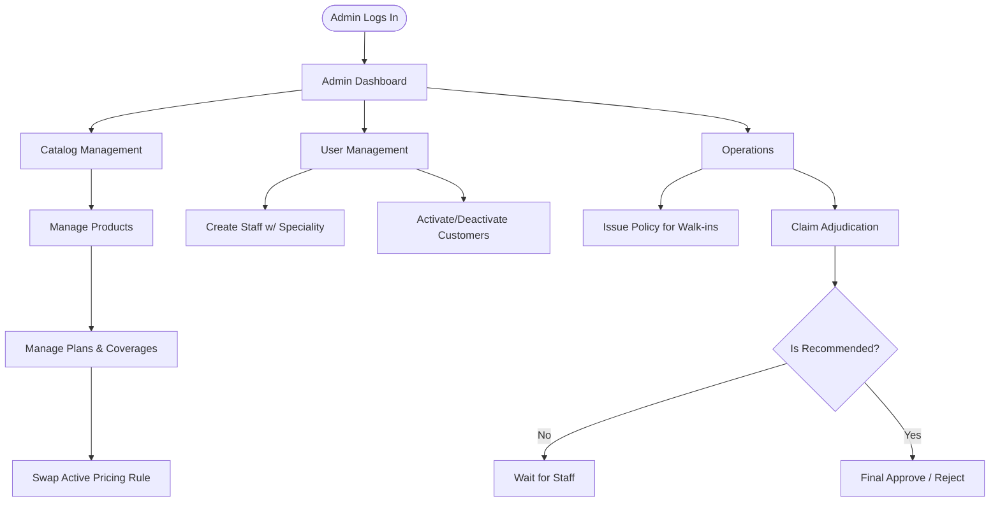
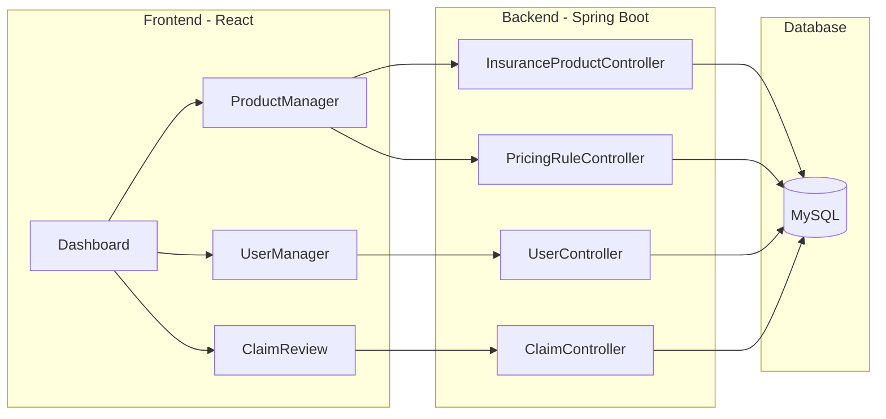
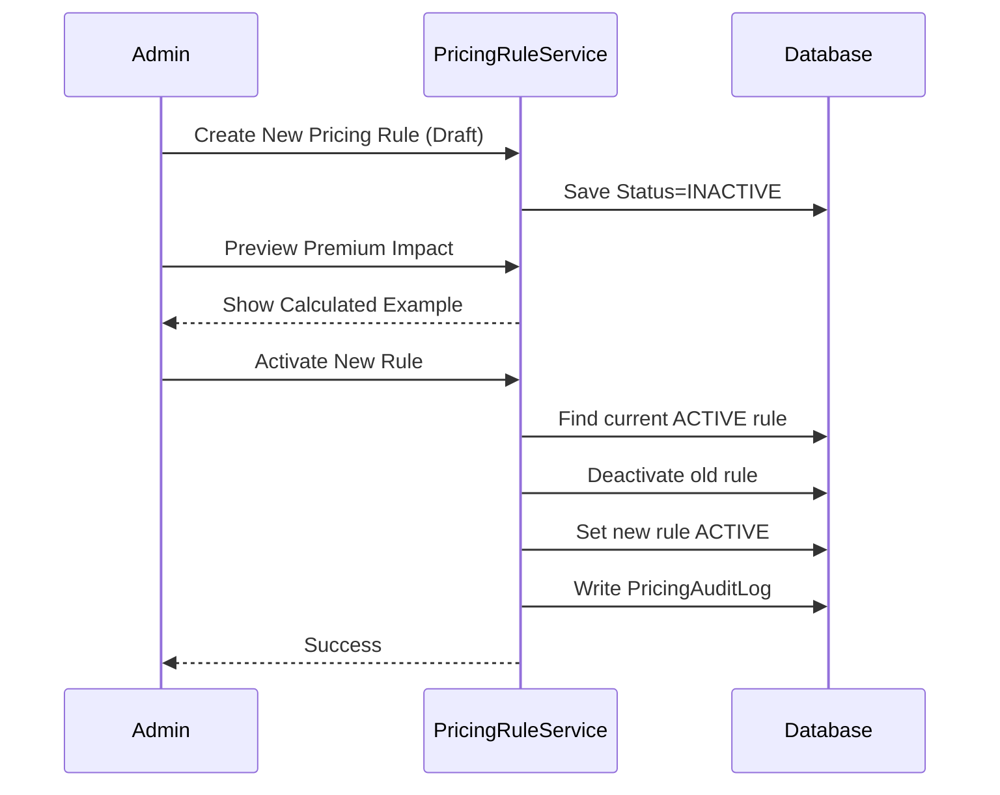

# Admin Flow
> The admin's operational narrative: catalog management, user provisioning, policy oversight, and final claim adjudication.

---

## Purpose
Explains how a `ROLE_ADMIN` operator manages the platform via the admin console. The Admin holds exclusive control over the business catalog (products, plans, coverage, pricing) and acts as the final decision-maker for claims.

---

## Overview
- **User Management:** Provision staff members (assigning specialities) and toggle customer account access.
- **Catalog Management:** Create and toggle products, configure policy plans via a step-by-step wizard, and manage coverage tiers.
- **Pricing:** Create and swap active pricing rules, previewing premium impacts before pushing changes live.
- **Adjudication:** Review staff recommendations and issue the final `APPROVED` or `REJECTED` decision on claims.

---

## Business Context
To maintain integrity and prevent fraud, structural changes to the business must be centralized. Only the admin can dictate what products are sold and at what price. For claims, the admin acts as the final authority, ensuring that the staff's investigation aligns with company policy before money is authorized for payout.

---

## Feature Flow

---

## Admin Console Architecture

---

## Sequence Diagram (Pricing Update)

---

## Database Design (Catalog)

| Entity | Purpose | Admin Actions |
|---|---|---|
| `ProductType` | Broad category (e.g., MOTOR). | Create, Toggle Active. |
| `PolicyPlan` | Specific offering (e.g., Comprehensive). | Create via Wizard, Configure Coverages. |
| `PricingRule` | Math variables (rates, GST, fees). | Create, Swap Active, Audit. |
| `StaffSpeciality` | Links staff user to a ProductType. | Assigned on creation. |

**Why this design?**
Isolating `PricingRule` from `PolicyPlan` allows the admin to update prices for the upcoming year without recreating the entire plan or mutating historical policies that were sold under the old rule.

---

## Business Rules

| Rule | Description | Why it exists |
|---|---|---|
| **One Active Pricing Rule** | A plan can only have exactly one `ACTIVE` rule at a time. | Prevents ambiguity during quote generation. |
| **Terminal Claim Decisions** | Admin can only approve/reject if a staff member has recommended it first. | Enforces Separation of Duties. |
| **Immutable Quotes** | Updating a pricing rule does NOT affect previously generated quotes. | Honors the price promised to the customer. |
| **No Self-Deactivation** | An admin cannot deactivate their own account. | Prevents locking everyone out of the system. |

---

## Validation Rules

- **Staff Creation:** Requires valid email, phone, and a valid `ProductType` enum for the speciality.
- **Pricing Activation:** Fails if the plan doesn't exist. Safely transitions the old rule to inactive atomically.
- **Claim Decision:** Validates the claim is currently in a `RECOMMENDED_*` state.

---

## Error Handling

| Scenario | HTTP Status | Behavior |
|---|---|---|
| Missing Admin Role | 403 Forbidden | Access Denied by Spring Security `@PreAuthorize`. |
| Adjudicating un-reviewed claim | 400 Bad Request | Blocked by state machine validation. |
| Deactivating active policy | 400 Bad Request | Policies with open claims cannot be cancelled. |

---

## Design Decisions

- **Why doesn't the admin set staff passwords?**
  To maintain zero-knowledge security, the admin provisions the account, but the staff member receives an OTP and sets their own password using the public forgot-password flow.
- **Why is there a Pricing Audit Log?**
  Price changes drastically affect revenue. Logging who changed the base risk rate, and when, is critical for compliance and business intelligence.
- **Why are products "toggled" rather than deleted?**
  Soft-deletion (Active/Inactive flags) prevents referential integrity errors (foreign key constraint failures) for historical policies tied to retired products.

---

## Interview Notes

1. **How is Admin access secured?**
   > Through Spring Security `@PreAuthorize("hasRole('ADMIN')")` on backend controllers, and a `RoleProtectedRoute` wrapper in React.
2. **How does the system ensure only one pricing rule is active?**
   > When an admin activates a new rule, a single `@Transactional` method fetches the currently active rule, deactivates it, activates the new one, and writes an audit log.
3. **What is Separation of Duties in the context of this app?**
   > Staff members investigate claims and recommend an outcome, but only Admins can make the final binding decision to approve or reject. Neither can do both.
4. **How do you handle deleting products that have existing policies?**
   > We don't delete them. We implement soft-deletes via an `isActive` boolean flag. If toggled false, it hides the product from new customers but preserves historical database relationships.
5. **How is the seed admin created?**
   > Via a `DataInitializer` bean that runs on application startup, checks if the admin email exists, and creates it if not.

---

## Related Documents
- [Claim Flow](Claim_Flow.md)
- [Pricing Flow](Pricing_Flow.md)

---

## Future Enhancements
- Export functionality for policy and claim reports (CSV/Excel).
- Bulk upload mechanism for updating pricing catalogs.
