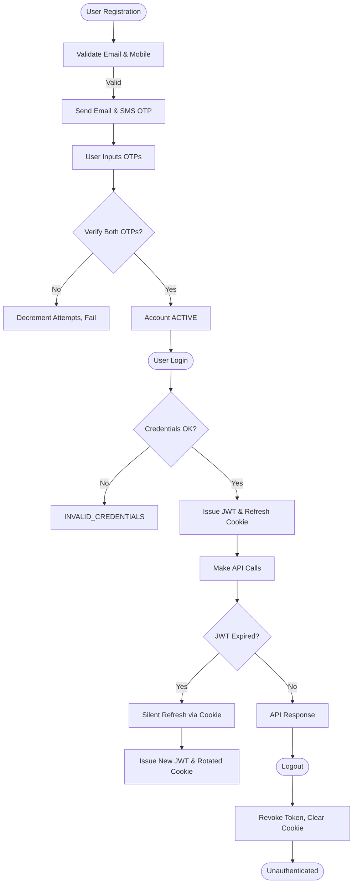
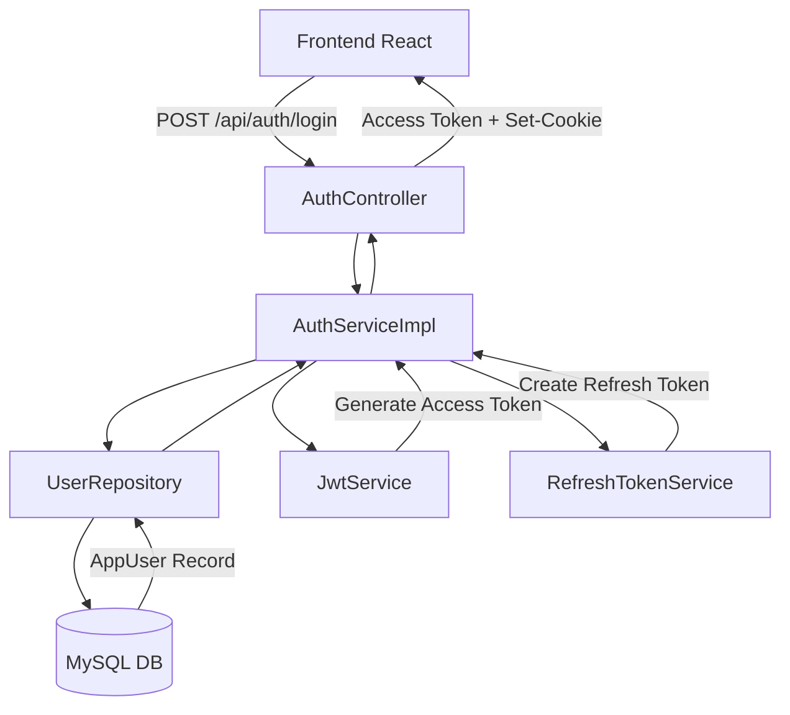
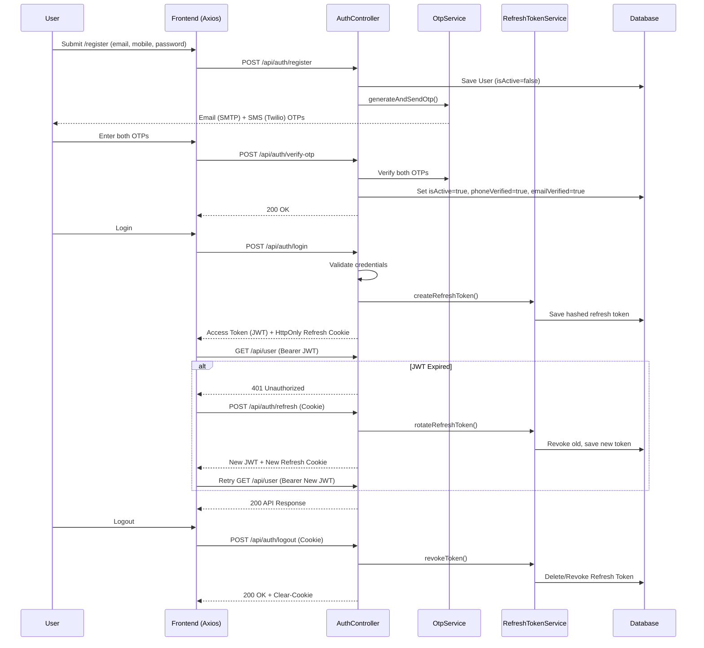

# Authentication Flow
> The authoritative end-to-end authentication narrative: registration, dual OTP verification, login with JWT and refresh-token cookie, session restoration, and password reset.

---

## Purpose
Describes how a user goes from an anonymous visitor to an authenticated, verified actor in the Insurance Policy & Claim Management System. This document covers the sub-flows for registration, login, silent token refresh, logout, and password recovery. 

---

## Overview
- **Self-Service Registration:** Customers register themselves and must verify both email (via Gmail SMTP) and phone (via Twilio SMS) before the account is activated.
- **Login:** Issues a short-lived, stateless access token (JWT) to memory and a long-lived, opaque refresh token as an HttpOnly cookie.
- **Session Restoration:** Axios interceptors silently refresh the JWT using the secure cookie upon token expiration (60 seconds in dev).
- **Security First:** Rate-limiting, dual-OTP validation, token rotation on use, and instant session invalidation via `tokenVersion` claims.

---

## Business Context
Self-service onboarding is a core requirement. Customers register and prove ownership of their contact channels. Dual-OTP verification prevents fraudulent account creation and is used to reset a forgotten password. From a security perspective, session invalidation must be immediate and stateless. Deactivating a user or resetting a password increments the `tokenVersion` claim in the database, invalidating all outstanding access and refresh tokens simultaneously.

---

## Feature Flow

---

## System Flow

---

## Sequence Diagram

---

## Database Design

| Entity | Purpose | Relationships |
|---|---|---|
| `AppUser` | Core user identity (Admin, Staff, Customer). | One-to-One with `Customer` or `StaffSpeciality`. |
| `OtpVerification` | Stores OTP codes, expiry, attempts. | Linked by email/phone. |
| `RefreshToken` | Tracks refresh sessions per user. | Many-to-One to `AppUser`. |

**Why this design?**
Storing OTPs in the DB allows for rate-limiting, attempt-tracking, and robust multi-channel verification. Hashing refresh tokens ensures that a database leak doesn't expose active sessions.

---

## Business Rules

| Rule | Description | Why it exists |
|---|---|---|
| **Dual OTP Validation** | Both email and phone OTPs must be verified to activate the account. | Ensures communication lines are valid for claim processing and reset ops. |
| **Silent Token Refresh** | 401 triggers an automatic retry using the refresh token cookie. | Prevents constant user re-authentication without relying on insecure LocalStorage. |
| **Token Versioning** | Deactivation or password reset bumps `tokenVersion`. | Instantly invalidates all outstanding JWTs and refresh tokens. |
| **Cookie Exclusivity** | Refresh token is only sent as `HttpOnly` cookie. | Protects long-lived credentials from XSS attacks. |
| **OTP Attempt Cap** | Max 5 failed attempts per OTP. | Thwarts brute-force attacks. |

---

## Validation Rules

- **Registration Input:** Email must be valid and unique. Mobile must be 10 digits and unique. Password must be 8-64 chars with at least 1 letter and 1 digit.
- **OTP Input:** Must be exactly 6 digits.
- **Business Logic:** Both email and phone must have unexpired, matching OTP records with attempts < 5.

### OTP Lifecycle
| Property | Rule |
|---|---|
| Length | 6 digits, generated securely (`SecureRandom`) |
| Expiry | 5 minutes |
| Attempts | Max 5 failed attempts allowed before marking as used |
| Resend Cooldown | 60 seconds since last dispatch |
| Daily Cap | Max 4 sends per 24 hours per user |

### Token Lifecycle
| Token | Storage | TTL | Rotation |
|---|---|---|---|
| Access (JWT) | In-memory (React State) | 60s (Dev) / 15m (Prod) | Issued on login and refresh |
| Refresh | HttpOnly Cookie + Hashed in DB | 7 days | Rotated upon every refresh API call |

---

## Error Handling

| Scenario | HTTP Status | Action / Meaning |
|---|---|---|
| Unverified Email/Phone | `401 Unauthorized` | `INVALID_CREDENTIALS` (Generic to prevent enumeration) |
| Invalid Credentials | `401 Unauthorized` | `INVALID_CREDENTIALS` |
| Token Expired | `401 Unauthorized` | Triggers silent Axios refresh |
| Invalid Refresh Token | `401 Unauthorized` | Triggers forced logout |
| OTP Rate Limit Exceeded | `429 Too Many Requests` | Wait for cooldown |

---

## Design Decisions

- **Why separate Access and Refresh tokens?** 
  Access tokens (JWTs) are stateless and cannot be revoked without a centralized check. By making them short-lived, we minimize exposure. Refresh tokens act as the central control point for session invalidation.
- **Why HttpOnly Cookies?**
  Storing tokens in `localStorage` makes them accessible to JavaScript, exposing them to XSS attacks. HttpOnly cookies cannot be read by JS, drastically improving security.
- **Why rotate Refresh Tokens?**
  Token rotation ensures that if a refresh token is stolen, the attacker and the legitimate user will both try to use it. The system detects a reused token, assumes compromise, and revokes all sessions for the user.
- **Why use a `tokenVersion` claim?**
  Instead of blacklisting every individual JWT (which requires Redis/DB lookups on every request), we compare the JWT's `tokenVersion` to the database's `tokenVersion`. If they don't match (e.g., password reset), the token is invalid.

---

## Interview Notes

1. **How do you secure JWTs in React?**
   > Store them in memory, never in localStorage. Use an HttpOnly cookie for the long-lived refresh token.
2. **How does the system handle concurrent logouts everywhere?**
   > Incrementing the `tokenVersion` in the DB instantly invalidates all existing JWTs and refresh tokens.
3. **What happens if a refresh token is stolen?**
   > Because we use refresh token rotation, when the attacker uses it, a new token is issued. When the legitimate user uses the old token, the backend detects replay and revokes the entire session family.
4. **Why do we return a generic error on login failure?**
   > To prevent account enumeration attacks. An attacker shouldn't know if an email exists in the system or not.
5. **How is the forgot password flow secured?**
   > It requires the same dual OTP validation (Email + SMS) as registration, ensuring the requester owns both contact methods.
6. **How does Axios handle silent token refresh?**
   > An Axios response interceptor catches `401` errors, calls `/api/auth/refresh` (sending the cookie), updates the in-memory token, and replays the failed request.
7. **What rate limits apply to authentication?**
   > Bucket4j limits OTP sends to 5/min, login 5/min, and refresh 10/min based on IP + Email combinations.
8. **Why are refresh tokens hashed in the database?**
   > If the database is compromised, the opaque refresh tokens cannot be used by the attacker to impersonate users, acting similarly to hashed passwords.

---

## Related Documents
- [JWT Technical Design](../06_Backend/JWT.md)
- [Authentication API](../03_API/Authentication_API.md)
- [Business Rules](../02_Business_Domain/Business_Rules.md)

---

## Future Enhancements
- Implement WebAuthn (Passkeys / Hardware Keys) as a second factor.
- Migrate rate-limiting to a distributed Redis cache for horizontal scaling.
- Support "Magic Link" passwordless login.
