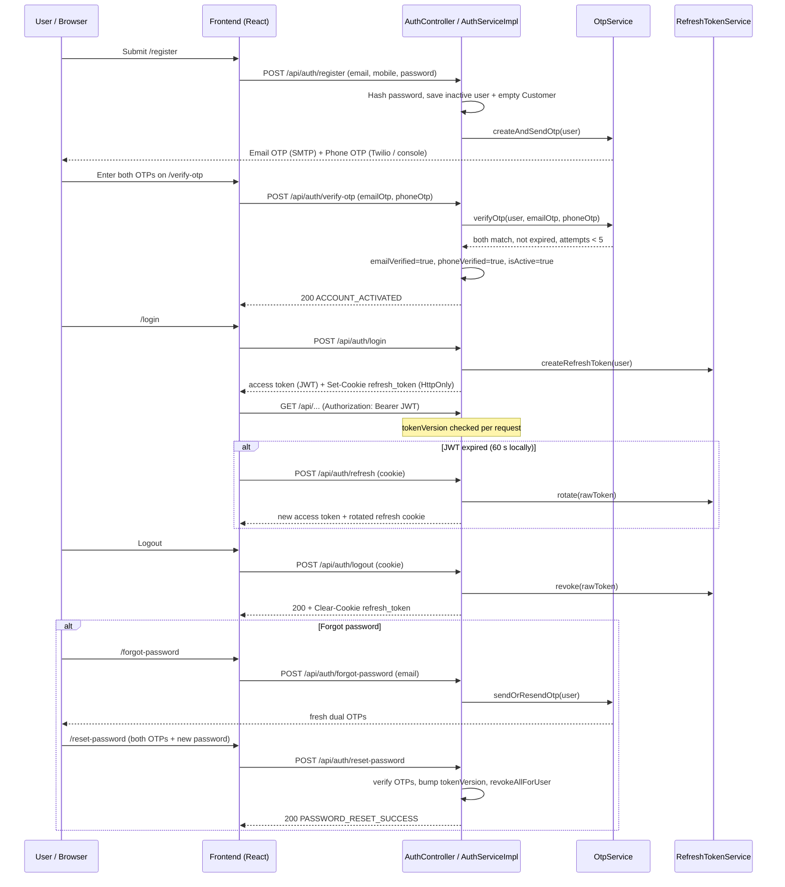

# Authentication Flow

> The authoritative end-to-end authentication narrative: registration, dual email + phone OTP verification, login with JWT access token and rotating refresh-token cookie, session restoration, logout, and the forgot/reset password loop.

## Purpose

Describes how a user goes from anonymous visitor to authenticated, verified actor in the Insurance Policy & Claim Management System. It is the flow-level companion to the endpoint reference (`../03_API/Authentication_API.md`) and the token mechanics reference (`../06_Backend/JWT.md`). Business rules governing OTP attempts and rate limits live in `../02_Business_Domain/Business_Rules.md`.

## Overview

Every human actor — customer, internal staff, admin — authenticates the same way once provisioned. Customers self-register; staff are provisioned by an admin; the seeded admin exists from boot. An account only becomes usable after **both** the email OTP and the phone OTP are verified. After that, login issues a short-lived stateless JWT (access token) plus an opaque refresh token delivered exclusively as an HttpOnly cookie. When the access token expires (60 seconds in the committed local profile, 15 minutes by default), the frontend silently refreshes via the cookie. Logout revokes the refresh token and clears the cookie.

## Business Context

Self-service onboarding is a core requirement: customers register, prove ownership of an email address and a mobile number, and only then can transact. Dual-OTP verification prevents account creation with unowned contact channels and is the same proof used to reset a forgotten password. Session invalidation must be immediate and stateless: deactivating a user or resetting a password bumps the `tokenVersion` claim so every outstanding access token and refresh token stops working at once.

## Technical Design

### Flow steps

1. **Register** — `POST /api/auth/register` (`AuthServiceImpl.registerUser`). Validates email/mobile uniqueness, hashes the password (BCrypt), creates the `AppUser` with `Role.ROLE_CUSTOMER`, `isActive=false`, `emailVerified=false`, `phoneVerified=false`, and an empty `Customer` profile. `OtpService.createAndSendOtp` generates two independent 6-digit OTPs and sends them (email via Gmail SMTP, SMS via Twilio). The account is inert until verified.
2. **Verify** — `POST /api/auth/verify-otp` with `{email, emailOtp, phoneOtp}`. `OtpService.verifyOtp` requires **both** OTPs to match the latest unexpired record. On success `emailVerified=true`, `phoneVerified=true`, `isActive=true` — the account is now `ACTIVE`.
3. **Resend** — `POST /api/auth/resend-otp` (`email` + `phone`). Re-sends the still-valid OTP (or regenerates one if the previous is expired/used). Blocked for active accounts and by the throttles below.
4. **Login** — `POST /api/auth/login`. Rejects unknown email, unverified email, unverified phone, and deactivated accounts with generic `INVALID_CREDENTIALS`. On success: a JWT access token is returned in the body and the refresh token is set as the HttpOnly cookie.
5. **Authorized requests** — the access token is sent as `Authorization: Bearer <token>`; `JwtAuthenticationFilter` validates signature, issuer, expiry (30 s clock skew), subject, and `tokenVersion` per request.
6. **Refresh** — on a `401`, the frontend calls `POST /api/auth/refresh` (cookie only). The presented token is rotated atomically; a fresh access token is returned and a new refresh cookie is set.
7. **Logout** — `POST /api/auth/logout` revokes the presented refresh token and clears the cookie.
8. **Forgot password** — `POST /api/auth/forgot-password` always returns success (unknown emails get the same response to avoid account enumeration) and, when the account exists, sends fresh dual OTPs.
9. **Reset password** — `POST /api/auth/reset-password` verifies both OTPs, re-hashes the new password, increments `tokenVersion` (invalidating all outstanding JWTs), and revokes all active refresh tokens for the user.

### OTP lifecycle (code-verified)

| Property | Value |
|---|---|
| Length | 6 digits, `SecureRandom` |
| Expiry | 5 minutes (`app.otp.expiry-minutes=5`), checked against `OtpVerification.expiresAt` |
| Attempts | Max 5; each wrong email or wrong phone OTP records a failed attempt, and after `app.security.max-otp-attempts=5` the OTP is marked used. Remaining attempts are never exposed to the client. |
| Resend cooldown | 60 seconds since last send (`OTP_RETRY_WAIT`) |
| Daily per-user cap | OTP sends are limited to 4 in any rolling 24-hour window (initial send + up to 3 resends) — `OTP_LIMIT_EXCEEDED` |
| Endpoint rate limit | Bucket4j per client IP + email: OTP endpoints 5/min (capacity/refill 5), register 5/min, login 5/min, forgot 3/min, reset 5/min, refresh 10/min (`application.properties` `app.security.rate-limit.*`) |
| SMS fallback | When Twilio is not configured (`app.twilio.*` blank), `SmsService` logs the phone OTP to the console: "Twilio is not configured. Phone OTP for {phone} is {otp}" |
| Resend semantics | An unexpired OTP is re-sent as-is; an expired or used OTP triggers a new pair |

### Token lifecycle

- **Access token**: HS256 JWT (`jjwt`), claims `roles`/`fullName`/`productSpeciality`/`tokenVersion` (the token payload carries `sub`, `iss`, `iat`, `exp`, `jti`, `role`, `tokenVersion`). Expiry: 15 minutes by default (`app.security.jwt.expiration-ms=900000`); the committed local `application.properties` sets `60000` ms = **60 seconds** for faster dev iteration. Stored in memory only on the client (never `localStorage`).
- **Refresh token**: opaque 256-bit random value, stored as a SHA-256 hash in `refresh_tokens`, delivered as the HttpOnly `refresh_token` cookie scoped to `Path=/api/auth`, 7-day TTL. Rotated on every use; presenting an already-rotated (revoked) token is treated as a replay and revokes the user's entire session family. `POST /api/auth/refresh` rotates; `POST /api/auth/logout` revokes.
- **Silent restore**: on app boot, if `ss_has_session` is set, `AuthContext` calls `/auth/refresh` to obtain a fresh access token from the cookie.
- **Frontend refresh**: `src/api/axiosInstance.js` runs a single-flight refresh on any non-auth `401`, retries the original request once, and dispatches `auth:token-refreshed` / `auth:unauthorized` / `auth:forbidden` / `api:error` events.

### Endpoints

All under `POST /api/auth/*` (public, backend port **8081**, `/api` prefix). Full contracts: `../03_API/Authentication_API.md`.

| Path | Purpose |
|---|---|
| `/register` | Create customer account, send dual OTPs |
| `/verify-otp` | Verify email + phone OTP, activate account |
| `/resend-otp` | Resend OTPs |
| `/login` | Authenticate, issue access token + refresh cookie |
| `/refresh` | Rotate refresh cookie, return fresh access token |
| `/logout` | Revoke refresh token, clear cookie |
| `/forgot-password` | Send password-reset OTPs |
| `/reset-password` | Verify OTPs, set new password, invalidate sessions |

## Workflow

1. User opens `/register`, submits full name, email, 10-digit mobile, password (8–64 chars, at least one letter and one digit). Frontend guards password strength and mobile format; backend re-validates.
2. Backend creates the inactive account and sends the email OTP + phone OTP (console fallback when Twilio is unconfigured).
3. User opens `/verify-otp` (the emailed staff link deep-links there) and enters both 6-digit codes. Both must pass within 5 minutes; wrong attempts consume the attempt budget.
4. Account flips to `ACTIVE`; the UI redirects to `/login`.
5. On login the JWT is stored in memory and `ss_user`/`ss_has_session` markers are set. The refresh cookie is set by the browser.
6. Requests carry `Bearer <access>`. At 60 s (local) the token expires; the first `401` triggers `/auth/refresh` and a silent retry.
7. On logout the refresh token is revoked server-side, the cookie is cleared, and the client wipes its in-memory token and markers.
8. Forgotten password: `/forgot-password` → both OTPs arrive → `/reset-password` (email + phone OTP + new password) → session family revoked, user signs in again.

## Code References

- `controller/AuthController.java` — `/api/auth` endpoints, cookie handling.
- `serviceimpl/AuthServiceImpl.java` — register, login, verify, resend, forgot/reset orchestration.
- `verification/OtpService.java`, `verification/OtpAttemptRecorder.java`, `verification/EmailService.java`, `verification/SmsService.java` — OTP generation, delivery, attempts.
- `security/JwtService.java`, `security/RefreshTokenService.java`, `security/JwtAuthenticationFilter.java`, `security/CustomUserDetailsService.java` — token mechanics.
- `config/RefreshTokenCookieManager.java`, `config/RateLimitFilter.java`, `config/AppSecurityProperties.java`, `config/DataInitializer.java` — cookie, throttles, seed admin.
- `config/SecurityAuditLogger.java` — `LOGIN_SUCCESS/FAILED`, `ACCOUNT_ACTIVATED/DEACTIVATED`, `REFRESH_*`, `PASSWORD_RESET`, `LOGOUT` events.
- Frontend: `src/pages/auth/{Register,VerifyOtp,Login,ForgotPassword}.jsx`, `src/context/AuthContext.jsx`, `src/api/axiosInstance.js`, `src/api/tokenStore.js`.

All backend paths under `insurance-policy-claim-management-system/src/main/java/com/insurance/demo/`.

## Diagrams

- Token lifecycle sequence (access/refresh): `../06_Backend/JWT.md`.
- Request/response flows per endpoint: `../03_API/Authentication_API.md`.
- Activity diagrams for account onboarding: `../09_Diagrams/Activity_Diagrams/`.

## Best Practices

- Generic failure messages (`INVALID_CREDENTIALS`, uniform forgot-password response) prevent account enumeration.
- Dual-channel OTP with attempt budgets, resend cooldowns, and per-IP+email buckets makes brute force impractical.
- `tokenVersion` gives instant, stateless revocation of every outstanding credential on deactivation or password reset.
- Refresh tokens are opaque, hashed at rest, cookie-delivered, rotated on use, and family-revoked on replay — never touch JavaScript.

## Future Improvements

- Move OTP transport to a channel-of-choice flow (SMS-first with email fallback).
- Hardware keys / TOTP as a second factor.
- Distributed rate limiting (Redis) for horizontal scale.
- See `../10_Evaluation/Future_Enhancements.md`.
