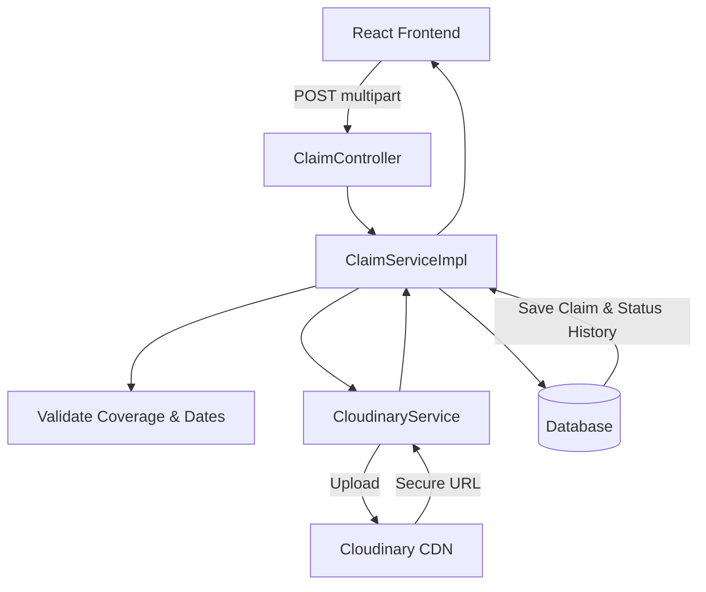
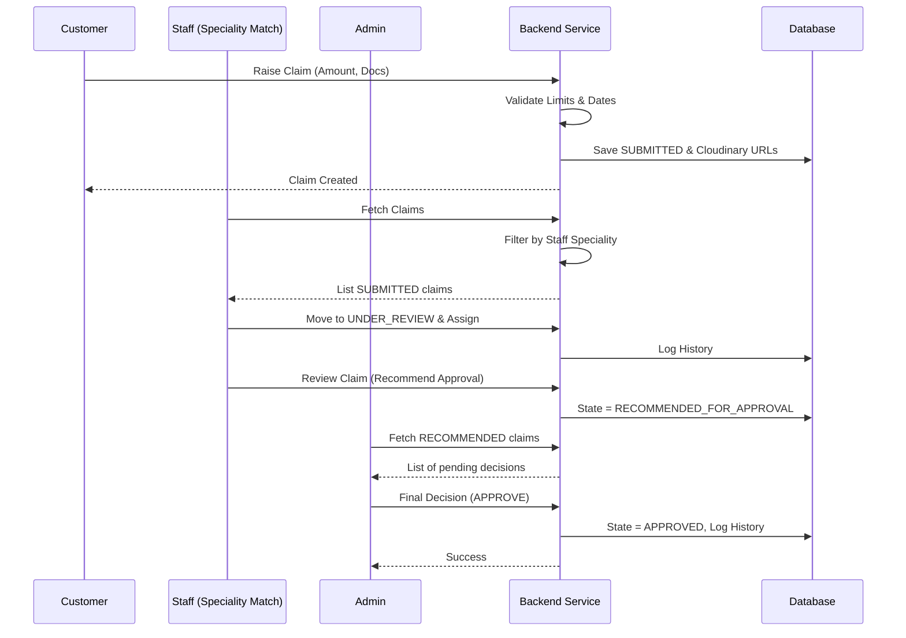
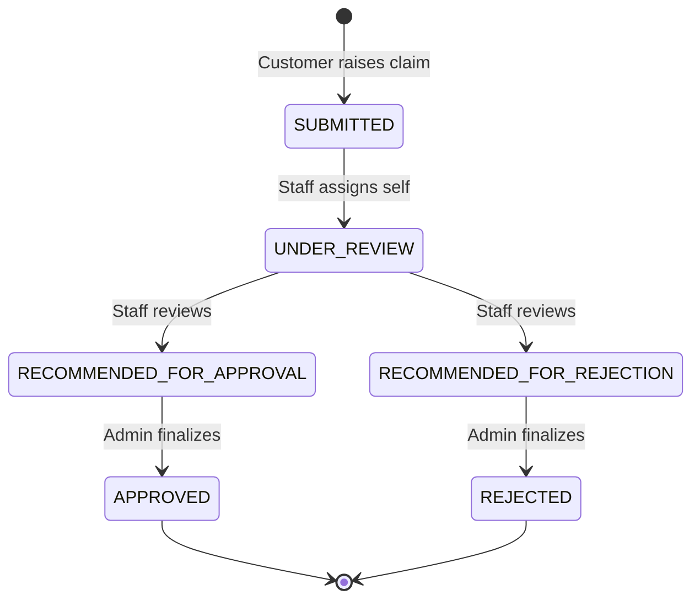

# Claim Flow
> The authoritative claim narrative: tracking the claim lifecycle from customer submission with Cloudinary evidence, through staff review, to the admin's final adjudication.

---

## Purpose
This document provides the single source of truth for the complete claim lifecycle. It covers how a claim transitions through its state machine, how evidence is stored, and how roles (Customer, Staff, Admin) interact with the workflow.

---

## Overview
- **Submission:** Customers raise claims against active policies, uploading mandatory evidence (PDF/Images) to Cloudinary.
- **Review:** Internal Staff (matching the product speciality) assign the claim to themselves, review evidence, and recommend approval or rejection.
- **Decision:** Admins make the final, immutable decision to approve or reject based on the staff recommendation.
- **Audit Trail:** Every status change is logged with actor details, remarks, and timestamps in `ClaimStatusHistory`.

---

## Business Context
Claims represent financial outflow. Strict governance is essential. Customers can only claim up to their remaining coverage amount. Staff act as investigators—they can recommend but cannot approve their own cases (separation of duties). Admins act as final arbiters. Full audit trails ensure regulatory compliance.

---

## Feature Flow

```mermaid
flowchart TD
    Start([Customer Raises Claim]) --> ValPolicy{Active Policy?}
    ValPolicy -- No --> ErrNotActive[Fail: POLICY_NOT_ACTIVE]
    ValPolicy -- Yes --> ValLimit{Amount <= Remaining?}
    
    ValLimit -- No --> ErrLimit[Fail: EXCEEDS_LIMIT]
    ValLimit -- Yes --> Upload[Upload Docs to Cloudinary]
    
    Upload --> StateSub[Claim SUBMITTED]
    StateSub --> StaffQueue[Staff View (Filtered by Speciality)]
    
    StaffQueue --> Assign[Staff Assigns to Self]
    Assign --> StateRev[UNDER_REVIEW]
    
    StateRev --> Rec{Staff Recommendation}
    Rec -- Approve --> RecApp[RECOMMENDED_FOR_APPROVAL]
    Rec -- Reject --> RecRej[RECOMMENDED_FOR_REJECTION]
    
    RecApp --> AdminDec[Admin Final Decision]
    RecRej --> AdminDec
    
    AdminDec -- Admin Approves --> FinalApp[APPROVED]
    AdminDec -- Admin Rejects --> FinalRej[REJECTED]
    
    FinalApp --> End([Terminal State])
    FinalRej --> End
```

---

## System Flow



---

## Sequence Diagram



---

## Database Design

| Entity | Purpose | Relationships |
|---|---|---|
| `Claim` | Core claim record (amount, incident date). | Many-to-One to `Policy`. |
| `ClaimDocument` | Stores Cloudinary URLs and metadata. | Many-to-One to `Claim`. |
| `ClaimStatusHistory` | Immutable audit trail of every change. | Many-to-One to `Claim`. |

**Why this design?**
Separating `ClaimStatusHistory` provides a built-in event log that easily powers the frontend "History Tracking" tab without requiring complex JSON auditing or external tools. 

---

## Claim State Machine



---

## Eligibility Check Rules

| Check | Condition | Failure Action |
|---|---|---|
| **Policy Status** | Must be exactly `ACTIVE`. | 400 `POLICY_NOT_ACTIVE` |
| **Ownership** | Requesting user must own the policy. | 400 `POLICY_NOT_OWNED` |
| **Remaining Cover** | `claimAmount <= (totalCover - sum(non_rejected_claims))` | 400 `EXCEEDS_LIMIT` |
| **Incident Date** | Must be within `[policyStartDate, policyEndDate]`. | 400 `INCIDENT_DATE_OUT_OF_BOUNDS` |
| **Evidence** | Must contain at least 1 valid PDF or Image (<5MB). | 400 Bad Request |

---

## Error Handling

| Scenario | HTTP Code | Resolution |
|---|---|---|
| Invalid File Type | 400 | Reject with allowed types (PDF, JPG, PNG). |
| Cloudinary Upload Failure | 500 | Transaction rolls back, prompt user to retry. |
| Staff processing wrong speciality | 403 | Forbidden, blocked at controller layer. |
| Admin deciding early | 400 | Ensure claim is in a `RECOMMENDED_*` state. |

---

## Design Decisions

- **Why use Cloudinary?**
  Storing files locally on a Spring Boot server doesn't scale horizontally and risks disk exhaustion. Cloudinary handles CDN delivery, format optimization, and secure URL generation seamlessly.
- **Why is there a dual-step approval (Staff -> Admin)?**
  To enforce separation of duties. Staff members do the ground work and investigation but cannot unilaterally authorize payouts, preventing internal fraud.
- **Why filter claims by `productSpeciality` for staff?**
  A Health Insurance investigator isn't trained to adjudicate Motor Insurance claims. The backend strictly enforces that staff only see and interact with their assigned domains.
- **Why is Remaining Cover calculated dynamically?**
  Instead of keeping a `remainingBalance` field on the policy (which risks race conditions), we compute it on the fly: `Coverage - SUM(approved + pending claims)`. This is safer for concurrency.

---

## Interview Notes

1. **How do you handle file uploads in Spring Boot?**
   > We use `MultipartFile` in the controller, validate MIME types and sizes, and delegate the stream to the Cloudinary API for cloud storage.
2. **How does the system ensure an employee doesn't approve a fraudulent claim?**
   > Through Separation of Duties. The Staff role can only transition a claim to `RECOMMENDED_FOR_APPROVAL`. Only an Admin can transition it to `APPROVED`.
3. **How do you calculate remaining policy coverage safely?**
   > We dynamically sum all non-rejected claims associated with the policy and subtract it from the total selected coverage at the time of the request to prevent race conditions.
4. **How do you maintain a claim audit trail?**
   > Every state transition triggers a write to the `ClaimStatusHistory` table, recording the old state, new state, actor email, timestamp, and remarks.
5. **Can an Admin skip the staff review process?**
   > No, the state machine strictly enforces that the final decision endpoint only accepts claims that are in `RECOMMENDED_FOR_APPROVAL` or `RECOMMENDED_FOR_REJECTION`.
6. **How is data privacy handled for claims?**
   > Role-Based Access Control (RBAC). Customers only see their own claims. Staff only see claims matching their `productSpeciality`. Admins see all.

---

## Related Documents
- [Claim API](../03_API/Claim_API.md)
- [Business Rules](../02_Business_Domain/Business_Rules.md)

---

## Future Enhancements
- Implement OCR (Optical Character Recognition) on uploaded invoices for automated data entry.
- Integrate an actual payout/disbursement API webhook once a claim is APPROVED.
