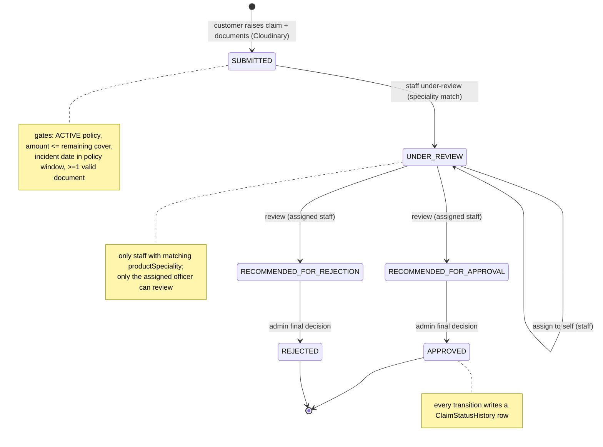

# Claim Flow

> The authoritative claim narrative: raising a claim with documents, validation, the `SUBMITTED → UNDER_REVIEW → RECOMMENDED_* → APPROVED/REJECTED` state machine, Cloudinary document storage, and the audit trail.

## Purpose

Single source of truth for how a claim moves from customer submission to final admin decision. The claim state machine and its transition rules are authoritative in `../02_Business_Domain/Claim_Workflow.md` and `../02_Business_Domain/Business_Rules.md` (section 5–6); endpoint contracts are in `../03_API/Claim_API.md`; the customer/staff/admin UI journey is covered here.

## Overview

A customer with an `ACTIVE` policy raises a claim via multipart upload (`ClaimRequestDTO` + document files). The service validates ownership, policy status, amount within remaining cover, incident date, and documents, then persists the claim as `SUBMITTED`, uploads the documents to Cloudinary, and writes the first `ClaimStatusHistory` row. Staff with a matching `productSpeciality` move it to `UNDER_REVIEW`, assign it, and review it to either `RECOMMENDED_FOR_APPROVAL` or `RECOMMENDED_FOR_REJECTION`. The admin then issues the final `APPROVED` or `REJECTED` decision. Every transition is recorded with actor, remarks, and timestamp.

## Business Context

Claims move money, so every gate exists to protect both the customer and the insurer: only active policies are claimable, the amount must fit the remaining cover of the policy, the incident must fall inside the policy window, and evidence (documents) is mandatory. Separation of duties means investigators recommend but never approve their own case — the admin signs off. The full history trail gives regulators and customers a complete, attributable record.

## Technical Design

### ClaimStatus state machine

```
SUBMITTED ──under-review (staff)────────▶ UNDER_REVIEW
UNDER_REVIEW ──assign (staff)──────────▶ UNDER_REVIEW (assignedStaff set)
UNDER_REVIEW ──review (assigned staff)─▶ RECOMMENDED_FOR_APPROVAL
UNDER_REVIEW ──review (assigned staff)─▶ RECOMMENDED_FOR_REJECTION
RECOMMENDED_FOR_APPROVAL ──final-decision (admin)──▶ APPROVED  (terminal)
RECOMMENDED_FOR_REJECTION ──final-decision (admin)──▶ REJECTED  (terminal)
```

Only these transitions exist. Staff can never set `APPROVED`/`REJECTED`; admin can only set `APPROVED`/`REJECTED` from a `RECOMMENDED_*` state; terminal states are immutable.

### Raise-claim validation (in order, `ClaimServiceImpl.raiseClaim`)

1. **Documents** — at least one file; files non-empty, valid names, content type `application/pdf` or `image/*`, each ≤ 5 MB on the raise path.
2. **Amount** — `claimAmount` positive.
3. **Ownership** — the policy belongs to the authenticated customer (400 `POLICY_NOT_OWNED`).
4. **Policy status** — must be `ACTIVE` (400 `POLICY_NOT_ACTIVE`).
5. **Remaining cover** — `remainingCoverage = selectedCoverage − Σ(claims with status != REJECTED)`; `claimAmount ≤ remainingCoverage` (400 `EXCEEDS_LIMIT` + the remaining amount).
6. **Incident date** — not in the future; within `[startDate, endDate]` inclusive (400 `FUTURE_INCIDENT_DATE` / `INCIDENT_DATE_OUT_OF_BOUNDS`).

On success: claim saved as `SUBMITTED` with generated `claimNumber = CLM-xxxxxxxx`; documents uploaded to Cloudinary (`ClaimDocumentServiceImpl.addDocumentsToClaim`, secure URLs stored on `ClaimDocument`); a `ClaimStatusHistory` row `SUBMITTED` is recorded with the customer's email.

### Document storage

`CloudinaryServiceImpl.uploadFile` returns metadata whose `secure_url` is stored as `ClaimDocument.documentReference` along with original file name, content type, and upload time. Appending more documents is allowed only by the policy owner (`POST /api/document/upload/{claimId}`) and enforces JPEG/PNG/PDF with a 10 MB per-file limit.

### Staff review gates

- `under-review` (`PATCH .../{claimId}/under-review`): speciality must match the claim's product type; only from `SUBMITTED`; not already finalised.
- `assign` (`PATCH .../{claimId}/assign`): only while `SUBMITTED`; only a matching speciality; cannot reassign a claim already assigned to another officer.
- `review` (`PATCH .../{claimId}/review`): the caller must be the assigned staff; the claim must be `UNDER_REVIEW`; `recommendedStatus` must be `RECOMMENDED_FOR_APPROVAL` or `RECOMMENDED_FOR_REJECTION`; `remarks` recorded.

### Admin final decision

`PATCH .../{claimId}/final-decision` (role `ROLE_ADMIN`): `recommendedStatus` must be `APPROVED` or `REJECTED`; the claim must currently be in `RECOMMENDED_FOR_APPROVAL`/`RECOMMENDED_FOR_REJECTION`; `adminRemarks` recorded. Terminal states cannot be changed.

### Audit trail

`ClaimStatusHistory` rows (`GET /api/claims/{claimId}/history`, paginated/filterable by `updatedBy` and `status`) capture `previousStatus`, `newStatus`, `remarks`, `updatedBy` (email), `updatedDate`. One row is written at submission and on every staff/admin transition, including the assignment event ("Staff member assigned").

### Reading permissions

- Customer: own claims, own claim history, and claims by policy — everything else 403.
- Staff: claims/history matching their speciality (no speciality → empty list / 403 on detail).
- Admin: all claims.

## Workflow

### Customer UI

1. `/customer/claims/raise` → select an `ACTIVE` policy, enter claim amount, reason, incident date, attach ≥1 file → `POST /api/claims/raise` (multipart). Backend validation as above. Claim appears `SUBMITTED` in `/customer/claims`.
2. Add more evidence later via `/customer/claims/upload/:claimId` → `POST /api/document/upload/{claimId}`.
3. Track at `/customer/claims/:claimId` (status, staff remarks, admin remarks, documents) and `/customer/claims/:claimId` history tab (audit trail).

### Staff UI

4. `/staff/claims` shows only claims of the officer's `productSpeciality`. On a claim: "Move to under review" → "Assign to self" → "Review" with `RECOMMENDED_FOR_APPROVAL` / `RECOMMENDED_FOR_REJECTION` and remarks.

### Admin UI

5. `/admin/claims` lists everything. On a `RECOMMENDED_*` claim, `/admin/claims/:id` shows the staff recommendation, then "Approve"/"Reject" issues `PATCH .../final-decision`. Both customer and staff see the final status through their own lists.



## Code References

- `controller/ClaimController.java` (raise, my-claims, paginated list, detail, history, under-review, assign, review, final-decision), `controller/ClaimDocumentController.java` (upload), `controller/PolicyController.java` (`GET /api/policies/{policyId}/claims`).
- `serviceimpl/ClaimServiceImpl.java` (validation, transitions, history), `serviceimpl/ClaimDocumentServiceImpl.java` (Cloudinary), `serviceimpl/CloudinaryServiceImpl.java`.
- `model/{Claim,ClaimDocument,ClaimStatusHistory,Policy}.java`, `enums/ClaimStatus.java`, `enums/PolicyStatus.java`.
- `util/ClaimNumberGenerator.java`.
- Frontend: `src/pages/customer/claims/{RaiseClaimPage,UploadDocumentsPage,ClaimDetailsPage,CustomerClaimListPage}.jsx`, `src/pages/staff/claims/{StaffClaimListPage,StaffClaimDetailPage}.jsx`, `src/pages/admin/claims/{ClaimListPage,ClaimDetailPage}.jsx`.

All backend paths under `insurance-policy-claim-management-system/src/main/java/com/insurance/demo/`.

## Diagrams

- Transition rules and role matrix: `../02_Business_Domain/Claim_Workflow.md`.
- Sequence diagrams: `../09_Diagrams/Sequence_Diagrams/`; activity diagrams: `../09_Diagrams/Activity_Diagrams/`.

## Best Practices

- Validation order is deterministic and message-specific, so customers are told exactly why a claim was rejected.
- Remaining-cover is computed from `selectedCoverage` minus non-rejected claims, preventing over-commitment of a single policy.
- Mandatory documents with type/size limits and secure Cloudinary URLs keep evidence auditable.
- Every transition is history-logged with actor and remarks — the claim is fully reconstructable.

## Future Improvements

- Scheduled follow-ups for claims idle in `UNDER_REVIEW`/`RECOMMENDED_*`.
- Document preview/OCR and fraud-scoring integration.
- Claim payout workflow (disbursement tracking) after `APPROVED`.
- See `../10_Evaluation/Future_Enhancements.md`.
