# Customer Flow

> The end-to-end customer journey in the Insurance Policy & Claim Management System: onboarding, profile creation, product/plan browsing, quoting, purchasing, paying, claiming, and tracking history.

## Purpose

Narrates the complete customer experience across the React frontend (`insurance-policy-claim-management-app-ui/src/pages`) and the Spring Boot backend (port **8081**, `/api` prefix), mapping each UI step to the endpoints that serve it. Endpoint payloads are authoritative in `../03_API/*`; business rules in `../02_Business_Domain/Business_Rules.md`.

## Overview

A customer registers and verifies their identity via dual OTP, logs in, completes their profile, browses active products and plans, obtains a quote, purchases a policy (which starts `PENDING_PAYMENT`), pays to activate it, and — when an incident occurs — raises and tracks a claim against the active policy. Throughout, the customer can view their policies, payments, claims, and profile. The role namespace is `/customer/*`, guarded by `RoleProtectedRoute`; the customer dashboard is `/customer/dashboard`.

## Business Context

The customer is the buyer and the claimant. Their journey must be frictionless but safe: purchases are blocked until the profile is complete, a quote can only be purchased while unexpired, a policy only becomes `ACTIVE` after payment, and claims are only accepted on `ACTIVE` policies within the remaining cover. Each invariant is enforced server-side, so the UI guidance below is a convenience, not a guarantee.

## Technical Design

### Stage-by-stage map

| Stage | UI route | Endpoint(s) |
|---|---|---|
| 1. Register | `/register` | `POST /api/auth/register` |
| 2. Verify | `/verify-otp` | `POST /api/auth/verify-otp`, `POST /api/auth/resend-otp` |
| 3. Login | `/login` | `POST /api/auth/login` |
| 4. Create / edit profile | `/customer/profile`, `/customer/profile/edit` | `POST /api/customers`, `GET /api/customers/profile`, `PUT /api/customers/{customerId}` |
| 5. Browse products | `/customer/products` | `GET /api/products/active`, `GET /api/products/{id}` |
| 6. Browse plans | `/customer/plans`, `/customer/products/:productId/plans` | `GET /api/plans/active`, `GET /api/plans/{productId}/active`, `GET /api/plans/{planId}` |
| 7. Quote | `/customer/purchase-policy/:planId` (steps Coverage → Duration → Quote) | `POST /api/premium/calculate` |
| 8. Purchase | same page (Confirm & Purchase) | `POST /api/policies/purchase` |
| 9. Pay | `/customer/payments/pay/:policyId` | `POST /api/payments` |
| 10. My policies | `/customer/policies`, `/customer/policies/:policyId` | `GET /api/policies/my-policies`, `GET /api/policies/{policyId}`, `GET /api/policies/{policyId}/claims` |
| 11. Raise claim | `/customer/claims/raise` | `POST /api/claims/raise` (multipart) |
| 12. Upload docs | `/customer/claims/upload/:claimId` | `POST /api/document/upload/{claimId}` (multipart) |
| 13. Track claim | `/customer/claims`, `/customer/claims/:claimId` | `GET /api/claims/my-claims`, `GET /api/claims/{claimId}`, `GET /api/claims/{claimId}/history` |
| 14. Payments history | `/customer/payments` | `GET /api/payments/my-payments`, `GET /api/payments/my-policies/{policyId}`, `GET /api/payments/{id}` |

### Route details

- Dashboard `/customer/dashboard` — summary cards (policies, active policies, claims, payments) via the service calls behind the pages above.
- Purchase wizard `PurchasePolicyPage` uses a 5-step `Stepper`: Coverage → Duration → Quote → Payment → Policy. Changing any selection invalidates the in-memory quote. The quote page shows a `QuoteCountdownTimer` tied to the 30-minute quote expiry.
- Claim screens: `RaiseClaimPage` submits the claim JSON plus document files as `multipart/form-data` (`@RequestPart("claim")` + `@RequestPart("files")`); `ClaimDetailsPage` shows status, remarks, documents, and the `ClaimStatusHistory` audit trail; `UploadDocumentsPage` appends more files.
- Payments: `RecordPaymentPage` pre-fills the amount from `calculatedPremium` and offers modes `UPI`, `CARD`, `NET_BANKING`, `CASH` and status `SUCCESS`/`FAILED`; `CustomerPaymentHistoryPage` lists payments with a PDF receipt download (`usePaymentPdf`, jsPDF).

### Key business gates encountered

- Purchase requires a **complete profile** (`isCustomerProfileComplete`: DOB, address, city, state, pin code, nominee) — `PolicyServiceImpl.purchasePolicy`.
- Quote must be `CREATED`, owned by the customer, unexpired (30 min), and its plan + product still active.
- HEALTH plans: one `ACTIVE`/`PENDING_PAYMENT` policy per customer+plan; non-HEALTH: one `PENDING_PAYMENT` per customer+plan.
- Payment must equal `calculatedPremium` exactly; `SUCCESS` flips the policy to `ACTIVE` (`PremiumPaymentServiceImpl.recordPayment`).
- Claims only on `ACTIVE` policies; incident date inside the policy window; amount within remaining cover; at least one document required.
- ANNUAL renewals are blocked until the 15-day early window before the next anniversary; ONE_TIME accepts exactly one `SUCCESS` payment.

## Workflow

1. **Onboard** — register on `/register`, verify both OTPs on `/verify-otp` (account becomes `ACTIVE`), sign in on `/login`.
2. **Complete profile** — the dashboard routes to profile creation; `POST /api/customers` persists DOB/address/nominee. Profile completion is a hard prerequisite for purchasing and for being issued a policy.
3. **Browse** — `/customer/products` lists active products by `ProductType` (HEALTH, MOTOR, LIFE, TRAVEL, INSURANCE). Selecting a product leads to `/customer/products/:productId/plans`; `/customer/plans` shows all active plans. `GET /api/plans/{planId}` supplies allowed durations, supported premium type, and coverage options.
4. **Quote** — `/customer/purchase-policy/:planId`: pick an active coverage amount, a duration from `allowedDurations`, confirm the plan's single premium type, then "Generate Quote" → `POST /api/premium/calculate` returns a `PremiumQuote` with `quoteId` (a `Quote` row, `CREATED`, 30-minute expiry).
5. **Purchase** — accept terms and "Confirm & Purchase" → `POST /api/policies/purchase` creates the policy `PENDING_PAYMENT` with pricing snapshots from the quote and marks the quote `USED`.
6. **Pay** — `/customer/payments/pay/:policyId` → `POST /api/payments` with the exact `calculatedPremium` amount and a payment mode; `SUCCESS` sets the policy `ACTIVE`.
7. **Claim** — on an incident, `/customer/claims/raise` submits the claim with documents; the claim is created `SUBMITTED`. Track on `/customer/claims/:claimId` as staff move it to `UNDER_REVIEW`, staff recommend, and admin decides (`APPROVED`/`REJECTED`). More documents can be appended on `/customer/claims/upload/:claimId`.
8. **Review history** — `/customer/policies` for policies, `/customer/payments` for receipts (PDF export), `/customer/claims` for claims and their audit trail.

```mermaid
flowchart LR
    A([Register /register]) --> B([Verify /verify-otp]) --> C([Login /login])
    C --> D([Profile /customer/profile])
    D --> E([Products /customer/products]) --> F([Plans /customer/plans])
    F --> G([Quote /customer/purchase-policy/:planId])
    G --> H([Purchase -> PENDING_PAYMENT])
    H --> I([Pay -> ACTIVE /customer/payments/pay/:policyId])
    I --> J([Raise claim /customer/claims/raise])
    J --> K([Track claim /customer/claims/:claimId])
    K --> L([History /customer/payments . /customer/policies . /customer/claims])
```

## Code References

- Pages: `src/pages/customer/**` (`CustomerDashboard`, `ProfilePage`, `EditProfilePage`, `CustomerProductListPage`, `CustomerPlanListPage`, `PurchasePolicyPage`, `CustomerPolicyListPage`, `CustomerPolicyDetailPage`, `RecordPaymentPage`, `CustomerPaymentHistoryPage`, `RaiseClaimPage`, `UploadDocumentsPage`, `ClaimDetailsPage`, `CustomerClaimListPage`).
- Services: `src/services/{authService,quoteService,policyService,paymentService,claimService,productService,planService,customerService}.js`; hooks `src/hooks/useApiTable`, `src/hooks/PdfDownload/usePaymentPdf`.
- Backend: `serviceimpl/{AuthServiceImpl,CustomerServiceImpl,PremiumCalculationServiceImpl,PolicyServiceImpl,PremiumPaymentServiceImpl,ClaimServiceImpl,ClaimDocumentServiceImpl}.java`.
- Routes/guards: `src/App.jsx` (`GuestRoute`, `ProtectedRoute`, `RoleProtectedRoute`, `DashboardRedirect`).

All backend paths under `insurance-policy-claim-management-system/src/main/java/com/insurance/demo/`.

## Diagrams

- Purchase and payment sequence: `../08_Workflows/Purchase_Flow.md`, `../08_Workflows/Payment_Flow.md`.
- Claim lifecycle: `../08_Workflows/Claim_Flow.md`.
- Authentication sequence: `../08_Workflows/Authentication_Flow.md`.
- Supporting activity/sequence diagrams: `../09_Diagrams/Activity_Diagrams/`, `../09_Diagrams/Sequence_Diagrams/`.

## Best Practices

- The wizard invalidates quotes on any selection change and counts down the 30-minute expiry, so a stale quote is never submitted.
- The UI pre-fills payment amounts from `calculatedPremium`, matching the server's exact-equality rule.
- Every customer-facing list is paginated and sorted server-side; ownership checks are enforced in services, never only in the UI.
- Claim documents are validated (type/size) on both raise and append paths before reaching Cloudinary.

## Future Improvements

- Inline profile-completion prompts with a guided wizard on first login.
- Email/SMS status notifications pushed to customers on policy and claim status changes.
- Recurring ANNUAL payment reminders when the renewal window opens.
- See `../10_Evaluation/Future_Enhancements.md`.
