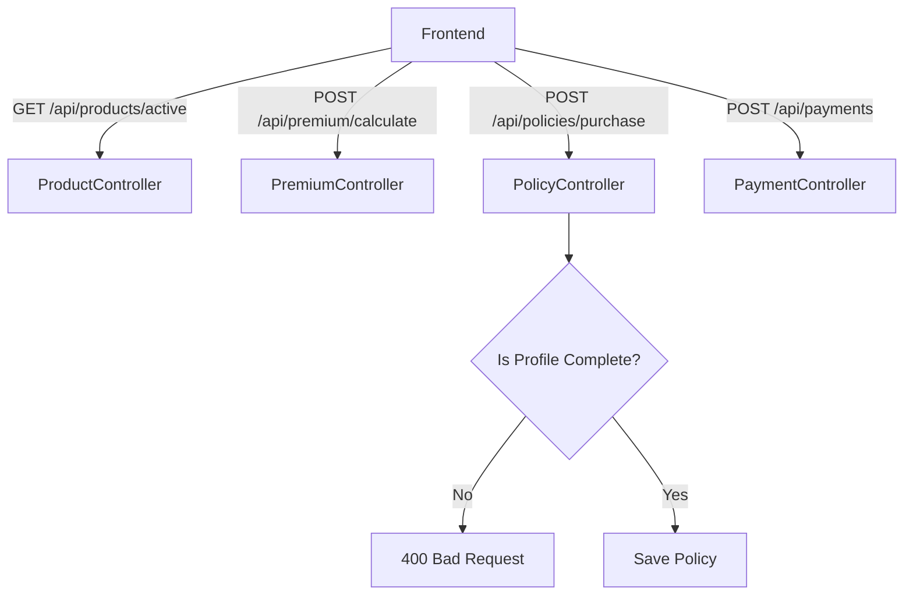
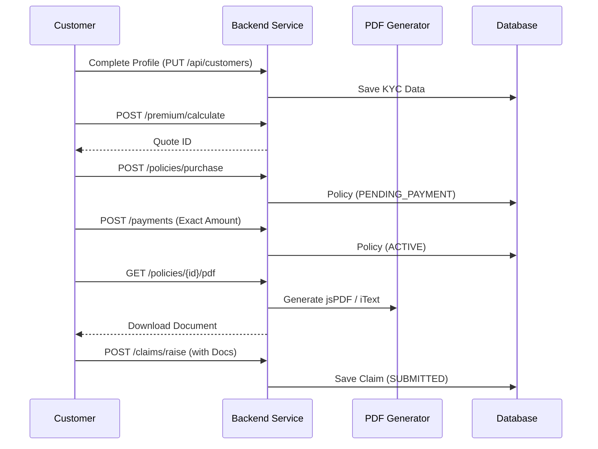

# Customer Flow
> The customer's complete journey: from onboarding and KYC completion, to quoting, purchasing, paying, and finally claiming against a policy.

---

## Purpose
This document maps out the end-to-end journey of a `ROLE_CUSTOMER` user within the system. It covers onboarding, browsing products, completing a purchase pipeline, and managing post-purchase activities like document generation and claims.

---

## Overview
- **Onboarding:** Register via dual-OTP, login, and complete the mandatory profile (KYC).
- **Purchasing:** Browse active products/plans, configure coverage, request a quote, and purchase.
- **Payment & Documents:** Complete exactly matched payments to activate policies, then download PDF receipts.
- **Servicing:** Raise claims with Cloudinary evidence tracking, or cancel eligible policies.

---

## Business Context
The customer portal is the revenue engine. It must balance frictionless user experience with strict legal compliance (KYC profiles) and financial accuracy. The entire flow is designed to be self-serve, empowering customers to handle quotes, payments, and claims digitally without requiring staff intervention.

---

## Feature Flow

```mermaid
flowchart TD
    Start([Anonymous User]) --> Reg[Register & Dual OTP]
    Reg --> Login[Login (JWT)]
    
    Login --> Profile[Complete Profile KYC]
    Profile --> Browse[Browse Products & Plans]
    
    Browse --> Config[Configure Coverage & Duration]
    Config --> Quote[Generate Quote]
    
    Quote --> Purchase[Accept Quote -> PENDING_PAYMENT]
    Purchase --> Pay[Exact Match Payment]
    Pay --> Active[Policy ACTIVE]
    
    Active --> Claim[Raise Claim]
    Claim --> Track[Track Claim Status]
    
    Active --> Doc[Download PDF Receipts]
    Active --> Cancel[Cancel Policy]
```

---

## Profile Completion Requirement Diagram

```mermaid
flowchart LR
    subgraph Incomplete Profile
        Reg[Registered]
        NoDOB[Missing DOB]
        NoAddr[Missing Address]
    end
    
    subgraph Complete Profile
        Full[KYC Complete]
        Quote[Can Generate Quote]
        Buy[Can Buy Policy]
    end
    
    Incomplete Profile -- POST /api/customers --> Complete Profile
    
    Incomplete Profile -.->|Blocked: 400 COMPLETE_PROFILE_FIRST| Buy
```

---

## System Flow



---

## Sequence Diagram (Purchase & Claim)



---

## Database Design

| Entity | Purpose | Relationships |
|---|---|---|
| `AppUser` | Auth credentials. | One-to-One to `Customer`. |
| `Customer` | Profile/KYC data (DOB, Address). | One-to-Many to `Policy`. |

**Why this design?**
By separating `AppUser` from `Customer`, we keep authentication logic isolated from business domain logic. A customer might not complete their profile immediately, so the `Customer` table acts as a progressive enhancement to their basic identity.

---

## Business Rules

| Rule | Description | Why it exists |
|---|---|---|
| **KYC Enforcement** | Profile must contain Address, DOB, and Nominee before purchase. | Legally required to bind an insurance contract. |
| **PDF Generation** | Receipts and policy documents are dynamically generated. | Prevents storing millions of static files. |
| **Cancellation Lock** | Policies cannot be cancelled if they have open claims. | Prevents fraud/abuse of the refund system. |

---

## Validation Rules

- **Profile:** DOB must be in the past. Address, city, state, pincode, and nominee cannot be empty.
- **Quote / Purchase / Claim:** See respective flow documents for deep validation rules.
- **PDF Download:** User must own the requested policy or payment record.

---

## Error Handling

| Scenario | HTTP Status | Behavior |
|---|---|---|
| Buying with incomplete profile | 400 Bad Request | Front-end intercepts and redirects to Profile page. |
| Accessing another user's policy | 403 Forbidden | Blocked by ownership checks in the service layer. |
| Canceling policy with open claim | 400 Bad Request | Blocked by state validation. |

---

## Design Decisions

- **Why is PDF generation done on the fly?**
  Policy documents contain dynamic data that rarely changes, but storing millions of PDFs wastes storage. Generating them dynamically using `jsPDF` (frontend) or `iText` (backend) is compute-cheap and storage-free.
- **Why is the Customer journey self-serve?**
  Reduces overhead. The system uses strict validations (e.g., exact payment matching, remaining cover calculation) to ensure customers cannot accidentally break the system state while navigating it alone.

---

## Interview Notes

1. **How do you ensure a user completes their profile before buying?**
   > The backend `PolicyServiceImpl` executes `isCustomerProfileComplete()` which checks for nulls on mandatory KYC fields. If it fails, it throws a 400 error which the frontend catches to redirect the user to the profile setup page.
2. **How is PDF generation handled?**
   > For simple receipts, it can be handled via frontend libraries like `jsPDF` capturing the DOM. For legally binding policy documents, it's generated backend-side using libraries like iText or PDFBox to ensure structural integrity and prevent tampering.
3. **How does the system prevent a customer from viewing someone else's policy?**
   > Every service method fetching a resource first retrieves the authenticated user's email from the `SecurityContext` and validates that it matches the owner of the requested entity.
4. **Why is the Quote separated from the Policy?**
   > A Quote is a temporary price snapshot. If a user abandons the cart, we don't want empty/unpaid policies cluttering the system. It transitions into a Policy only upon explicit purchase intent.
5. **How is policy cancellation handled?**
   > The system checks if there are any active claims. If not, the status is set to `CANCELLED`. In a real-world scenario, this would trigger a prorated refund workflow.

---

## Related Documents
- [Purchase Flow](Purchase_Flow.md)
- [Payment Flow](Payment_Flow.md)

---

## Future Enhancements
- Introduce prorated refund calculations on cancellation.
- Add digital wallet integration for storing policy PDFs.
