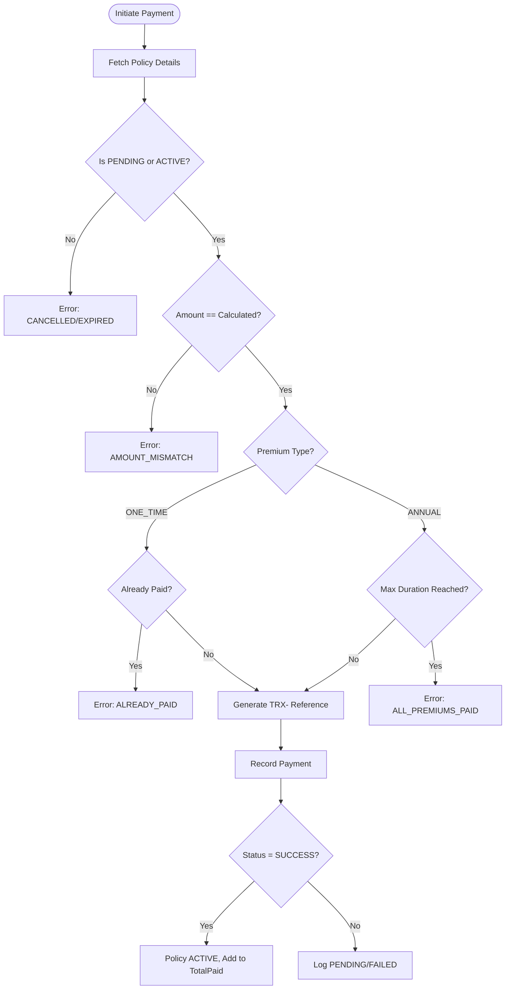
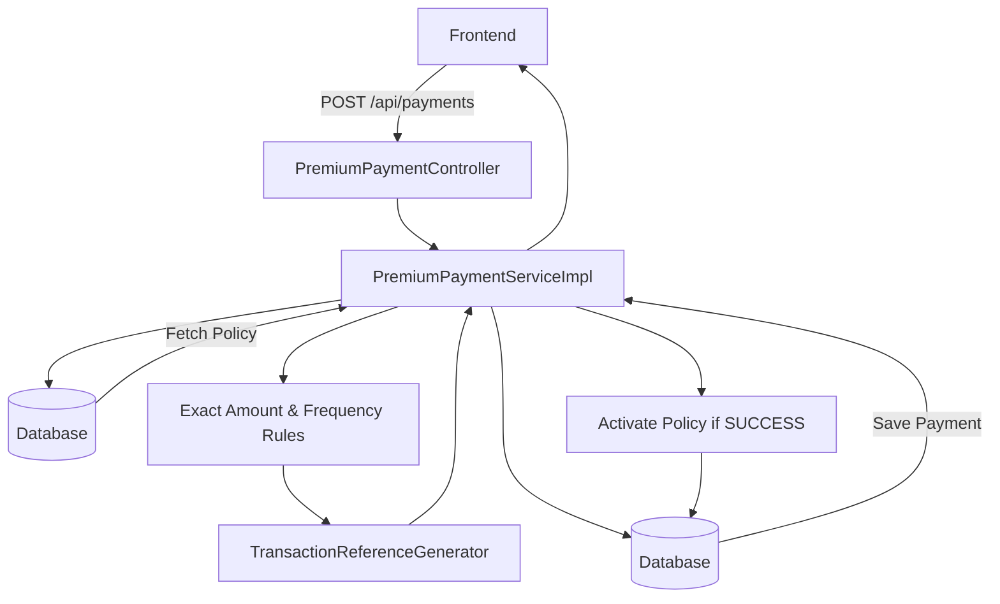
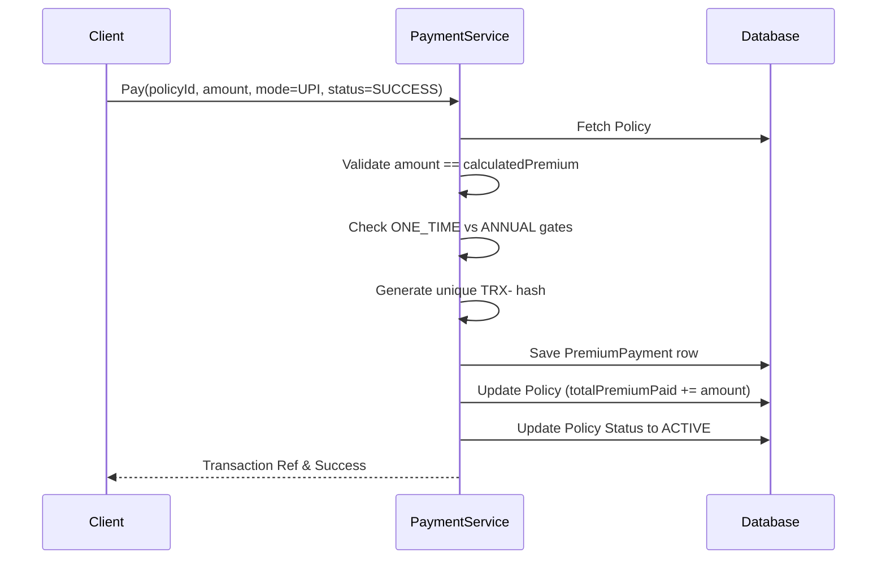
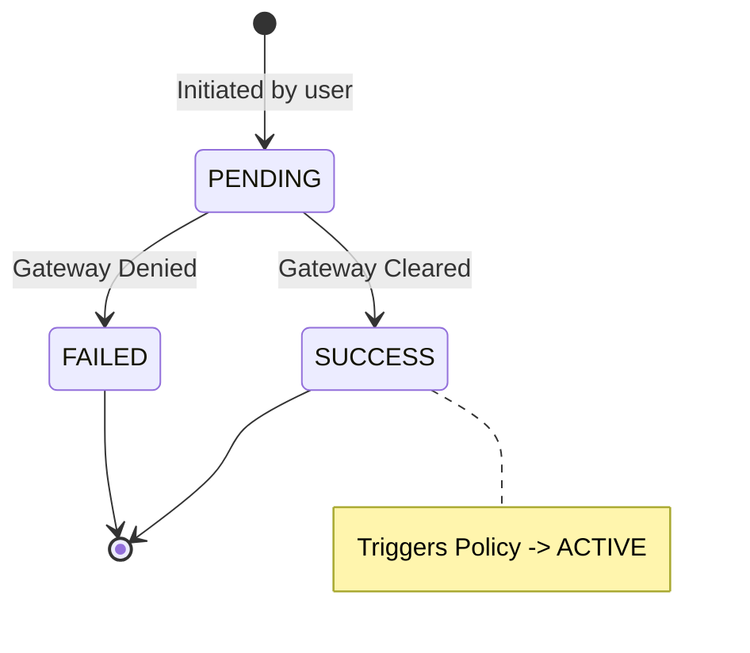

# Payment Flow
> The exact-match financial gateway: handling ONE_TIME vs ANNUAL premiums, transaction tracking, and policy activation.

---

## Purpose
Describes the financial settlement phase of the system. It covers how payments are recorded, how exact-amount validation ensures ledger accuracy, and how successful payments trigger policy activation.

---

## Overview
- **Payment Types:** Supports `ONE_TIME` (single lump sum) and `ANNUAL` (recurring) premium structures.
- **Exact Validation:** The requested payment amount must exactly equal the `calculatedPremium` derived during the quote phase.
- **Transaction Tracking:** Generates unique `TRX-` references for auditing.
- **Activation:** A `SUCCESS` payment flips the policy from `PENDING_PAYMENT` to `ACTIVE`.

---

## Business Context
Payments are the most critical data points in the system. Discrepancies between expected premiums and actual payments cause accounting nightmares. By enforcing an "exact match" rule, the system eliminates partial payments and rounding drift. The distinction between One-Time and Annual allows for flexible product offerings (e.g., a 3-year term paid upfront vs. paid yearly).

---

## Feature Flow

---

## System Flow

---

## Sequence Diagram

---

## Payment State Machine

---

## Database Design

| Entity | Purpose | Relationships |
|---|---|---|
| `PremiumPayment` | Ledger of transactions. | Many-to-One to `Policy`. |
| `Policy` | Holds `totalPremiumPaid` and `calculatedPremium`. | - |

**Why this design?**
Storing `totalPremiumPaid` directly on the `Policy` avoids expensive SUM aggregations during frequent reads, while the `PremiumPayment` table acts as the immutable audit log.

---

## ONE_TIME vs ANNUAL

| Feature | ONE_TIME | ANNUAL |
|---|---|---|
| **Frequency** | Once at inception | Yearly, up to `policyDuration` |
| **Validation Gate** | Blocked if > 0 SUCCESS payments exist | Blocked if SUCCESS count >= duration |
| **Total Cost** | Usually includes a multi-year discount | Standard base rate multiplied by years |

---

## Business Rules

| Rule | Description | Why it exists |
|---|---|---|
| **Exact Amount Matching** | Amount paid must equal `calculatedPremium` using `BigDecimal.compareTo() == 0`. | Prevents fractional accounting errors and partial payments. |
| **Unique References** | Every payment gets a guaranteed unique `TRX-` string. | Crucial for bank reconciliation. |
| **Cumulative Cap** | `totalPremiumPaid` cannot exceed `calculatedPremium * duration`. | Prevents overcharging. |

---

## Error Handling

| Scenario | HTTP Status | Action / Meaning |
|---|---|---|
| Amount Mismatch | 400 Bad Request | The client payload was tampered with. |
| Paying Cancelled Policy | 400 Bad Request | Financial logic blocked. |
| Paying One-Time twice | 400 Bad Request | Duplication prevented. |

---

## Design Decisions

- **Why handle simulated payments?**
  In a real app, this endpoint would be a Webhook receiver from Stripe or Razorpay. By building it to accept `status` as a parameter, we simulate the webhook flow. In prod, the endpoint is secured to only accept signed requests from the gateway.
- **Why use `BigDecimal`?**
  Floating-point math (`double`/`float`) creates precision errors in Java (e.g., 0.1 + 0.2 = 0.30000000000000004). `BigDecimal` provides exact precision for financial calculations.

---

## Interview Notes

1. **How do you handle currency precision in Java?**
   > I strictly use `BigDecimal` for all monetary values and use `.compareTo() == 0` for exact equality checks to avoid floating-point drift.
2. **What happens if a user tries to pay half their premium?**
   > The system throws a 400 error `AMOUNT_MISMATCH`. We strictly enforce that the requested amount exactly matches the `calculatedPremium` snapshot on the policy.
3. **How is a policy activated?**
   > Once a `PremiumPayment` record is saved with a status of `SUCCESS`, the service immediately updates the associated `Policy` status from `PENDING_PAYMENT` to `ACTIVE`.
4. **How do you ensure transaction references are unique?**
   > They are generated cryptographically (`TRX-` + hex string) and the database column has a `UNIQUE` constraint to prevent collisions at the schema level.
5. **How does the system distinguish between One-Time and Annual logic?**
   > The service checks the `premiumType` on the policy. If One-Time, it asserts no prior successful payments exist. If Annual, it ensures the count of successful payments doesn't exceed the policy duration.

---

## Related Documents
- [Purchase Flow](Purchase_Flow.md)
- [Premium Calculation](../02_Business_Domain/Premium_Calculation.md)
