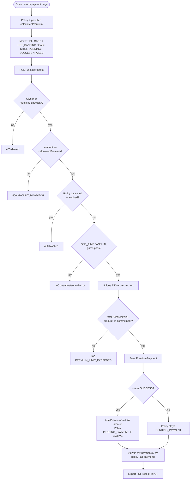

# Payment Flow

> The payment narrative: supported modes, recording a premium payment, status handling, the exact-amount rule, policy activation, transaction references, payment history views, and PDF receipt export.

## Purpose

Explains how premium payments are recorded and tracked from a single endpoint (`POST /api/payments`) and its read side, and how a successful payment activates a policy. Business rules (exact-amount match, one-time/annual gates) are catalogued in `../02_Business_Domain/Business_Rules.md` (section 4); the request/response contracts are in `../03_API/Payment_API.md`.

## Overview

A payment is a `PremiumPayment` row bound to a policy, carrying an amount, a `PaymentMode`, a `PaymentStatus` (`PENDING`, `SUCCESS`, `FAILED`), a globally unique `transactionReference`, and a timestamp. Recording a payment is a deliberate, validated act — the amount must exactly equal the policy's `calculatedPremium`, and a `SUCCESS` payment adds to `totalPremiumPaid` and flips the policy to `ACTIVE`. Customers pay their own policies; staff may pay within their `productSpeciality`. Customers can view history (`/customer/payments`, per-policy), staff and admin can view all payments with filters, and any payment can be exported as a PDF receipt.

## Business Context

Premium reconciliation is the financial heart of the business. The exact-amount rule means the quoted premium is the payable amount — nothing more, nothing less. ONE_TIME policies take exactly one successful payment; ANNUAL policies take up to `policyDuration` yearly payments gated by a 15-day early-renewal window. Every payment is uniquely referenced (`TRX-` + 12 uppercase hex chars) so banks and auditors can trace a transaction unambiguously.

## Technical Design

### Payment modes and status

- `PaymentMode` {UPI, CARD, NET_BANKING, CASH} — selected from the UI (`PAYMENT_MODE_OPTIONS`).
- `PaymentStatus` {PENDING, SUCCESS, FAILED} — recorded per the caller.

### Recording a payment (`PremiumPaymentServiceImpl.recordPayment`)

1. Load the policy; access control:
   - Customer: only their own policy (403 `NOT_OWN_POLICY_PAYMENT`).
   - Staff: only a policy whose product type matches their speciality (403 `SPECIALITY_RECORD_PAYMENT_DENIED`).
2. **Exact-amount rule**: `policy.calculatedPremium.compareTo(dto.amount) != 0` → 400 `AMOUNT_MISMATCH`. The amount must equal the quoted total exactly.
3. Reject `CANCELLED` (400 `CANCELLED_POLICY_RESTRICTED`) and `EXPIRED` (400 `EXPIRED_POLICY_RESTRICTED`) policies.
4. Premium-type gates:
   - **ONE_TIME**: an existing `SUCCESS` payment blocks further payments (400 `ONE_TIME_ALREADY_PAID`).
   - **ANNUAL**: the next renewal is only eligible inside the 15-day window before the first anniversary of the latest `SUCCESS` payment (400 `EARLY_PAYMENT_RESTRICTION`); the count of `SUCCESS` payments must stay below `policyDuration` (400 `ALL_PREMIUMS_PAID`).
5. Generate `transactionReference = TRX-` + 12 uppercase hex characters (`TransactionReferenceGenerator`); a collision is a 409 `DUPLICATE_REFERENCE`.
6. Cumulative cap: `totalPremiumPaid + amount ≤ calculatedPremium × policyDuration` (400 `PREMIUM_LIMIT_EXCEEDED`).
7. Persist the payment with mode, reference, date.
8. On `SUCCESS`: `totalPremiumPaid += amount` and `policyStatus = ACTIVE`. `PENDING`/`FAILED` are recorded **without** activation — the policy stays `PENDING_PAYMENT`.

### PENDING handling

`PENDING` payments are persisted and listed in history but do not activate the policy. They represent unsettled or in-flight transactions; a later `SUCCESS` payment performs the activation. (Automated settlement via a payment-gateway webhook is a listed future improvement — see below.)

### Payment history views

| Audience | UI | Endpoint |
|---|---|---|
| Customer (all payments) | `/customer/payments` | `GET /api/payments/my-payments` |
| Customer (per policy) | `/customer/payments` policy tab | `GET /api/payments/my-policies/{policyId}` |
| Admin / staff (all, filtered) | `/admin/payments`, `/staff/payments` | `GET /api/payments/page?policyId=&paymentStatus=&transactionId=&minAmount=&maxAmount=` |
| Admin / staff (per policy) | policy detail | `GET /api/payments/policy/{id}` |
| All roles (single) | payment detail | `GET /api/payments/{id}` |

Staff pagination is scoped by `productSpeciality` (staff without a speciality see nothing). Customer reads enforce ownership.

### PDF receipt export

`src/hooks/PdfDownload/usePaymentPdf.js` builds a receipt with jsPDF (`doc.save('Receipt_<TRX>.pdf')`): header with product name ("InsuranceFlow"), transaction details table (reference, policy number, plan, product type, premium amount, mode, status, date), and a footer. Available from the payment history/detail screens for all roles.

### Policy interplay

- A `SUCCESS` payment activates a `PENDING_PAYMENT` policy; the customer can then raise claims against it (`../08_Workflows/Claim_Flow.md`).
- `totalPremiumPaid` and `remainingClaimAmount` are surfaced on the policy detail; the payment history is shown on the policy detail page.

## Workflow

1. Customer with a `PENDING_PAYMENT` policy opens `/customer/payments/pay/:policyId` (staff equivalent: `/staff/payments/pay/:policyId`). The amount field pre-fills from `calculatedPremium`.
2. The payer selects a mode (`UPI`/`CARD`/`NET_BANKING`/`CASH`) and a status (`SUCCESS` for an already-settled payment, `FAILED`/`PENDING` when appropriate) and submits `POST /api/payments`.
3. Server validates ownership/speciality, exact amount, policy status, one-time/annual gates, uniqueness, and the cumulative cap.
4. On `SUCCESS`: payment persisted, `totalPremiumPaid` incremented, policy → `ACTIVE`. On `PENDING`/`FAILED`: payment persisted, policy unchanged.
5. The payer views the result in `/customer/payments` (or `/admin/payments`, `/staff/payments`) and exports a PDF receipt.

## Code References

- `controller/PremiumPaymentController.java` — record + all read endpoints.
- `serviceimpl/PremiumPaymentServiceImpl.java` — all payment rules.
- `model/PremiumPayment.java`, `model/Policy.java`, `enums/{PaymentMode,PaymentStatus,PolicyStatus,PremiumType}.java`.
- `util/TransactionReferenceGenerator.java`.
- Frontend: `src/pages/customer/payments/{RecordPaymentPage,CustomerPaymentHistoryPage}.jsx`, `src/pages/staff/payments/{StaffRecordPaymentPage,StaffPaymentListPage}.jsx`, `src/pages/admin/payments/PaymentListPage.jsx`, `src/pages/{admin,staff}/policies/PolicyDetailPage.jsx` (payment-history tabs), `src/hooks/PdfDownload/usePaymentPdf.js`.

All backend paths under `insurance-policy-claim-management-system/src/main/java/com/insurance/demo/`.

## Diagrams

- Purchase + payment sequence: `../08_Workflows/Purchase_Flow.md`.
- Business rules catalogue: `../02_Business_Domain/Business_Rules.md`.
- Activity/sequence diagrams: `../09_Diagrams/Activity_Diagrams/`, `../09_Diagrams/Sequence_Diagrams/`.

## Best Practices

- Exact-equality on `BigDecimal.compareTo` eliminates rounding drift between quote and payment.
- Global uniqueness of `transactionReference` makes every payment traceable and idempotency-relevant.
- ONE_TIME/annual gating prevents overpayment, duplicate premium, and early renewals.
- Staff scope to their speciality on every payment read/write; customers are hard-restricted to their own policies.
- PDF receipts are generated client-side with jsPDF, avoiding server storage of financial documents.

## Future Improvements

- Payment-gateway integration with webhooks to settle `PENDING` transactions asynchronously.
- Idempotency keys per payment attempt (reuse of `transactionReference` semantics).
- Refund flow and partial-payment plans for instalment premiums.
- See `../10_Evaluation/Future_Enhancements.md`.
