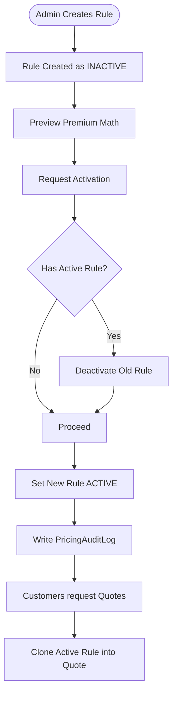
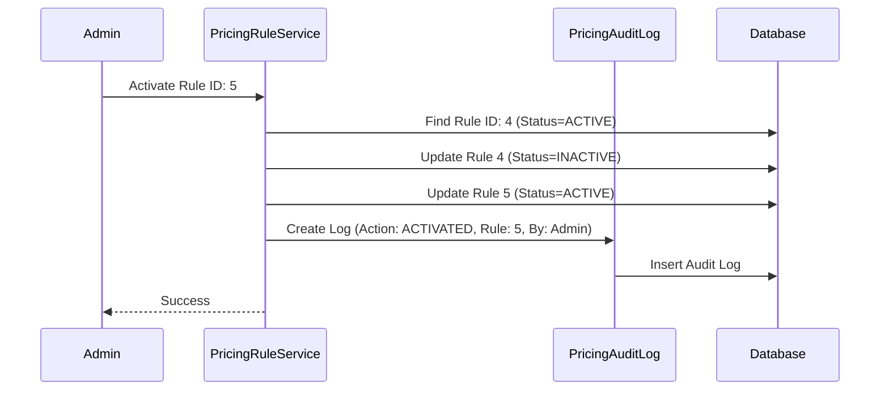

# Pricing Flow
> The catalog math engine: creating pricing rules, swapping active rules, generating quotes, and ensuring contract immutability.

---

## Purpose
This document details how pricing logic is managed by Admins and consumed by the system. It covers the lifecycle of a `PricingRule`, how it affects quotes, and why legacy policies remain unaffected by new price changes.

---

## Overview
- **Creation & Auditing:** Admins create `PricingRule` entities defining base rates, fees, and taxes. Every change writes to `PricingAuditLog`.
- **One Active Rule:** A policy plan can only have one `ACTIVE` rule at a time. Swapping requires deactivating the old rule first.
- **Quoting:** When a customer generates a quote, the system clones the math variables from the `ACTIVE` rule into the quote.
- **Immutability:** Existing policies use the cloned variables. Admin price changes only affect future purchases.

---

## Business Context
Insurance pricing changes annually based on risk models. When an actuary decides to raise rates by 2%, the Admin must update the system without invalidating the legal contracts of customers who bought policies yesterday. The system handles this via strict state management (Active/Inactive rules) and data snapshotting (copy-by-value into Quotes).

---

## Feature Flow



---

## System Flow

```mermaid
flowchart TD
    UI[Admin Dashboard] -->|POST /pricing-rules| Ctrl[PricingRuleController]
    Ctrl --> Svc[PricingRuleServiceImpl]
    Svc --> DB[(Database)]
    DB -->|Save INACTIVE| Svc
    
    UI -->|PATCH /activate| Ctrl
    Ctrl --> Svc
    Svc --> Transaction[@Transactional Swap]
    Transaction --> DB
    DB -->|Old -> INACTIVE\nNew -> ACTIVE| Transaction
    Transaction --> AuditSvc[AuditLogger]
    AuditSvc --> DB
```

---

## Audit Log Sequence Diagram



---

## Database Design

| Entity | Purpose | Relationships |
|---|---|---|
| `PolicyPlan` | The core product offering. | One-to-Many to `PricingRule`. |
| `PricingRule` | Holds `baseRiskRate`, `processingFee`, `gstRate`. | Many-to-One to `PolicyPlan`. |
| `PricingAuditLog` | Historical ledger of rule changes. | Many-to-One to `PricingRule`. |

**Why this design?**
Separating `PricingRule` from `PolicyPlan` allows for versioning over time. A 10-year-old plan might have 10 different pricing rules associated with it, providing a perfect historical timeline of how prices evolved.

---

## Business Rules

| Rule | Description | Why it exists |
|---|---|---|
| **Single Active Rule** | A plan must have exactly one active pricing rule to be quoted. | Prevents ambiguity in the premium calculator. |
| **Snapshotting** | Quotes copy the `baseRiskRate` and fees explicitly. | Ensures price guarantees for 30 minutes, and insulates bought policies forever. |
| **Immutable Logs** | `PricingAuditLog` entries can never be updated or deleted. | Regulatory compliance for financial systems. |

---

## Design Decisions

- **Why separate Pricing from the Plan?**
  If pricing fields lived on the `PolicyPlan` entity, updating the price would overwrite the historical record. By breaking it into a separate entity, we can maintain a timeline of inactive rules.
- **Why use a Premium Preview tool?**
  Insurance math is complex. Admins need a way to verify that a new rule produces sane numbers (e.g., verifying a $1,000 policy doesn't accidentally cost $100,000 due to a typo in the risk rate) before pushing it live.
- **Why are quotes snapshotted instead of just storing the `ruleId`?**
  If a quote only stored `ruleId`, and the admin updated the rule's values directly (rather than making a new rule), the customer's price would change in their cart. Snapshotting (copy-by-value) guarantees the contract.

---

## Interview Notes

1. **How do you ensure a price change doesn't alter existing policies?**
   > Through the Snapshot pattern. When a quote is generated, the specific rates (`riskRate`, `gstRate`) are copied from the active rule into the quote, and subsequently into the policy. Future rules don't touch these snapshots.
2. **How is the swapping of active rules handled safely?**
   > Using a Spring `@Transactional` boundary. The service fetches the current active rule, deactivates it, activates the new rule, and writes the audit log. If any step fails, the entire transaction rolls back.
3. **Why do we need a Pricing Audit Log?**
   > Price changes directly impact business revenue and customer fairness. Regulators require strict audit trails of who changed financial parameters and when.
4. **What happens if a plan has no active pricing rule?**
   > The `PremiumCalculationService` will throw a 400 Bad Request indicating "No active pricing rule found", preventing any quotes from being generated for that plan.
5. **How does the Premium Preview work?**
   > It acts as a dry-run. It calls the exact same Strategy Pattern calculations (`AnnualPremiumCalculator` or `OneTimePremiumCalculator`) used by customers, but uses the draft rule variables without saving a quote to the database.

---

## Related Documents
- [Premium Calculation Domain](../02_Business_Domain/Premium_Calculation.md)
- [Purchase Flow](Purchase_Flow.md)
