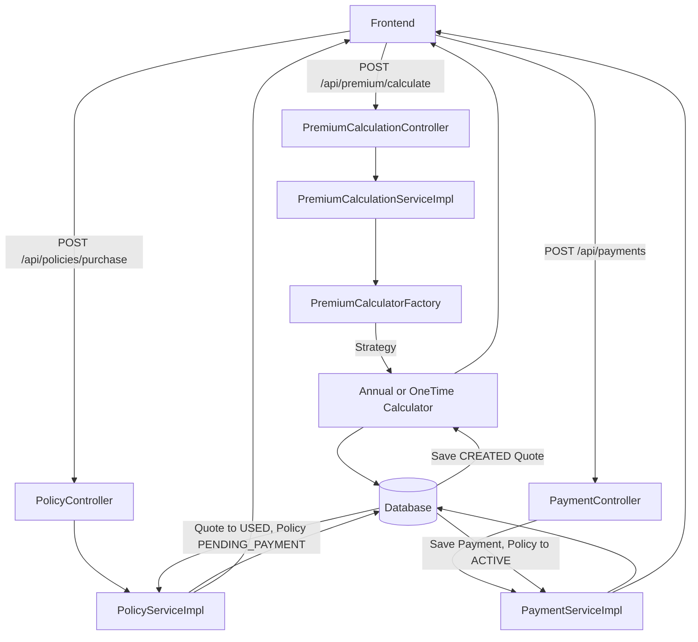
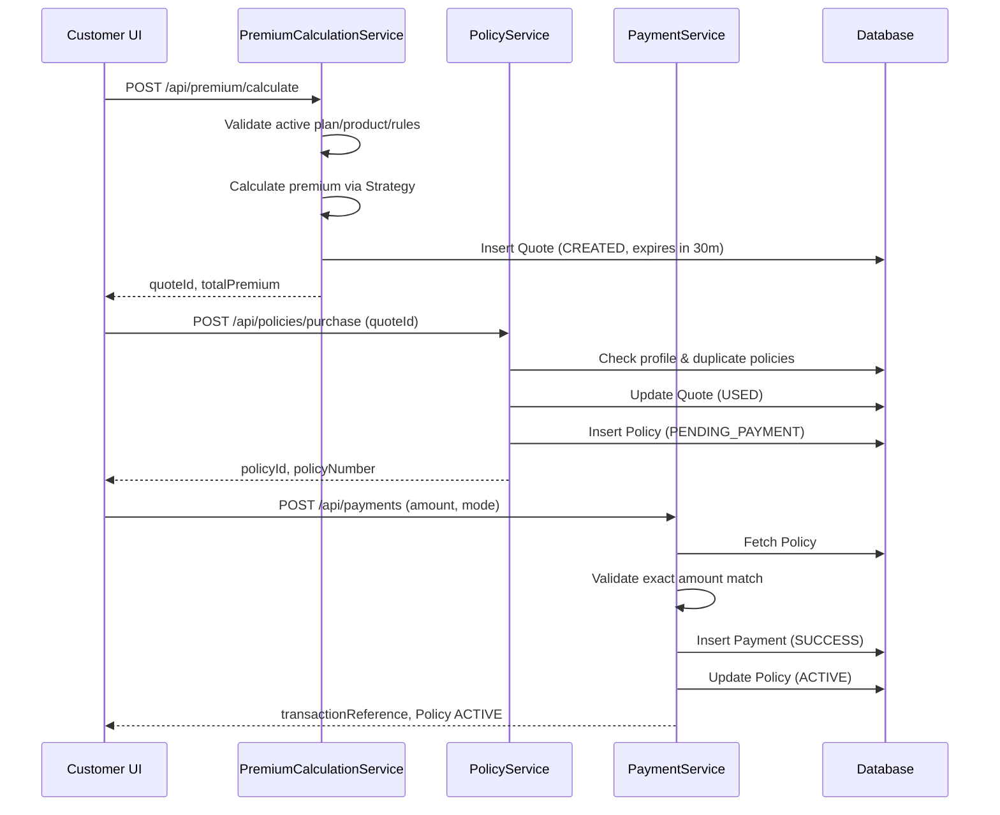

# Purchase Flow
> The authoritative purchase narrative: generate a quote, purchase into pending payment, exact payment matching, and policy activation.

---

## Purpose
This document provides the single source of truth for how an insurance policy is bought end-to-end. It covers the 3-stage pipeline: Quote Generation, Purchase, and Payment & Activation.

---

## Overview
- **Stage 1: Quote Generation:** A customer selects a plan, coverage, duration, and premium type. A short-lived (30-minute) `Quote` is generated.
- **Stage 2: Purchase:** The customer accepts the quote, creating a `Policy` in the `PENDING_PAYMENT` state.
- **Stage 3: Payment:** An exact-amount payment is made. Upon success, the policy becomes `ACTIVE`.

---

## Business Context
An insurance purchase is a financial and legal commitment. The pipeline is strictly gated: quotes expire quickly to prevent stale pricing, payment amounts must match the calculated premium exactly (to the penny) to avoid accounting drift, and duplicate policies for identical coverages are blocked to prevent fraudulent over-insurance.

---

## Feature Flow

```mermaid
flowchart TD
    Start([Select Plan & Coverage]) --> ValProfile{Profile Complete?}
    ValProfile -- No --> FailProf[Error: COMPLETE_PROFILE_FIRST]
    ValProfile -- Yes --> QuoteReq[Request Quote]
    
    QuoteReq --> BackendCalc[Calculate Premium (Strategy Pattern)]
    BackendCalc --> QuoteGen[Return Quote (Valid 30 mins)]
    
    QuoteGen --> AcceptQuote([Accept & Purchase])
    AcceptQuote --> ValQuote{Quote Valid?}
    
    ValQuote -- No --> FailQuote[Error: Expired/Used]
    ValQuote -- Yes --> CheckDup{Duplicate Cover?}
    
    CheckDup -- Yes --> FailDup[Error: POLICY_EXISTS]
    CheckDup -- No --> Pending[Create Policy PENDING_PAYMENT]
    
    Pending --> Pay([Submit Payment])
    Pay --> ValAmt{Exact Amount?}
    
    ValAmt -- No --> FailAmt[Error: AMOUNT_MISMATCH]
    ValAmt -- Yes --> Active[Policy ACTIVE]
    Active --> End([Success])
```

---

## System Flow



---

## Sequence Diagram



---

## Database Design

| Entity | Purpose | Relationships |
|---|---|---|
| `Quote` | Temporary snapshot of pricing intent. | Tied to `Customer` and `PolicyPlan`. |
| `Policy` | The core contract. | Many-to-One to `Customer`, `Quote`, `PolicyPlan`. |
| `PremiumPayment` | Financial ledger entry. | Many-to-One to `Policy`. |

**Why this design?**
Separating `Quote` from `Policy` ensures stale data doesn't pollute the contract table. Copying `calculatedPremium` and snapshot fields (like `pricingRuleId`) directly onto the `Policy` ensures the contract remains immutable even if catalogue prices change in the future.

---

## Business Rules

| Rule | Description | Why it exists |
|---|---|---|
| **Complete Profile Gate** | Only profiles with full KYC (Address, Nominee) can purchase. | Legal requirement for binding contracts. |
| **Quote Expiry** | Quotes expire in exactly 30 minutes. | Prevents holding on to old prices during catalogue updates. |
| **Exact Amount Match** | Payment MUST equal `calculatedPremium`. No partial payments. | Prevents accounting reconciliation nightmares. |
| **Duplicate Checking** | Cannot buy overlapping Health policies. | Prevents double-claiming fraud (indemnity principle). |
| **Pricing Snapshot** | Policy copies pricing logic at purchase time. | Insulates existing customers from future admin pricing changes. |

---

## Validation Rules

### Stage 1 (Quote)
- Plan and Product must be `isActive=true`.
- Duration must exist in `plan.allowedDurations`.
- Coverage must exist in the plan's `CoverageOptions`.
- An `ACTIVE` pricing rule must exist for the plan.

### Stage 2 (Purchase)
- Profile must have DOB, address, city, state, pin code, nominee.
- Quote must be `CREATED` and `expiresAt` > Now.
- Product-specific duplication check passes.

### Stage 3 (Payment)
- Request amount == `policy.calculatedPremium` exactly.
- If ONE_TIME, verify no existing SUCCESS payment.
- Unique Transaction Reference (`TRX-` + 12 hex).

---

## Worked Example

**MOTOR, ONE_TIME Premium, 3 Year Duration**
- Base Coverage = ₹10,00,000
- Risk Rate = 0.030
- Processing Fee = ₹150
- GST = 18%

**Calculation (`OneTimePremiumCalculator`):**
1. Base Premium = 10,00,000 * 0.030 = ₹30,000
2. Taxable Amount = 30,000 + 150 = ₹30,150
3. GST = 30,150 * 0.18 = ₹5,427
4. Annualized Premium = 30,150 + 5,427 = ₹35,577
5. Total Committment = 35,577 * 3 = ₹106,731
6. Discount (3 yr, 5%) = ₹5,337
7. **Final Premium to Pay = 106,731 - 5,337 = ₹101,394**

Payment endpoint strictly expects exactly `101394`.

---

## Error Handling

| Case | Enforcement | Result HTTP | Result Message |
|---|---|---|---|
| Incomplete customer profile | `isCustomerProfileComplete` | 400 | `COMPLETE_PROFILE_FIRST` |
| Quote older than 30 minutes | `expiresAt` check | 400 | `Quote has expired` |
| Quote belongs to another | Identity check | 400 | `Quote does not belong to the authenticated customer` |
| Duplicate HEALTH cover | `existsBy...` query | 409 | `HEALTH_POLICY_EXISTS` |
| Payment amount mismatch | `compareTo != 0` | 400 | `AMOUNT_MISMATCH` |
| Second ONE_TIME payment | Count check | 400 | `ONE_TIME_ALREADY_PAID` |
| All ANNUAL premiums paid | Count >= duration | 400 | `ALL_PREMIUMS_PAID` |
| Duplicate transaction ref | Unique Constraint | 409 | `DUPLICATE_REFERENCE` |

---

## Design Decisions

- **Why use the Strategy Pattern for premium calculations?**
  `PremiumCalculatorFactory` dispatches to `AnnualPremiumCalculator` or `OneTimePremiumCalculator`. This prevents massive `if-else` blocks and allows us to easily add a `MonthlyPremiumCalculator` in the future without modifying existing code.
- **Why are quotes tracked in the database rather than just returned as a JWT/Token?**
  A DB entity allows us to track conversion metrics, audit abandoned quotes, and easily transition the quote to `USED` ensuring it can strictly only be consumed once.
- **Why is there a `PENDING_PAYMENT` state instead of creating the policy only upon payment?**
  It holds the lock for duplicate checking, reserves the policy number, and handles scenarios where a payment gateway drops the connection. The customer can just retry the payment on the existing policy.

---

## Interview Notes

1. **How do you handle different types of premium calculations?**
   > I implemented the Strategy Design Pattern. A Factory returns either the Annual or One-Time calculator based on the plan's configuration, keeping the code Open-Closed to new payment frequencies.
2. **How do you ensure a user cannot reuse an old quote with cheaper prices?**
   > Quotes have a strict 30-minute expiry timestamp in the database and transition to a `USED` state upon policy purchase.
3. **What happens if a pricing rule is changed by an admin while a user is on the payment screen?**
   > Nothing breaks. The purchase relies on the snapshot data cloned into the `Quote` and subsequently the `Policy`. The contract honors the price at the time the quote was generated.
4. **Why enforce exact amount matching on the backend?**
   > To prevent clients from modifying the payload (e.g. paying $1 for a $1000 policy). The backend is the single source of truth for financial transactions.
5. **How do you prevent duplicate policy purchases?**
   > During purchase, the service checks the database for existing policies for that customer and plan in `ACTIVE` or `PENDING_PAYMENT` states.
6. **Why do we need a COMPLETE_PROFILE check before purchase?**
   > An insurance contract is legally binding and requires full KYC (Know Your Customer) details like address and nominee before issuance.
7. **What is the `HALF_UP` rounding rule?**
   > `BigDecimal` calculations use `RoundingMode.HALF_UP` to resolve fractional pennies fairly and consistently in financial math.
8. **How does the system ensure transaction references are unique?**
   > They are generated using a cryptographically secure random generator, prefixed with `TRX-`, and backed by a database unique constraint.

---

## Related Documents
- [Premium Calculation Domain](../02_Business_Domain/Premium_Calculation.md)
- [Policy API Specs](../03_API/Policy_API.md)

---

## Future Enhancements
- Integration with an actual Payment Gateway (Stripe/Razorpay) via Webhooks.
- Automated cleanup job (cron) to delete `EXPIRED` quotes.
