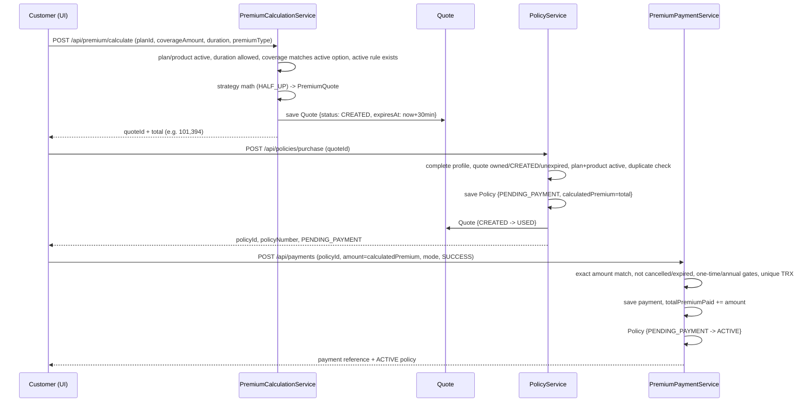

# Purchase Flow

> The authoritative purchase narrative: select plan + coverage + duration, generate a quote, purchase into `PENDING_PAYMENT`, record the exact payment, and activate the policy.

## Purpose

Single source of truth for how a policy is bought end to end: quote generation, purchase, payment, and the state transitions that occur. The premium mathematics are authoritative in `../02_Business_Domain/Premium_Calculation.md`; every enforced rule is catalogued in `../02_Business_Domain/Business_Rules.md`; endpoint payloads are in `../03_API/Policy_API.md`, `../03_API/Payment_API.md`, and `../03_API/Plan_API.md`.

## Overview

A customer with a complete profile selects a plan, an active coverage amount, a duration, and the plan's premium type, and requests a quote. `POST /api/premium/calculate` persists a `Quote` (`CREATED`, 30-minute expiry) and returns `quoteId`. `POST /api/policies/purchase` consumes the quote to create a policy in `PENDING_PAYMENT` and marks the quote `USED`. `POST /api/payments` with the exact `calculatedPremium` and `paymentStatus = SUCCESS` moves the policy to `ACTIVE`. Purchase is a multi-step transaction where each step is independently validated server-side.

## Business Context

An insurance purchase is a commitment with money attached, so the pipeline is gated: only complete profiles can buy; a quote is single-use and short-lived; a policy exists in limbo (`PENDING_PAYMENT`) until the exact premium is paid; and no customer can accidentally hold duplicate cover on the same plan. The numeric premium is fixed at quote time and must reconcile exactly at payment time.

## Technical Design

### State transitions

```
Quote :  CREATED ──purchase/issue──▶ USED
         CREATED ──after 30 min────▶ EXPIRED
         CREATED ──cancelled───────▶ CANCELLED

Policy : PENDING_PAYMENT ──payment SUCCESS──▶ ACTIVE
         PENDING_PAYMENT ──cancel───────────▶ CANCELLED
         ACTIVE ──expiry────────────────────▶ EXPIRED
         ACTIVE ──cancel (no open claims)───▶ CANCELLED
```

### Stage 1 — Quote generation

`POST /api/premium/calculate` (`PremiumCalculationController`, role `ROLE_CUSTOMER`) → `PremiumCalculationServiceImpl.generateQuoteInternal`:

1. Load the plan; require plan `isActive` and product `isActive`.
2. Require `duration` in `plan.allowedDurations` and `premiumType == plan.supportedPremiumType`.
3. Require the coverage amount to equal an **active** `CoverageOption` of the plan.
4. Resolve the active pricing rule: `findByPolicyPlanIdAndStatusOrderByIdDesc(planId, ACTIVE)` → highest-id `ACTIVE` rule; none → 400 `No active pricing rule found`.
5. `PremiumCalculatorFactory.getCalculator(premiumType)` selects `AnnualPremiumCalculator` (ANNUAL) or `OneTimePremiumCalculator` (ONE_TIME), which computes the `PremiumQuote` with `BigDecimal` HALF_UP rounding.
6. A `Quote` row is persisted with the plan's snapshot (`planVersion`, `pricingRuleId`, risk rate, processing fee, GST, annual premium, total), `status = CREATED`, `expiresAt = now + 30 minutes`. The response carries `quoteId` and `expiresAt`.

### Stage 2 — Purchase

`POST /api/policies/purchase` (`PolicyController`, role `ROLE_CUSTOMER`) → `PolicyServiceImpl.purchasePolicy`:

1. Load the customer by the authenticated email; require a **complete profile** (DOB, address, city, state, pin code, nominee) — 400 `COMPLETE_PROFILE_FIRST`.
2. Load the quote and run `validateQuoteForPurchase`: quote owned by the customer; `status == CREATED`; not past `expiresAt` (else flipped to `EXPIRED` and rejected); plan active; product active.
3. Duplicate check per product type:
   - HEALTH: at most one policy in `[ACTIVE, PENDING_PAYMENT]` per customer+plan → 409 `HEALTH_POLICY_EXISTS`.
   - Non-HEALTH: at most one `PENDING_PAYMENT` per customer+plan → 409 `POLICY_EXISTS`.
4. Build the policy from quote snapshots (`selectedCoverage`, `premiumType`, `policyDuration`, `premiumRateUsed`, `processingFeeUsed`, `gstUsed`, `calculatedPremium = quote.total`, `planVersion`, `pricingRuleId`, `quoteId`, generated `policyNumber` `POL-xxxxxxxx`), `policyStatus = PENDING_PAYMENT`, `totalPremiumPaid = 0`, `startDate = today`, `endDate = startDate + duration years`.
5. Save the policy, then flip the quote to `USED`. Return the policy detail with `remainingClaimAmount = selectedCoverage`.

### Stage 3 — Payment and activation

`POST /api/payments` (`PremiumPaymentController`, roles `ROLE_CUSTOMER` or `ROLE_INTERNAL_STAFF`) → `PremiumPaymentServiceImpl.recordPayment`:

1. Load the policy; ownership check (customer pays own policy; staff pays matching speciality).
2. `dto.amount` must **exactly equal** `policy.calculatedPremium` → 400 `AMOUNT_MISMATCH`.
3. Reject `CANCELLED` and `EXPIRED` policies.
4. ONE_TIME: no existing `SUCCESS` payment (400 `ONE_TIME_ALREADY_PAID`). ANNUAL: not before the 15-day early window of the next anniversary; successful payments must not already reach `policyDuration`.
5. Generate `transactionReference = TRX-` + 12 uppercase hex chars (`TransactionReferenceGenerator`); reject duplicates.
6. Cumulative `totalPremiumPaid + amount` must not exceed `calculatedPremium × policyDuration`.
7. Persist `PremiumPayment` with the mode and status. If `SUCCESS`: add to `totalPremiumPaid` and set `policyStatus = ACTIVE`. `PENDING`/`FAILED` payments are recorded without activation.

### Worked example (ONE_TIME, MOTOR)

From `../02_Business_Domain/Premium_Calculation.md` Worked example 1: `coverage = 10,00,000`, `rate = 0.030`, `fee = 150`, `gst = 18%`, `duration = 3`:

- base = 10,00,000 × 0.030 = **30,000**; processingFee = **150**; taxable = **30,150**
- gst = 30,150 × 18 / 100 = **5,427**; annualPremium = **35,577**
- totalCommitment = 35,577 × 3 = **106,731**; discount (3 yr, 5%) = **5,337**
- **totalPremium = 106,731 − 5,337 = 101,394**

The quote's `total` and the policy's `calculatedPremium` are **101,394**, and the payment amount must equal 101,394 exactly. (ANNUAL example: LIFE, coverage 50,00,000 → `calculatedPremium` = 40,200 per year, paid up to `duration` times.)

### Failure cases (code-verified)

| Case | Enforcement | Result |
|---|---|---|
| Incomplete customer profile | `isCustomerProfileComplete` | 400 `COMPLETE_PROFILE_FIRST` |
| Quote belongs to another customer | `validateQuoteForPurchase` | 400 `Quote does not belong to the authenticated customer` |
| Quote already `USED`/`EXPIRED`/`CANCELLED` | status check | 400 `Quote status is not CREATED…` |
| Quote older than 30 minutes | `expiresAt` check (flips to `EXPIRED`) | 400 `Quote has expired` |
| Plan or product deactivated after quoting | active checks | 400 `plan/product no longer active` |
| Duplicate HEALTH cover (ACTIVE/PENDING) | `existsBy…` | 409 `HEALTH_POLICY_EXISTS` |
| Duplicate non-HEALTH pending | `existsBy…` | 409 `POLICY_EXISTS` |
| Payment amount mismatch | `compareTo != 0` | 400 `AMOUNT_MISMATCH` |
| Paying a cancelled/expired policy | status check | 400 `CANCELLED_POLICY_RESTRICTED` / `EXPIRED_POLICY_RESTRICTED` |
| Second ONE_TIME payment | `existsByPolicyIdAndPaymentStatus(SUCCESS)` | 400 `ONE_TIME_ALREADY_PAID` |
| ANNUAL renewal too early | payment window check | 400 `EARLY_PAYMENT_RESTRICTION` |
| All ANNUAL premiums already paid | count ≥ duration | 400 `ALL_PREMIUMS_PAID` |
| Duplicate transaction reference | unique check | 409 `DUPLICATE_REFERENCE` |
| Cumulative premium exceeds commitment | `totalPremiumPaid + amount` | 400 `PREMIUM_LIMIT_EXCEEDED` |

## Workflow

1. Customer completes profile (`/customer/profile` → `POST/GET /api/customers`, `PUT /api/customers/{id}`).
2. Browse products (`GET /api/products/active`) → plans (`GET /api/plans/{productId}/active`) → open `/customer/purchase-policy/:planId`.
3. Select coverage → duration → confirm premium type → "Generate Quote" → `POST /api/premium/calculate`; store the returned `quoteId`.
4. Accept terms within the 30-minute window → "Confirm & Purchase" → `POST /api/policies/purchase` → policy `PENDING_PAYMENT`, quote `USED`.
5. `POST /api/payments` with the exact `calculatedPremium`, mode, and `SUCCESS` → policy `ACTIVE`.
6. Customer tracks the policy at `/customer/policies/:policyId`; admin/staff at `/admin/policies/:id` / `/staff/policies/:policyId`.



## Code References

- `controller/{PremiumCalculationController,PolicyController,PremiumPaymentController}.java`.
- `serviceimpl/PremiumCalculationServiceImpl.java` (quote), `serviceimpl/PolicyServiceImpl.java` (purchase/validate/duplicates), `serviceimpl/PremiumPaymentServiceImpl.java` (payment/activation).
- `service/strategy/{AnnualPremiumCalculator,OneTimePremiumCalculator,PremiumCalculatorFactory}.java` — math.
- `model/{Quote,Policy,PremiumPayment,PolicyPlan,CoverageOption,PricingRule}.java`, `enums/{QuoteStatus,PolicyStatus,PremiumType,PaymentStatus}.java`.
- `util/{PolicyNumberGenerator,TransactionReferenceGenerator}.java`.
- Frontend: `src/pages/customer/policies/PurchasePolicyPage.jsx`, `src/pages/customer/payments/RecordPaymentPage.jsx`, `src/pages/staff/policies/StaffIssuePolicyPage.jsx`, `src/pages/staff/payments/StaffRecordPaymentPage.jsx`.

All backend paths under `insurance-policy-claim-management-system/src/main/java/com/insurance/demo/`.

## Diagrams

- Payment detail and modes: `../08_Workflows/Payment_Flow.md`.
- Premium math and strategy classes: `../02_Business_Domain/Premium_Calculation.md`.
- Sequence/activity diagrams: `../09_Diagrams/Sequence_Diagrams/`, `../09_Diagrams/Activity_Diagrams/`.

## Best Practices

- Single-use, time-boxed quotes (`CREATED → USED/EXPIRED`) prevent replay and stale pricing.
- The exact-equality payment rule makes the quote amount the contract: no rounding drift.
- Pricing snapshots on the policy mean catalogue changes never alter in-force contracts.
- Duplicate checks are status-aware (HEALTH vs non-HEALTH), so expired/cancelled policies can be repurchased.

## Future Improvements

- Payment gateway integration with webhooks for asynchronous `PENDING → SUCCESS/FAILED` settlement.
- Auto-expiry sweeper for `PENDING_PAYMENT` policies.
- Multi-currency and instalment plans.
- See `../10_Evaluation/Future_Enhancements.md`.
