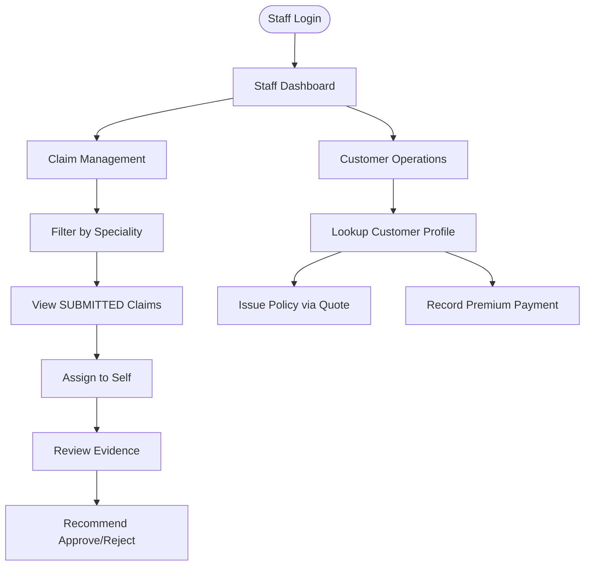
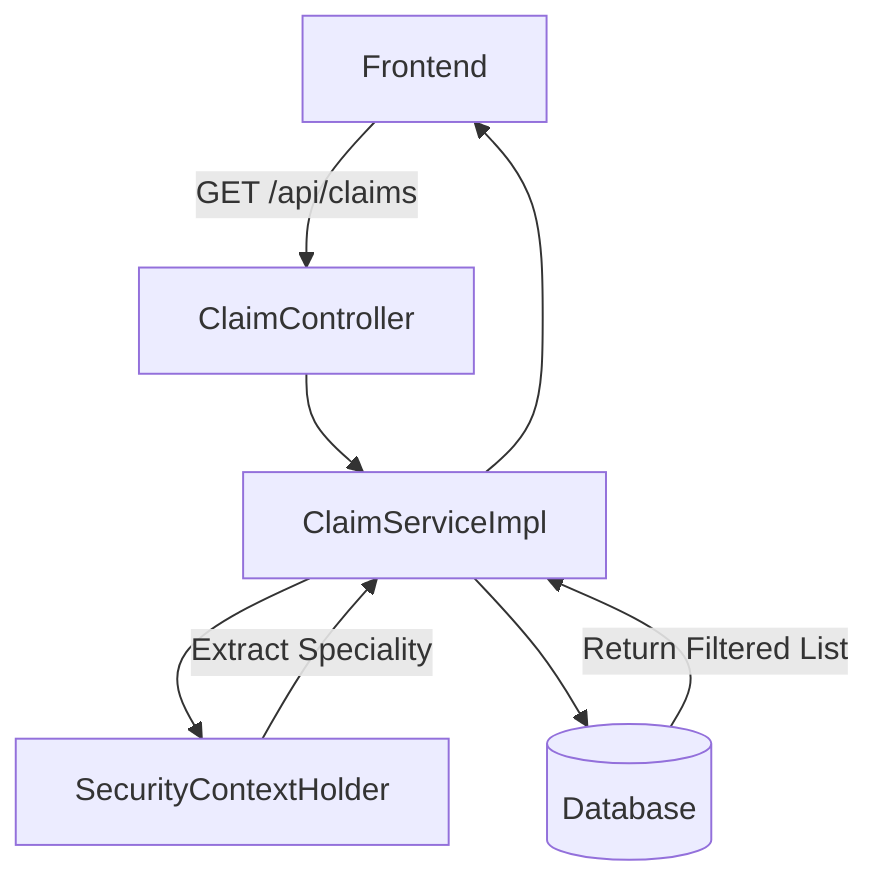
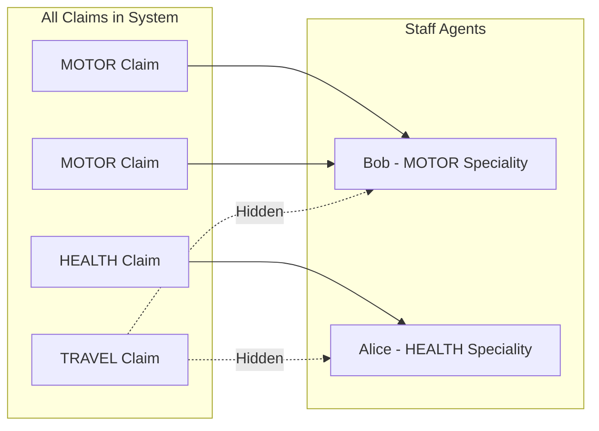
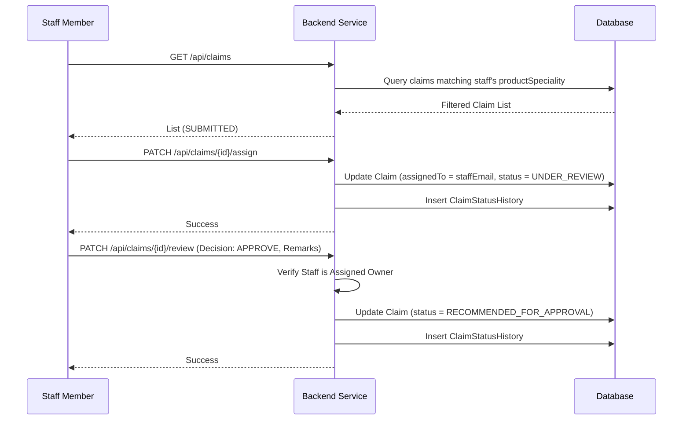

# Staff Flow
> The staff's operational narrative: specialized claim queue management, investigating incidents, and assisting walk-in customers with policies and payments.

---

## Purpose
Describes how a `ROLE_INTERNAL_STAFF` user interacts with the system. Staff act as specialized investigators who filter, assign, and review claims before sending them to the admin for final approval. They also assist walk-in customers with policy purchases and payments.

---

## Overview
- **Specialized Claim Queue:** Staff dashboards are filtered strictly by their assigned `productSpeciality` (e.g., MOTOR staff only see MOTOR claims).
- **Claim Review Process:** Staff pick claims from a pooled queue, assign them to themselves, conduct reviews, and make recommendations.
- **Customer Assistance:** Staff can look up customers, issue policies on their behalf (using quotes), and record payments.

---

## Business Context
Efficiency and domain expertise are critical in insurance. By filtering queues by speciality, the system ensures that complex medical claims are reviewed by health experts, not auto mechanics. The review process is structured to enforce accountability, requiring explicit "assignment" before review can commence, providing a clear audit trail of who touched what.

---

## Feature Flow

---

## System Flow

---

## Speciality Filtering Diagram

---

## Sequence Diagram (Claim Processing)

---

## Database Design

| Entity | Purpose | Relationships |
|---|---|---|
| `StaffSpeciality` | Links staff user to a specific product line. | One-to-One to `AppUser`. |
| `Claim` | Holds the `assignedStaff` email for locking. | - |

**Why this design?**
By storing `productSpeciality` in a dedicated table linked to the user, we keep the core `AppUser` generic while enforcing strict domain boundaries at the repository level.

---

## Business Rules

| Rule | Description | Why it exists |
|---|---|---|
| **Speciality Enclosure** | Staff can only view and interact with claims matching their `productSpeciality`. | Ensures domain expertise in investigations. |
| **Assignment Locking** | A claim must be explicitly assigned to a staff member before they can review it. | Prevents duplicate work by multiple staff. |
| **No Final Decisions** | Staff can only "Recommend". They cannot "Approve". | Enforces separation of duties to prevent fraud. |

---

## Validation Rules

- **Assigning a Claim:** The claim must be `SUBMITTED`. The caller's speciality must match the product.
- **Reviewing a Claim:** The claim must be `UNDER_REVIEW`. The caller MUST be the exact staff member who assigned it.
- **Issuing Policy:** The quote must be valid, and the customer profile must be complete.

---

## Error Handling

| Scenario | HTTP Status | Action / Meaning |
|---|---|---|
| Reviewing unassigned claim | 400 Bad Request | Enforces assignment step first. |
| Reviewing someone else's claim | 403 Forbidden | Blocked ownership check. |
| Viewing wrong speciality claim | 403 Forbidden | Blocked by speciality filter. |

---

## Design Decisions

- **Why separate `assign` and `review` steps?**
  It creates a claim locking mechanism. Once Alice assigns a claim to herself, Bob cannot accidentally review it at the same time. This also creates clear metrics on how long an investigation took (time between assignment and recommendation).
- **Why do staff help with policy issuance?**
  To support omnichannel sales. A walk-in customer or phone customer can get a quote generated, and the staff member can finalize the purchase in the system on their behalf.

---

## Interview Notes

1. **How is speciality filtering implemented securely?**
   > The backend reads the authenticated user's details from the `SecurityContextHolder`, extracts their speciality, and forcefully applies it to the database query. The client cannot bypass this by sending a different speciality ID.
2. **How do you prevent two staff members from reviewing the same claim?**
   > Through the `assign` step. The claim tracks `assignedStaff`. The `review` endpoint strictly validates that the requesting user matches the `assignedStaff`.
3. **What happens if a staff member tries to fetch a claim outside their speciality?**
   > The service layer performs an ownership/speciality check. If it fails, a 403 Forbidden or 404 Not Found (to prevent enumeration) is returned.
4. **Why isn't staff creation handled by staff themselves?**
   > Only Admins can provision staff to prevent malicious internal actors from creating ghost accounts to approve fraudulent claims.
5. **How does the system track who investigated a claim?**
   > Every status change, including assignments and recommendations, writes to the `ClaimStatusHistory` table, locking in the actor's email.

---

## Related Documents
- [Claim Flow](Claim_Flow.md)
- [Admin Flow](Admin_Flow.md)

---

## Future Enhancements
- Manager role to re-assign claims if a staff member goes on leave.
- SLA tracking (timers) for claims stuck in `UNDER_REVIEW`.
