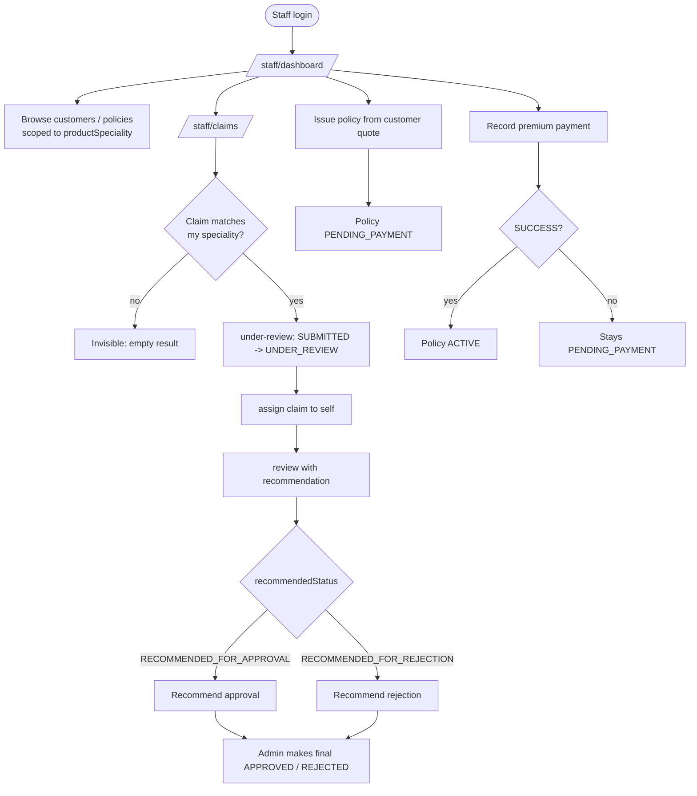

# Staff Flow

> The internal staff operator's narrative: login, speciality-scoped dashboards, customer browsing, claim processing (under-review → assign → review with recommendation), policy issuance, and payment handling.

## Purpose

Explains how a `ROLE_INTERNAL_STAFF` user — an Insurance Operations Officer — works through the `/staff/*` console. Staff are the investigators: they triage, assign, and review claims against policies in their `productSpeciality`, issue policies, and record premium payments. They never make final claim decisions (that is the admin's job). Endpoint contracts live in `../03_API/*`; the enforcement rules in `../02_Business_Domain/Business_Rules.md`.

## Overview

Staff log in with the account an admin provisioned (`POST /api/users/staff`, then dual-OTP activation). From `/staff/dashboard` they reach scoped lists of customers, policies, claims, and payments. Every staff-scoped list and detail view is filtered by `productSpeciality`: a HEALTH staff member sees only HEALTH claims/policies/payments, a MOTOR staff member only MOTOR ones, and a staff member with no speciality sees nothing. Claim processing follows the sequence `SUBMITTED → UNDER_REVIEW → (assign) → RECOMMENDED_FOR_APPROVAL / RECOMMENDED_FOR_REJECTION`, after which the admin decides.

## Business Context

Claims must be examined by someone who knows the product line, hence the speciality gate. Staff provide the recommendation; the admin provides the binding decision — the classic separation of duties. The same speciality gate protects policy issuance, payment recording, and even viewing: a motor officer cannot touch a health policy. A staff member can only review claims assigned to themselves, and assignment happens once.

## Technical Design

### Access and scoping

- Backend port **8081**, `/api` prefix. Staff endpoints are `@PreAuthorize("hasRole('INTERNAL_STAFF')")` (or `hasAnyRole('ADMIN','INTERNAL_STAFF')` for shared reads).
- Speciality comes from `AppUser.staffSpeciality.productSpeciality` (entity `StaffSpeciality`). It is set at creation and filters:
  - Claims list (`getAllClaimsWithPagination`): `policy.policyPlan.insuranceProduct.productType = staffSpeciality`; no speciality → empty result.
  - Policies list / by-customer (`getAllPolicies`, `getPoliciesByCustomer`): same predicate.
  - Claim detail / history / policy detail: must match, else 403 `SPECIALITY_*`.
  - Payments list / per-policy: `policy.policyPlan.insuranceProduct.productType` must match.
  - Premium admin calculation is allowed for staff via `POST /api/premium/admin/calculate`.
- Frontend namespace `/staff/*` guarded by `RoleProtectedRoute allowedRole={ROLES.INTERNAL_STAFF}`.

### Capability matrix

| Capability | UI route | Endpoint |
|---|---|---|
| Login / session | `/login` | `POST /api/auth/login` |
| Dashboard | `/staff/dashboard` | scoped aggregate views |
| Browse customers | `/staff/customers`, `/staff/customers/:id` | `GET /api/customers/page`, `GET /api/customers/{customerId}`, `GET /api/customers` |
| View policies | `/staff/policies`, `/staff/policies/:policyId` | `GET /api/policies`, `GET /api/policies/{policyId}`, `GET /api/policies/customer/{customerId}` |
| Issue policy | `/staff/issue-policy` | `POST /api/policies/issue` |
| View claims | `/staff/claims`, `/staff/claims/:id` | `GET /api/claims`, `GET /api/claims/{claimId}`, `GET /api/claims/{claimId}/history`, `GET /api/policies/{policyId}/claims` |
| Move claim to review | `/staff/claims/:id` | `PATCH /api/claims/{claimId}/under-review` |
| Assign claim | `/staff/claims/:id` | `PATCH /api/claims/{claimId}/assign` |
| Review + recommend | `/staff/claims/:id` | `PATCH /api/claims/{claimId}/review` |
| View / record payments | `/staff/payments`, `/staff/payments/pay/:policyId` | `GET /api/payments/page`, `GET /api/payments/policy/{id}`, `GET /api/payments/{id}`, `POST /api/payments` |
| Admin quote for a customer | — | `POST /api/premium/admin/calculate` |

### Claim-processing sequence (staff portion)

1. `PATCH /api/claims/{claimId}/under-review` — only from `SUBMITTED`; sets `UNDER_REVIEW` and writes history "Claim under review". Speciality must match the claim's product type.
2. `PATCH /api/claims/{claimId}/assign` — only while `SUBMITTED`; assigns the claim to the current staff member. Reassigning another officer's claim is rejected.
3. `PATCH /api/claims/{claimId}/review` — only on the claim assigned to the caller, only while `UNDER_REVIEW`, and only with `recommendedStatus` of `RECOMMENDED_FOR_APPROVAL` or `RECOMMENDED_FOR_REJECTION` plus remarks. History is written with the recommendation.

The endpoint reference for these transitions is `../03_API/Claim_API.md`; the full state machine is in `../02_Business_Domain/Claim_Workflow.md`.

### Issue-policy and payment speciality gates

- `PolicyServiceImpl.issuePolicy` rejects staff whose `productSpeciality` does not equal the plan's `productType` (403 `SPECIALITY_ISSUE_DENIED`).
- `PremiumPaymentServiceImpl.recordPayment` rejects staff paying a policy of a different product type (403 `SPECIALITY_RECORD_PAYMENT_DENIED`).
- A `SUCCESS` payment activates the policy; staff can record a customer's payment on their behalf (`/staff/payments/pay/:policyId`).

## Workflow

1. **Login** — staff sign in (account activated via OTP after provisioning). `/staff/dashboard` loads speciality-scoped statistics.
2. **Browse** — `/staff/customers` and `/staff/policies` list only data whose product type matches the officer's speciality. Drill into customer/policy detail to assess eligibility.
3. **Process claims** — `/staff/claims` shows matching claims. Per claim: move to `UNDER_REVIEW`, assign to self, then review with a recommendation and remarks. Revisit the claim list to filter by status and pick up new `SUBMITTED` claims.
4. **Issue policies** — `/staff/issue-policy` creates a `PENDING_PAYMENT` policy from a customer's valid quote (speciality-gated).
5. **Record payments** — `/staff/payments/pay/:policyId` records a customer's premium payment (exact `calculatedPremium`, mode UPI/CARD/NET_BANKING/CASH); `SUCCESS` activates the policy.
6. **Hand off** — recommended claims move to the admin for `final-decision`; the staff member can watch progress via `/staff/claims/:id`.

## Code References

- `controller/ClaimController.java` (`/under-review`, `/assign`, `/review`), `controller/PolicyController.java` (`/issue`), `controller/PremiumPaymentController.java` (`POST /api/payments`), `controller/CustomerController.java`.
- `serviceimpl/{ClaimServiceImpl,PolicyServiceImpl,PremiumPaymentServiceImpl,UserServiceImpl}.java` — speciality gates and transition rules.
- `model/StaffSpeciality.java`, `enums/ProductType.java`, `enums/ClaimStatus.java`.
- Frontend: `src/pages/staff/**` (`StaffDashboard`, `customers/*`, `policies/*`, `claims/*`, `payments/*`, `StaffIssuePolicyPage`, `StaffRecordPaymentPage`).

All backend paths under `insurance-policy-claim-management-system/src/main/java/com/insurance/demo/`.

## Diagrams

- Claim state machine and sequence: `../08_Workflows/Claim_Flow.md`, `../02_Business_Domain/Claim_Workflow.md`.
- Payment flow: `../08_Workflows/Payment_Flow.md`.
- Supporting activity diagrams: `../09_Diagrams/Activity_Diagrams/`.

## Best Practices

- Speciality scoping is enforced in the service layer on every read and write, not just hidden in the UI — defense in depth.
- Review is restricted to assigned claims, preventing two officers from recommending on the same claim.
- Staff can only ever recommend; the admin decision endpoints are admin-only.
- Audit history is written on every transition, so the recommendation and its author are always recoverable.

## Future Improvements

- Queue-style triage (oldest `SUBMITTED` first) and bulk status filters.
- Escalation rules when a recommendation sits too long.
- Staff-level KPIs on cycle time.
- See `../10_Evaluation/Future_Enhancements.md`.
