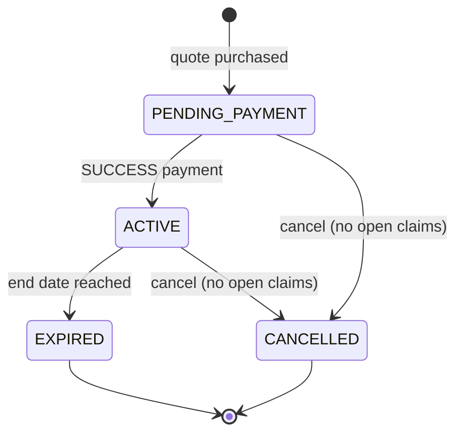
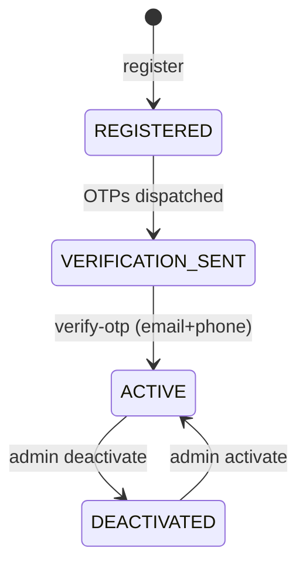
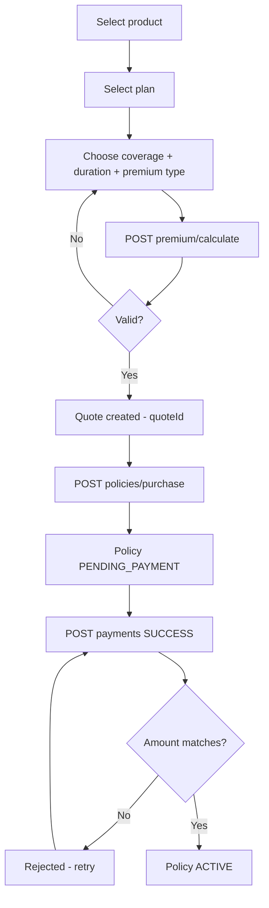
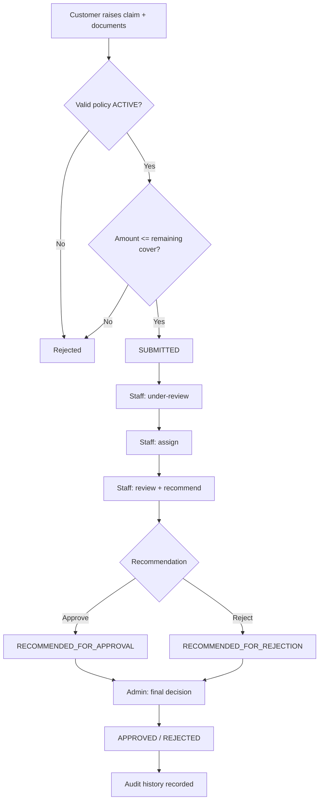
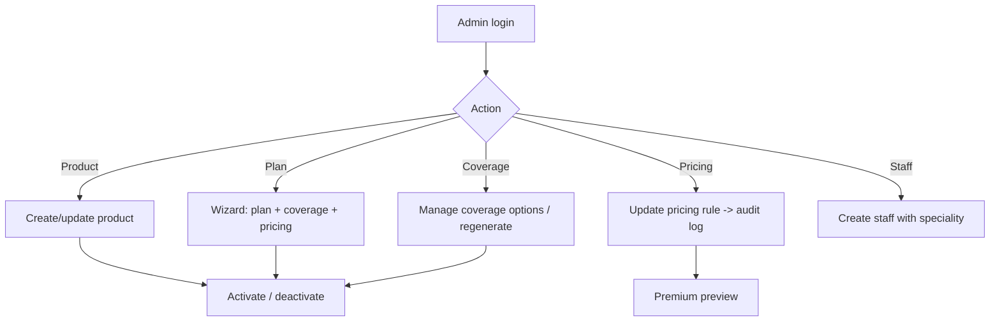

# Activity Diagrams

> Business-process activity and state diagrams for the primary workflows.

## Policy lifecycle

## User lifecycle

## Purchase activity

## Claim processing activity

## Admin catalog activity

## Related

- `../08_Workflows/` — narrative walkthroughs of these activities
- `../02_Business_Domain/` — the business rules behind each branch
