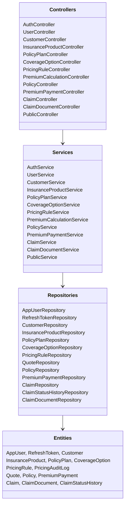
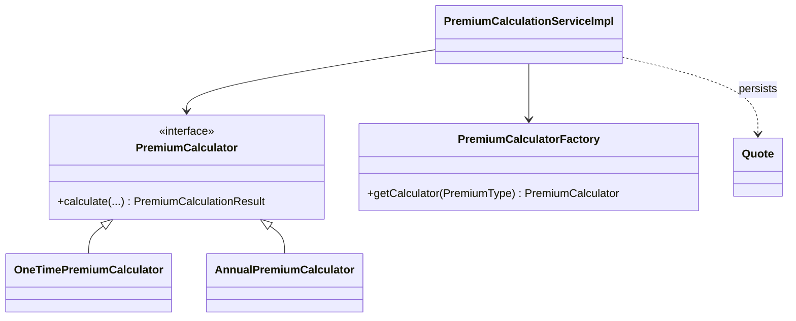
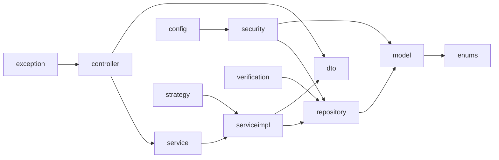

# Class Diagrams

> Backend class structure and package dependencies (Mermaid).

## Purpose

Show the static structure: the layered backend, the premium-calculation strategy
family, and how packages depend on each other. Class-level detail lives in
`../06_Backend/`.

## Backend layer structure

## Premium calculation strategy family

## Package dependency graph

## Related

- `../06_Backend/Package_Structure.md` — class-by-class map
- `../06_Backend/Premium_Calculation_Service.md` — strategy family in depth
- `../04_Database/Entity_Relationships.md` — entity relationships
