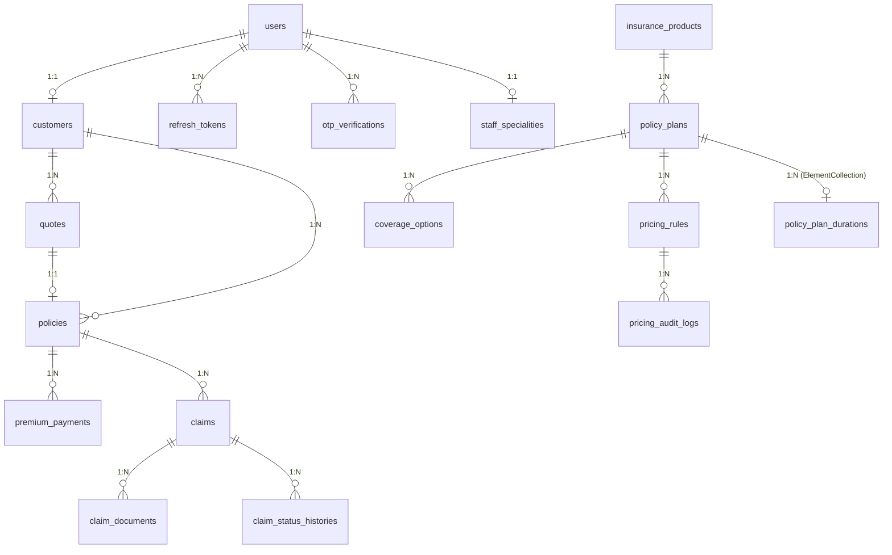

# ER Diagram (Overview)

> Entity-relationship overview. The authoritative, column-level ER diagram lives
> in `../../04_Database/ER_Diagram.md` — this page is the quick visual index.

## Notes

- 16 entities → 17 physical tables (`policy_plan_durations` is an
  ElementCollection join table owned by `policy_plans`).
- `premium_payments.payment_id` is the primary key column name (from `@Id`
  column annotation).
- `Policy` and `Claim` carry a `version` column for optimistic locking (`@Version`).
- Enums are stored as STRING.

## Related

- `../../04_Database/ER_Diagram.md` — full ER with columns, PKs, FKs, and types
- `../../04_Database/Entity_Relationships.md` — relationship semantics (cascade/fetch)
- `../../04_Database/Constraints.md` — constraints and defaults
