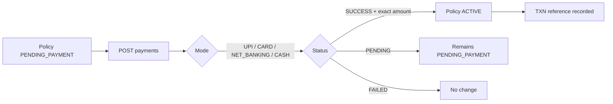
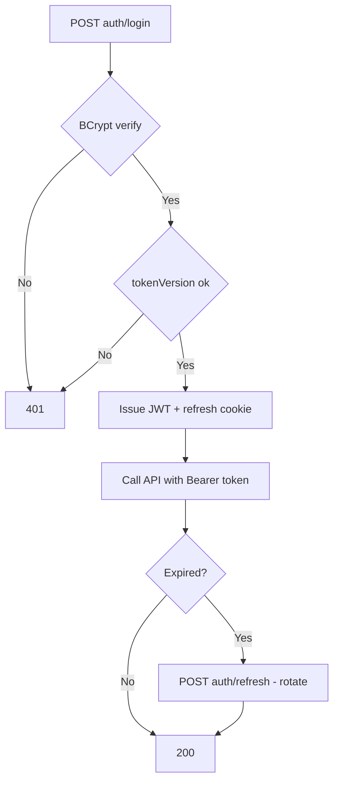
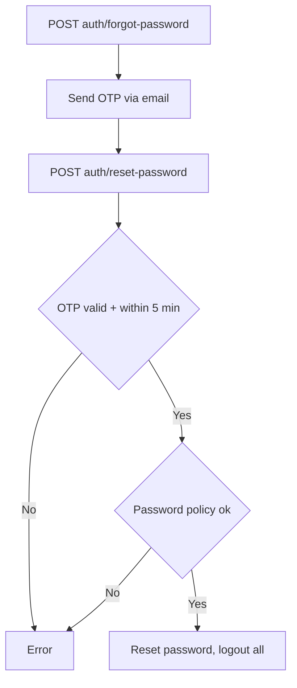

# Flowcharts

> Simple process flowcharts (linear flows and decision points).

## Payment activation

## Login / access flow

## Password reset

## Related

- `../03_API/Authentication_API.md`, `../03_API/Payment_API.md`
- `../08_Workflows/Payment_Flow.md`, `../08_Workflows/Authentication_Flow.md`
