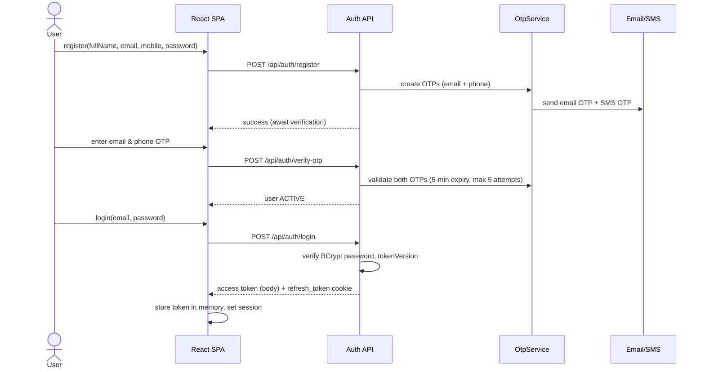
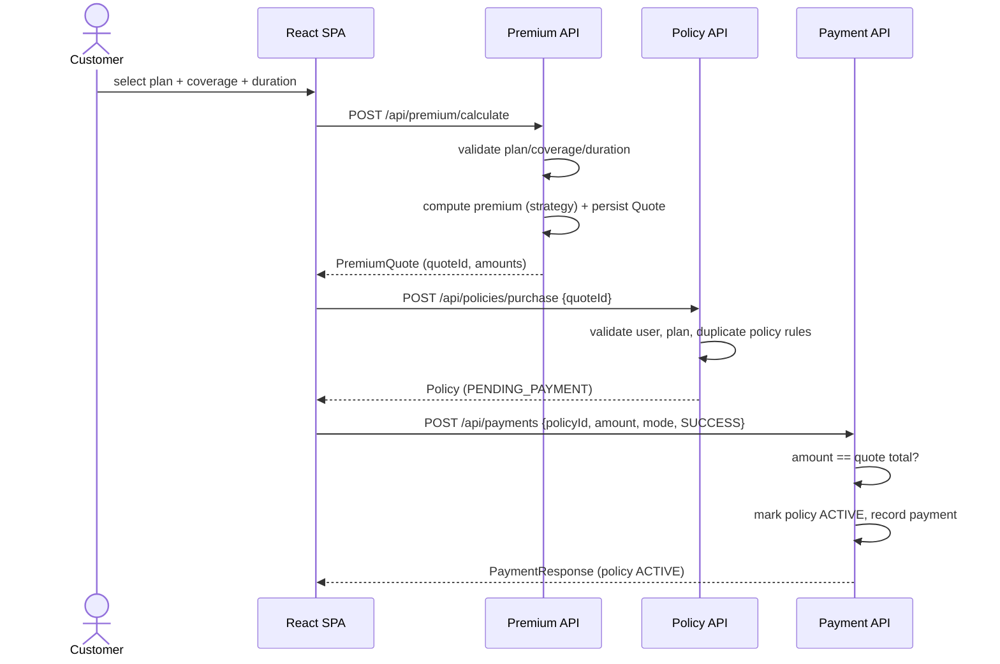
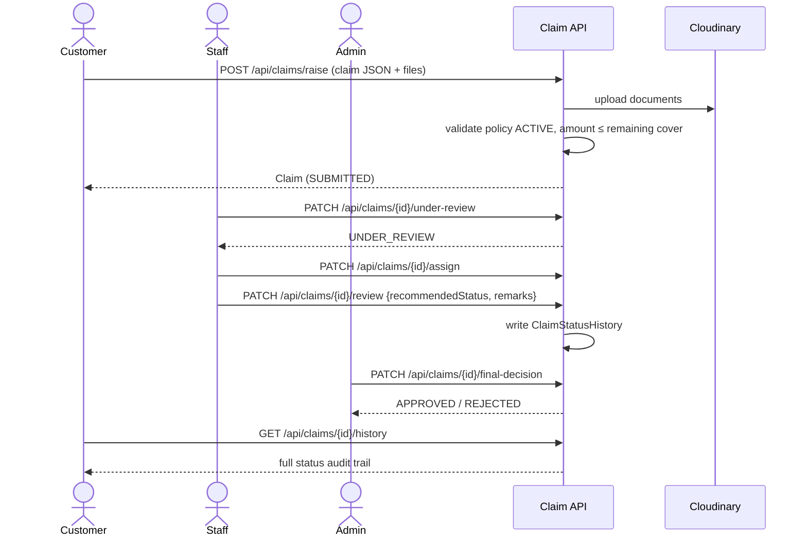
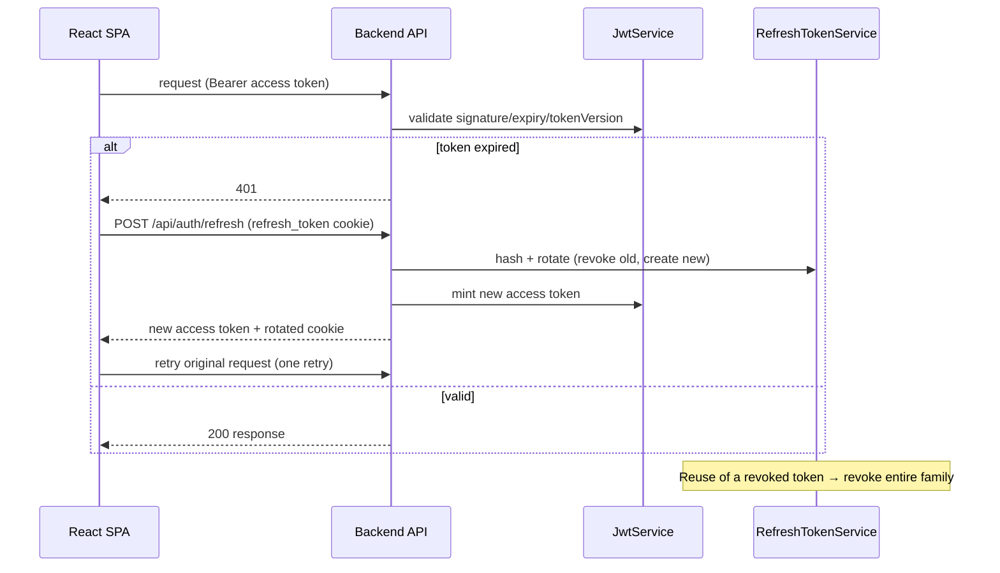

# Sequence Diagrams

> Mermaid sequence diagrams for the primary interaction flows.

## Authentication: register → OTP verify → login

## Quote → Purchase → Payment

## Claim lifecycle

## Token refresh (access + refresh)

## Related

- `../08_Workflows/Authentication_Flow.md`, `Purchase_Flow.md`, `Claim_Flow.md`
- `../06_Backend/JWT.md` — token internals
- `../03_API/API_Flow.md` — endpoint-level call sequences
