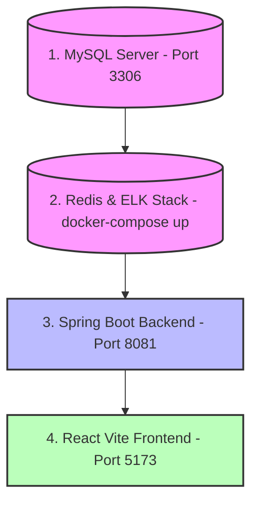

# Run Guide
> Master operational guide for starting and verifying the InsuranceFlow local development environment.

---

## Purpose
Standard operating procedure for booting all system services in the required order to prevent connection refusals.

---

## Startup Order

Services **MUST** be started in this exact sequence:



---

## Quick Command Reference

| Component | Command / Action | Port | Status / Verification URL |
|:---|:---|:---|:---|
| **MySQL** | Start MySQL Service | 3306 | Connect to `insurance_db` |
| **Redis & ELK** | `docker-compose up -d` | 6379, 9200, 5044, 5601 | `http://localhost:5601` (Kibana) |
| **Backend API**| `mvn spring-boot:run` | 8081 | `http://localhost:8081/swagger-ui.html` & `/api/public/stats` |
| **Frontend App**| `npm run dev` | 5173 | `http://localhost:5173` |

---

## Detailed Steps & Verification

### 1. Data Layer (MySQL + Redis + ELK)
1. Start MySQL locally. Ensure `insurance_db` exists and credentials in `env.properties` match.
2. In `insurance-policy-claim-management-system`, run:
   ```bash
   docker-compose up -d
   ```
3. **Verify:**
   - Redis Ping: `docker exec -it insurance-redis redis-cli ping` $\rightarrow$ returns `PONG`.
   - Kibana UI: Open [`http://localhost:5601`](http://localhost:5601).

### 2. Backend API (Spring Boot)
1. Open a terminal in `insurance-policy-claim-management-system`.
2. Run:
   ```bash
   mvn spring-boot:run
   ```
3. **Verify:**
   - Look for `Tomcat started on port(s): 8081 (http)`.
   - Open Swagger: [`http://localhost:8081/swagger-ui.html`](http://localhost:8081/swagger-ui.html).
   - Open Public Stats: [`http://localhost:8081/api/public/stats`](http://localhost:8081/api/public/stats).
   - *Default Admin Seed:* `admin@insurance.com` / `Admin@123` is created automatically on initial boot.

### 3. Frontend App (React + Vite)
1. Open a terminal in `insurance-policy-claim-management-app-ui`.
2. Run:
   ```bash
   npm run dev
   ```
3. **Verify:**
   - Terminal displays `Local: http://localhost:5173/`.
   - Open [`http://localhost:5173`](http://localhost:5173) in your browser.

---

## Related Documents
- [Troubleshooting](./Troubleshooting.md)
- [Build Guide](./Build.md)
- [Environment Setup](./Environment.md)
