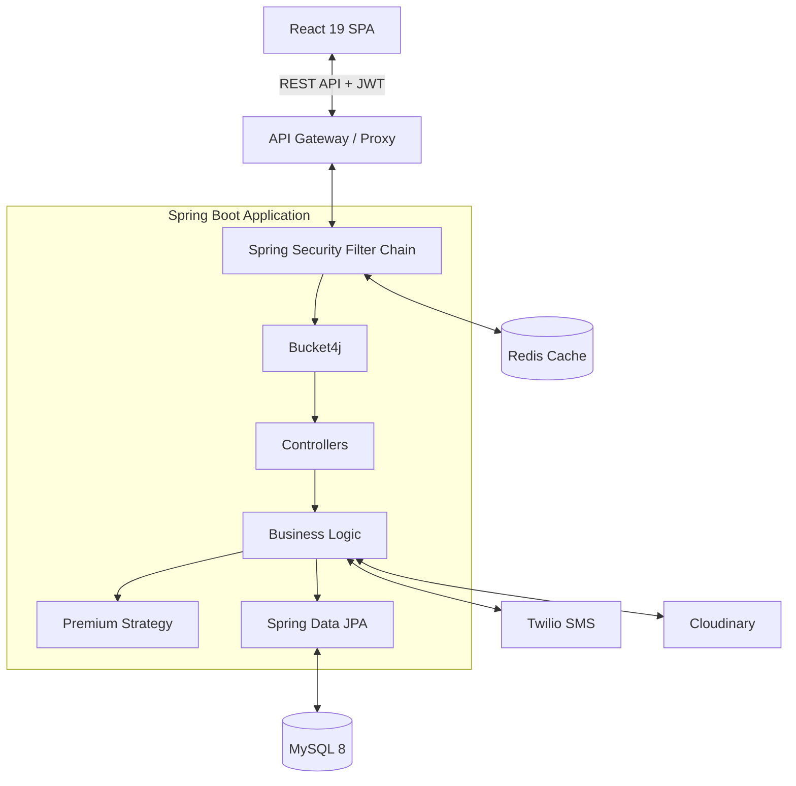

# Project Summary
> A comprehensive, enterprise-grade Insurance Policy & Claim Management System.

---

## Purpose
To provide a high-level overview of the InsuranceFlow project for evaluators, recruiters, and technical interviewers, highlighting the system's capabilities, architecture, and technical depth.

---

## Overview
InsuranceFlow is a full-stack, secure platform designed to handle the end-to-end lifecycle of insurance policies. It supports dynamic premium calculation, multi-stage claim workflows, and strict role-based access control, simulating a real-world enterprise financial application.

---

## Key Capabilities

| Customer | Internal Staff | Admin |
|----------|----------------|-------|
| Browse insurance plans | View all user policies | Full system configuration |
| Generate 30-min price quotes | Review submitted claims | Approve/Reject claims (Maker-Checker) |
| Purchase policies (One-time/Annual) | Recommend claims for approval | Override system constraints |
| File and track claims | View pricing audit logs | Manage user roles and system status |
| Download PDF receipts/policies | Assist customers with payments | Configure Pricing Rules & Coverage |

---

## Technical Highlights
- **Frameworks:** Spring Boot 4.0.6 (Java 17) Backend, React 19 (Vite) Frontend.
- **Security:** Stateless JWT authentication, HttpOnly refresh tokens with rotation, DB hashing.
- **Authentication:** Dual-channel OTP (Email via SMTP, SMS via Twilio).
- **Rate Limiting:** Bucket4j per-IP/Email rate limiting.
- **Design Patterns:** Strategy Pattern for Premium Calculation, Factory Pattern, DTOs.
- **Database:** MySQL 8 with 17 normalized tables, leveraging `@Version` for Optimistic Locking.
- **Storage:** Cloudinary integration for secure claim document uploads.
- **Caching:** Redis for token blacklisting and high-speed session checks.
- **Frontend State:** React Context API, Axios Interceptors for seamless token refresh.
- **Financial Precision:** Strict `BigDecimal` usage for all monetary transactions.

---

## Architecture at a Glance

---

## Key Numbers
- **16** Core Database Entities
- **17** Normalized Tables
- **3** Distinct RBAC Roles (`ROLE_ADMIN`, `ROLE_INTERNAL_STAFF`, `ROLE_CUSTOMER`)
- **2** Factor Authentication Methods
- **100%** Strict BigDecimal usage for currency

---

## Why this is a strong project
This project demonstrates senior-level understanding of enterprise requirements. Instead of simple CRUD, it implements complex state machines (Policy lifecycle, Claim approval workflow). It addresses real-world security vulnerabilities (XSS, CSRF, Token Theft) via HttpOnly cookies and rotation. It guarantees data integrity using Optimistic Locking to prevent race conditions during claim approvals.

---

## Quick Demo Credentials
Access the system locally at `http://localhost:5173`.

> [!IMPORTANT]
> The database automatically seeds the Admin user on startup via `DataSeeder`.

- **Admin Account:** `admin@insurance.com` / `Admin@123`

---

## Related Documents
- [Features Checklist](./Features_Checklist.md)
- [Setup Guide](../11_Developer_Guide/Setup.md)
