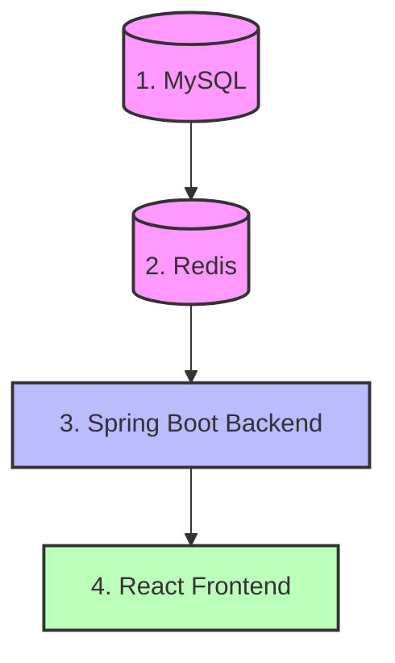

# Run Guide
> How to start up the InsuranceFlow local development environment.

---

## Purpose
Standard operating procedure for starting the application suite daily, ensuring services boot in the correct order to prevent connection refusals.

---

## Startup Order

Services MUST be started in this exact order:



---

## Quick Command Reference

| Component | Command / Action | Port |
|-----------|------------------|------|
| **MySQL** | Start via Services or Docker | 3306 |
| **Redis** | `redis-server` (or Docker) | 6379 |
| **Backend** | `mvn spring-boot:run` | 8081 |
| **Frontend** | `npm run dev` | 5173 |

---

## Detailed Steps & Verification

### 1. Data Layer
Start MySQL and Redis.
**Verify:**
- Ping Redis: `redis-cli ping` (should output `PONG`).
- MySQL: Ensure you can connect to `insurance_db`.

### 2. Backend API
Open terminal in the backend root directory.
```bash
mvn spring-boot:run
```
**Verify:**
- Terminal should display the Spring Boot banner.
- Look for: `Tomcat started on port(s): 8081`.
- Go to browser: `http://localhost:8081/api/system/health`. Should return `200 OK`.
- **Note:** The `DataSeeder` runs automatically and inserts the Admin user if it doesn't exist.

### 3. Frontend App
Open terminal in the frontend root directory.
```bash
npm run dev
```
**Verify:**
- Terminal should display: `Vite ready in X ms`.
- Look for: `Local: http://localhost:5173/`.
- Open that URL in your browser. You should see the login screen.

---

> [!TIP]
> Always keep your backend terminal visible while using the frontend. Backend exception logs are the fastest way to debug 500 errors.

---

## Related Documents
- [Troubleshooting](./Troubleshooting.md)
- [Build Guide](./Build.md)
