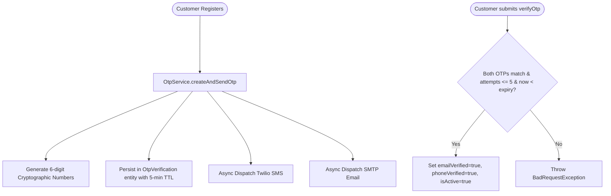

# 📱 Dual-OTP Verification Architecture (SMS & Email)

> **Layer:** Verification & Authentication Subsystem  
> **Package:** `com.insurance.demo.verification`  
> **Key Classes:** `OtpService.java`, `SmsService.java`, `EmailService.java`, `OtpVerification.java`  
> **External APIs:** Twilio SMS Gateway + Gmail SMTP Mail Server

---

## 1. What is Dual-OTP Verification?

When a customer registers or requests a password reset, the system generates two separate, secure 6-digit one-time passwords and delivers them concurrently:
1. **Email OTP:** Delivered via Gmail SMTP with an HTML template.
2. **Phone OTP:** Delivered via Twilio SMS API directly to the user's mobile device.

The account is activated only when **both** OTPs are successfully entered.

---

## 2. Verification Lifecycle & Security Rules

---

## 3. Security Protections Built into OTP Subsystem

| Protection | Implementation | Threat Mitigated |
|:---|:---|:---|
| **5-Minute Expiry (TTL)** | `expires_at = now() + 5 minutes` | Prevents replay attacks using stale OTPs. |
| **Max Attempt Threshold** | Hard limit of 5 failed attempts | Blocks automated brute-force guessing of 6-digit combinations. |
| **Single-Use Invalidation** | Deleted/invalidated upon first successful verify | Prevents re-verification of the same token. |
| **Asynchronous Delivery** | `@Async` email and SMS transmission | Prevents external gateway latency from slowing down API response. |

---

## 4. Interview Questions & Answers

1. **Q: Why does the system require both Email and Phone verification rather than just Email?**  
   **A:** Insurance contracts are legal financial instruments requiring authenticated phone communication for claim alerts and fraud prevention (KYC standard).
2. **Q: What happens if an attacker tries to guess the OTP?**  
   **A:** The `OtpVerification` entity tracks an `attemptCount`. If attempts reach 5, the OTP is permanently invalidated and the user must request a new OTP.
