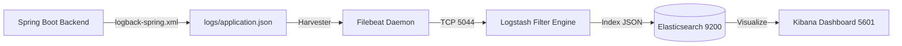

# 📊 ELK Stack & Kibana Observability

> **Layer:** Observability / DevOps  
> **Key Files:** `logback-spring.xml`, `docker-compose.yml`, `logstash.conf`, `filebeat.yml`  
> **Key Java Classes:** `SecurityAuditLogger.java`, `LogstashEncoder`

---

## 1. What is the ELK Stack?

The **ELK Stack** is a centralized log management and analytics suite consisting of four integrated components:
- **E**lasticsearch: Distributed search and analytics engine.
- **L**ogstash: Log ingestion and transformation pipeline.
- **K**ibana: Interactive web dashboard for search, filtering, and data visualization.
- **Filebeat**: Lightweight shipper collecting log files from the application container.

---

## 2. The Log Pipeline Workflow



---

## 3. Structured JSON vs. Plain Text Logs

Traditional console logging outputs unformatted strings:
```text
2026-08-26 10:15:32 INFO c.i.d.s.AuthServiceImpl - User 42 login success
```
*Problem:* Hard to search or filter programmatically without complex regex.

Our system uses **Structured JSON** via `net.logstash.logback.encoder.LogstashEncoder`:
```json
{
  "@timestamp": "2026-08-26T10:15:32.145Z",
  "level": "INFO",
  "logger_name": "com.insurance.demo.config.SecurityAuditLogger",
  "message": "[AUDIT] SECURITY_AUDIT: LOGIN_SUCCESS | userId=42, role=ROLE_CUSTOMER",
  "userId": 42,
  "service": "insurance-backend"
}
```
*Advantage:* Every key (`level`, `userId`, `logger_name`) is indexed as an individual searchable field in Elasticsearch.

---

## 4. Kibana Dashboard Capabilities

Using Kibana (`http://localhost:5601`), evaluators and engineers can:
1. **Search Errors:** Query `level: "ERROR"` to instantly find all unhandled exceptions across the system.
2. **Audit User Activity:** Query `message: *LOGIN_FAILED*` to identify brute-force password attacks.
3. **Trace Claim Decisions:** Query `message: *CLAIM_DECISION*` to verify when an Admin approved a payout.
4. **Visual Metrics:** Render pie charts of HTTP status codes (`200 OK` vs `400 Bad Request` vs `500 Server Error`).

---

## 5. Interview Questions & Answers

1. **Q: Why run Filebeat instead of having Spring Boot write directly to Elasticsearch?**  
   **A:** Writing directly from Spring Boot to Elasticsearch over HTTP would block application threads during network latency or ES downtime. Filebeat reads asynchronously from local disk files with zero application overhead.
2. **Q: How does structured logging improve debugging?**  
   **A:** It enables instant multi-parameter filtering (e.g., `userId: 15 AND level: ERROR AND @timestamp > now-1h`) without manual log parsing.
