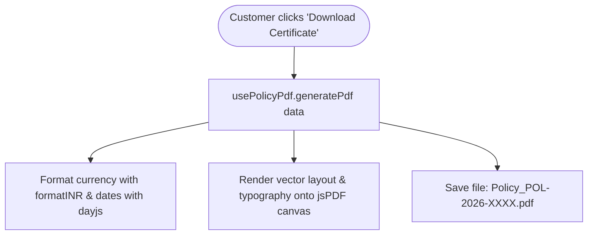

# 📄 Client-Side PDF Generation Engine

> **Layer:** Frontend / Reporting Engine  
> **Package:** `src/hooks/PdfDownload/`  
> **Key Hooks:** `usePolicyPdf.js`, `useClaimPdf.js`, `useCustomerPdf.js`  
> **Libraries:** `jspdf`, `html2canvas`

---

## 1. What is Client-Side PDF Generation?

Instead of having the Spring Boot backend render and stream heavy binary PDF files, the React application renders pixel-perfect official insurance certificates and reports directly in the user's browser using JavaScript.

---

## 2. Supported Documents

| Hook | Generated Document | Key Rendered Attributes |
|:---|:---|:---|
| `usePolicyPdf.js` | **Official Policy Schedule Certificate** | Policy Number, Insured Customer, Plan Details, Coverage Amount (INR format), Start/End Dates, Total Premium Paid, Legal Stamp & Seal. |
| `useClaimPdf.js` | **Claim Investigation & Settlement Report** | Claim Number, Incident Date, Claim Reason, Approved Payout Amount, Assigned Staff, Admin Remarks. |
| `useCustomerPdf.js` | **Customer Account Portfolio Statement** | Customer KYC Details, Nominee Information, Active Policies List, Payment Transaction Ledger. |

---

## 3. Implementation Workflow

---

## 4. Why Client-Side over Server-Side (iText / Jasper)?

1. **Zero Server Load:** Document rendering uses the client's CPU and RAM, allowing the backend server to handle thousands of concurrent API requests without CPU throttling.
2. **Instant Download:** Zero network latency streaming large multi-megabyte PDF files over the wire; data is already in frontend memory.
3. **Responsive Formatting:** Layout dynamically adjusts to the customer's data using JavaScript templates.

---

## 5. Interview Questions & Answers

1. **Q: How does `formatINR()` format currency?**  
   **A:** It formats raw numbers into the standard Indian numbering system (e.g. `500000` $\rightarrow$ `₹5,00,000.00`) using `Intl.NumberFormat('en-IN')`.
2. **Q: How does client-side PDF generation protect document authenticity?**  
   **A:** The PDF generator only accepts verified data returned from authenticated Spring Boot API endpoints (not user-editable inputs).
