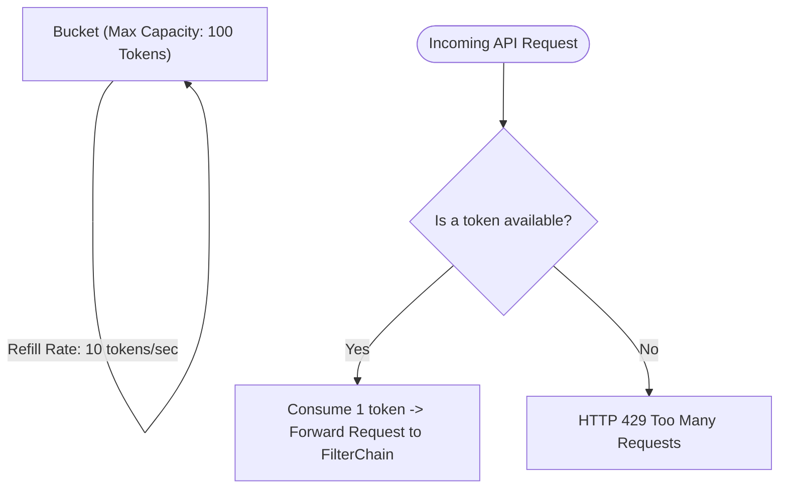

# 🛡️ Rate Limiting & Denial-of-Service (DoS) Protection

> **Layer:** Security / Servlet Filter Perimeter  
> **Key Class:** `RateLimitFilter.java`  
> **Algorithm:** Token Bucket Algorithm (Bucket4j)

---

## 1. What is Rate Limiting?

Rate limiting is a traffic-shaping defensive mechanism that restricts the number of API requests a client (IP address or user) can send within a given time window.

---

## 2. Why is it Essential in Insurance Systems?

1. **Brute-Force Protection:** Prevents automated credential-stuffing attacks on `/api/auth/login` and `/api/auth/verify-otp`.
2. **Resource Exhaustion Defense:** Prevents denial-of-service (DoS) attacks on CPU-heavy endpoints like `/api/premium/calculate`.
3. **SMS/Email Cost Control:** Prevents malicious users from spamming `/api/auth/resend-otp`, exhausting paid Twilio SMS API credits.

---

## 3. The Token Bucket Algorithm

---

## 4. Rate Limit Tiers

| Endpoint Tier | Rate Limit | Refill Window | Primary Defense |
|:---|:---:|:---:|:---|
| **Auth & OTP Endpoints** (`/api/auth/*`) | 5 requests | Per minute | Anti-Brute-Force & Anti-Spam |
| **Standard Protected APIs** (`/api/*`) | 60 requests | Per minute | General DoS Protection |
| **Public Endpoints** (`/api/public/*`) | 120 requests | Per minute | Scraping & Crawler Throttle |

---

## 5. Interview Questions & Answers

1. **Q: What HTTP status code is returned when a client exceeds their rate limit?**  
   **A:** `429 Too Many Requests`, accompanied by a `Retry-After` header indicating when the client can try again.
2. **Q: What is the difference between Token Bucket and Fixed Window rate limiting?**  
   **A:** Fixed Window can allow a burst of $2\times$ traffic at the boundary of two windows. Token Bucket smooths traffic over time while accommodating legitimate temporary bursts up to bucket capacity.
