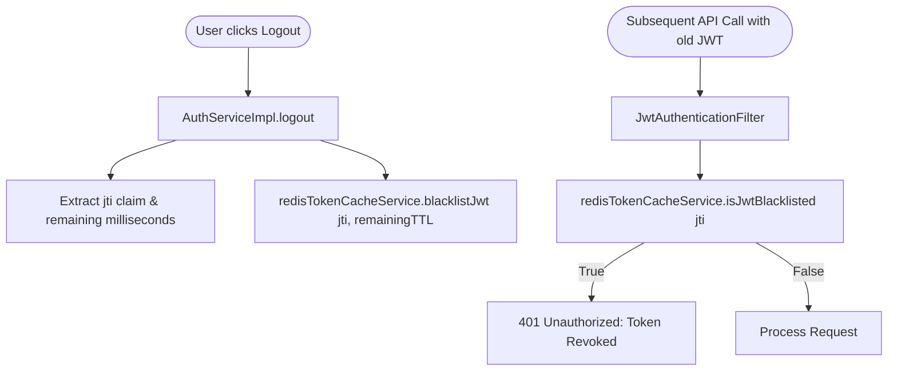

# ⚡ Redis Token Cache & Blacklisting

> **Layer:** Security / Backend Infrastructure  
> **Package:** `com.insurance.demo.security.cache`  
> **Key Classes:** `RedisTokenCacheService.java`, `RedisConfig.java`, `JwtAuthenticationFilter.java`

---

## 1. What is Redis Token Cache?

In a stateless JWT architecture, the backend does not store session state in a database. However, this creates a challenge: **how do you immediately revoke an access token when a user logs out or resets their password before the 15-minute token expires?**

We use **Redis** (an ultra-fast, in-memory key-value store) to maintain a dynamic blacklist of revoked token identifiers (`jti`) and a 10-second grace window for silent token refresh.

---

## 2. Key Patterns & Time-to-Live (TTL)

| Key Pattern | Stored Value | TTL | Architectural Purpose |
|:---|:---|:---|:---|
| `auth:jwt:blacklist:{jti}` | `"revoked"` | Remaining token validity | Instantly blocks logged-out access tokens. |
| `auth:refresh:grace:{tokenHash}` | `"grace_active"` | 10 seconds | Prevents race condition failures when multiple browser tabs refresh simultaneously. |

---

## 3. How Token Blacklisting Works

---

## 4. The 10-Second Refresh Grace Window

When a user opens the application across 3 tabs and the access token expires:
1. All 3 tabs may send concurrent requests to `/api/auth/refresh`.
2. Tab 1's request arrives first $\rightarrow$ validates the refresh token, revokes it in DB, and issues a new refresh token.
3. Without a grace window, Tab 2 and Tab 3 would arrive 50ms later with the old refresh token and fail with `401 Token Already Revoked`.
4. With Redis Grace Window: The old token's hash is stored in `auth:refresh:grace:{hash}` for 10 seconds. If Tab 2 or 3 arrives within 10s, it is recognized as part of the same refresh rotation and succeeds.

---

## 5. Why Not Use MySQL for Blacklisting?

- `JwtAuthenticationFilter` runs on **every incoming HTTP request**.
- Querying a MySQL disk-based table on every request would degrade throughput and cause severe database lock contention.
- Redis operates entirely in **RAM**, resolving lookups in **< 1 millisecond**.
- Redis automatically purges expired keys via native **TTL**, requiring zero scheduled cleanup cron jobs.

---

## 6. Interview Questions & Answers

1. **Q: How does Redis handle memory cleanup for blacklisted tokens?**  
   **A:** Every key is set with a TTL equal to the remaining expiration time of the JWT. Once the JWT naturally expires, Redis automatically evicts the key.
2. **Q: What happens if Redis is temporarily unreachable?**  
   **A:** The application catches the exception gracefully. Token validation falls back to checking the user's `tokenVersion` in MySQL.
