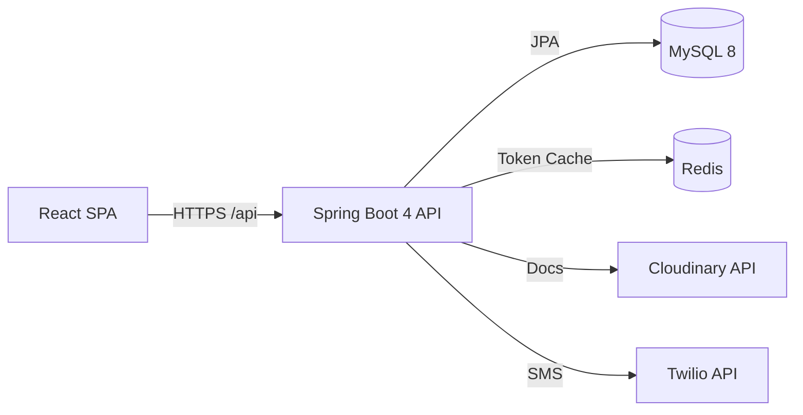

# InsuranceFlow — Documentation Hub
> The master entry point for understanding the architecture, domain, and implementation of InsuranceFlow.

---

## Purpose
This hub provides a structured path into the InsuranceFlow system. Whether you are an evaluator looking for technical depth, an interviewer preparing questions, or a developer extending the codebase, this is your starting point.

---

## Overview
InsuranceFlow is a full-stack web application for an insurance company that lets customers browse insurance products, get instant premium quotes, purchase policies, pay premiums, and raise claims — while giving internal staff a queued claim-review workflow and admins full control over the catalog, pricing, users, and final claim decisions.

---

## System Architecture

---

## Audience Reading Paths

### 1. Recruiter
_Fast, high-signal reading to understand project scope and completeness._
- `09_Evaluation/Project_Summary.md` — One-page executive summary.
- `00_Project_Overview/Features.md` — What the application can do, by role.

### 2. Interviewer
_Deep-dive context to ask smart questions about architecture and design decisions._
- `01_System_Architecture/High_Level_Architecture.md` — How the pieces fit together.
- `07_Design_Patterns/README.md` — Why certain patterns (Strategy, Factory) were chosen.
- `09_Evaluation/Interview_Questions.md` — Pre-written Q&A across architecture, security, and DB.

### 3. Developer
_Actionable guides to run, understand, and extend the system._
- `10_Developer_Guide/Setup.md` — How to get it running locally.
- `03_API/README.md` — API payload and endpoint structures.
- `04_Database/README.md` — Schema and entity relationships.
- `08_Workflows/README.md` — End-to-end flows for key operations.

### 4. Contributor
_Guidelines for adding new features and documentation._
- `CONTRIBUTING.md` — Documentation standards, templates, and the absolute Fact Sheet.
- `06_Backend/README.md` — Controller, Service, and Repository layers.
- `05_Frontend/README.md` — React components, hooks, and routing.

---

## Folder Index

| Folder | Contents |
|---|---|
| `00_Project_Overview/` | Vision, features, tech stack, and 5-minute architecture summary. |
| `01_System_Architecture/` | High-level system, backend, frontend, security, and folder structure. |
| `02_Business_Domain/` | Insurance domain rules, premium math, and pricing/coverage logic. |
| `03_API/` | Auth, Product, Plan, Policy, Claim, and Payment API endpoints. |
| `04_Database/` | ER summaries, schema definitions, entities, and seed data info. |
| `05_Frontend/` | React routing, layout, state, hooks, components, and UI workflows. |
| `06_Backend/` | Spring Boot controllers, services, DTOs, security, and exceptions. |
| `07_Design_Patterns/` | Strategy, Factory, Adapter, SOLID principles, and Decision Records. |
| `08_Workflows/` | End-to-end flows (register, quote, purchase, pay, claim, admin). |
| `09_Evaluation/` | Quality checklists, viva interview questions, audit reports, and roadmap. |
| `10_Developer_Guide/` | Setup, Run, Build, Environment, and Troubleshooting. |
| `11_Knowledge_Base/` | 40 concept reference cards explaining specific project implementations. |
| `12_Team_Ownership_and_Viva/` | Balanced 1/3 team ownership model, 20-topic viva guide, and common knowledge summary. |

---

## Key Facts at a Glance

> [!IMPORTANT]
> - **Backend**: Spring Boot 4.0.6 (Java 17) on port `8081`
> - **Frontend**: React 19 / Vite 8 on port `5173`
> - **Database**: MySQL 8 `insurance_db` (16 entities / 17 tables)
> - **Access Token**: 15 min JWT (60s in dev), in-memory on UI
> - **Refresh Token**: 7-day TTL, HttpOnly cookie, rotating
> - **Seed Admin**: `admin@insurance.com` / `Admin@123`

---

## Start Here
- 🚀 **Want to run it?** [Developer Guide](./10_Developer_Guide/Setup.md)
- 🧠 **Want to understand the code?** [Backend Architecture](01_System_Architecture/Backend_Architecture.md)
- 📊 **Want to test it?** [Evaluator Demo](../demo-data/04-evaluator-demo.md)

---

## Domain Glossary

| Term | Definition |
|---|---|
| **Product** | High-level category (e.g., HEALTH, MOTOR, LIFE, TRAVEL, INSURANCE). |
| **Plan** | Specific offering under a Product (e.g., "Gold Health Plan"). |
| **CoverageOption** | Selectable coverage amount (e.g., ₹5,00,000) mapped to a Plan. |
| **PricingRule** | Rules defining base risk rate, processing fee, and duration discounts. |
| **Quote** | 30-minute valid pricing preview before policy purchase (CREATED, USED, EXPIRED, CANCELLED). |
| **Policy** | An instantiated insurance contract (PENDING_PAYMENT, ACTIVE, EXPIRED, CANCELLED). |
| **PremiumPayment** | Record of money paid exactly matching the premium to activate a Policy. |
| **Claim** | Request for payout by Customer against an ACTIVE Policy (SUBMITTED, UNDER_REVIEW, RECOMMENDED, APPROVED, REJECTED). |
| **ClaimStatusHistory** | Audit trail of claim status changes (SUBMITTED → REVIEW → DECISION). |
| **PremiumType** | Payment frequency (ONE_TIME vs. ANNUAL). |
