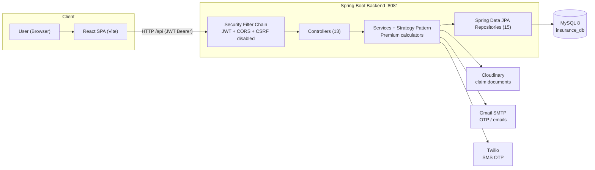
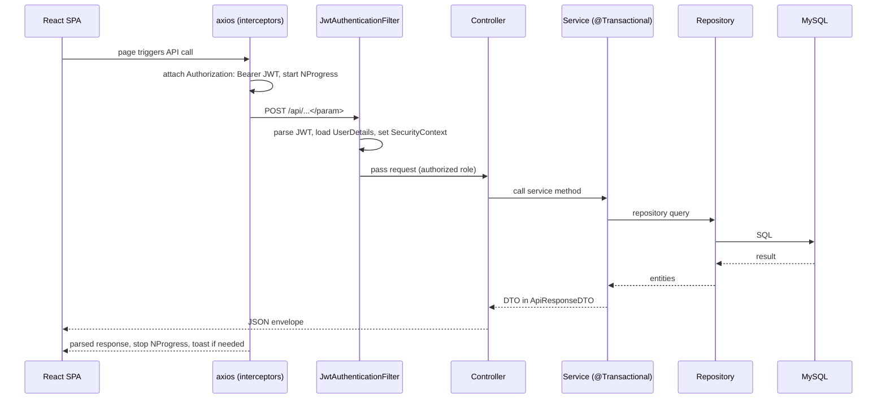

# System Architecture

The Insurance Policy & Claim Management System is a two-module full-stack application: a **Spring Boot REST API** backend and a **React single-page application** frontend, backed by **MySQL** and several external services.

## High-level system diagram

## Key characteristics

- **Frontend**: React 19 + Vite 8 + React Router 7 + Bootstrap 5 + Axios. Runs on `http://localhost:5173`, proxies `/api` to the backend at `http://localhost:8081` during development.
- **Backend**: Java 17, Spring Boot 4.0.6, Spring MVC, Spring Data JPA (Hibernate), Spring Security (stateless JWT), Bean Validation, springdoc-openapi (Swagger UI at `/swagger-ui.html`).
- **Database**: MySQL `insurance_db` with `ddl-auto=update`; credentials injected from `env.properties` via `spring.config.import`.
- **Authentication**: email + password, two-factor OTP (email via Gmail SMTP, phone via Twilio), stateless JWT (jjwt 0.12.x) with `roles`, `fullName`, and `productSpeciality` claims.
- **Three roles**: `ROLE_ADMIN`, `ROLE_INTERNAL_STAFF`, `ROLE_CUSTOMER`, enforced with URL-level rules in `SecurityConfig` plus method-level checks inside services.
- **File uploads**: claim documents are uploaded to **Cloudinary** (`insurance_claims` folder); only the public reference is stored in MySQL.
- **Pricing**: strategy pattern with `AnnualPremiumCalculator` and `OneTimePremiumCalculator` selected by a `PremiumCalculatorFactory` keyed on `PremiumType`.

## Technology summary

| Layer | Technology | Version |
|-------|-----------|---------|
| Backend language | Java | 17 |
| Backend framework | Spring Boot | 4.0.6 |
| Persistence | Spring Data JPA + Hibernate ORM | Boot-managed |
| Database | MySQL | 8.x |
| Security | Spring Security + jjwt | 0.12.6 |
| API docs | springdoc-openapi | 3.0.2 |
| Mapping | ModelMapper | 3.2.0 |
| Media | Cloudinary HTTP SDK | 1.39.0 |
| SMS | Twilio SDK | 11.0.0 |
| Frontend | React | 19 |
| Build | Vite | 8 |
| Router | React Router | 7 |
| UI | Bootstrap + Bootstrap Icons | 5.3.x |

## Request lifecycle (typical authenticated call)

## See also

- [`02-backend-architecture.md`](02-backend-architecture.md) — backend layers in detail
- [`03-domain-model.md`](03-domain-model.md) — domain entities and relationships
- [`04-frontend-architecture.md`](04-frontend-architecture.md) — frontend structure
- [`05-deployment-architecture.md`](05-deployment-architecture.md) — runtime topology
- [`imp-doc/02-architecture/system-architecture.md`](../../imp-doc/02-architecture/system-architecture.md) — additional layered-style description
