# Backend Architecture

## Layered structure

The backend follows a classic **N-tier layered architecture** inside the package `com.insurance.demo`:

```mermaid
flowchart TB
    subgraph "Web Layer (controller/)"
        PC[PublicController]
        AC[AuthController]
        UC[UserController]
        CC[CustomerController]
        IPC[InsuranceProductController]
        PPC[PolicyPlanController]
        POC[PolicyController]
        PMC[PremiumPaymentController]
        CLC[ClaimController]
        CDC[ClaimDocumentController]
        COC[CoverageOptionController]
        PRC[PricingRuleController]
        QLC[PremiumCalculationController]
    end

    subgraph "Service Layer (service/ + serviceimpl/)"
        AS[AuthServiceImpl]
        PS[PolicyServiceImpl]
        CS[ClaimServiceImpl]
        PCS[PremiumCalculationServiceImpl]
        PPS[PremiumPaymentServiceImpl]
        PPS2[PolicyPlanServiceImpl]
        PRS[PricingRuleServiceImpl]
        COS[CoverageOptionServiceImpl]
        PDS[InsuranceProductServiceImpl]
        CUS[CustomerServiceImpl]
        US[UserServiceImpl]
        CDS[ClaimDocumentServiceImpl]
        PB[PublicServiceImpl]
        SUBS["Strategy: Annual/OneTimePremiumCalculator + Factory"]
    end

    subgraph "Persistence Layer (repository/)"
        R["15 Spring Data JPA Repositories"]
    end

    subgraph "Model Layer (model/)"
        E["15 @Entity classes"]
    end

    PC & AC & UC & CC & IPC & PPC & POC & PMC & CLC & CDC & COC & PRC & QLC --> SUBS
    AS & PS & CS & PCS & PPS & PPS2 & PRS & COS & PDS & CUS & US & CDS & PB --> R
    R --> E

    subgraph "Cross-Cutting"
        X1["GlobalExceptionHandler (@RestControllerAdvice)"]
        X2["Security: JwtAuthenticationFilter + JwtService + CustomUserDetailsService"]
        X3["Config: SecurityConfig, CorsConfig, AppConfig (ModelMapper), CloudinaryConfig"]
        X4["Verification: OtpService, EmailService, SmsService"]
        X5["Util: ClaimNumberGenerator, PolicyNumberGenerator, TransactionReferenceGenerator, PaginationValidator"]
    end

    X2 -. wraps .-> PC
    X1 -. handles errors from .-> PC
```



## Layer responsibilities

| Layer | Responsibility | Notable classes |
|-------|----------------|-----------------|
| **Controller** | HTTP mapping, validation binding, request/response envelopes (`ApiResponseDTO<T>`) | 13 controllers under `controller/` |
| **Service** | Business rules, transactions, orchestration, DTO mapping | 14 `*ServiceImpl` classes + strategy calculators |
| **Repository** | Data access via Spring Data JPA | 15 repositories (derived queries, `@EntityGraph`, `JpaSpecificationExecutor`) |
| **Model** | JPA entities and enums | 15 entities, 11 enums |
| **DTO** | Request/response payloads with Bean Validation annotations | `dto/`, `dto/request/` (23), `dto/response/` (20) |

## Request path

```
HTTP request
  → CorsConfig (origin http://localhost:5173, credentials)
  → JwtAuthenticationFilter (OncePerRequestFilter, stateless JWT)
  → SecurityFilterChain authorization rules
  → @RestController
  → ServiceImpl (@Transactional where write/read required)
  → Repository → Hibernate → MySQL
  → DTO wrapped in ApiResponseDTO<T>
  → GlobalExceptionHandler for any thrown exception
```

## Security configuration summary

`SecurityConfig` is stateless (`SessionCreationPolicy.STATELESS`), disables CSRF (JWT in headers), enables CORS, and delegates both 401 (entry point) and 403 (access denied) to `GlobalExceptionHandler` via the `handlerExceptionResolver`.

Rules (all matchers in `SecurityConfig`):

- **Public (permitAll):** `OPTIONS /**`, Swagger UI + `/v3/api-docs/**`, `/api/auth/**`, `/api/public/**`.
- **ADMIN:** plan/product/pricing-rule/coverage-option writes, user management (`/api/users/**`), `/api/admin/**`, claim `final-decision`.
- **INTERNAL_STAFF:** claim `review` / `under-review` / `assign`, policy `issue` / `cancel`, payments, paged list views.
- **CUSTOMER:** `/api/policies/purchase`, `/api/policies/my-policies`, `/api/claims/raise`, `/api/claims/my-claims`, own profile, own payments, document upload.
- Everything else → authenticated.

## Transactions

Services use declarative `@Transactional`:

- Write operations (purchase, issue, payment, claim transitions, plan/pricing CRUD) are `@Transactional` (some with `rollbackFor = Exception.class`).
- Read operations are `@Transactional(readOnly = true)`.

> **Note for evaluators:** Spring Boot 4.0.6 enables Open Entity Manager in View (OSIV) by default (`spring.jpa.open-in-view`, `matchIfMissing = true`). The application currently relies on it for lazy access in a couple of non-transactional read paths. See [`../performance.md`](../performance.md) and [`../decision-records.md`](../decision-records.md) for analysis and the recommended change.

## Exceptions

`GlobalExceptionHandler` centralizes error handling with **13 handlers**, mapping to `ErrorResponseDTO`:

| Exception | HTTP |
|-----------|------|
| `ResourceNotFoundException` | 404 |
| `DuplicateResourceException`, `DataIntegrityViolationException` | 409 |
| `BadRequestException`, `IllegalArgumentException`, validation errors, `PlanNotActiveException`, type/readable mismatches | 400 |
| `ObjectOptimisticLockingFailureException` / `StaleObjectStateException` | 409 (concurrency) |
| `AccessDeniedException` | 403 |
| `BadCredentialsException`, `AuthenticationException` | 401 |
| Anything else | 500 |

Validation failures return `ValidationErrorResponseDTO` with a `fieldErrors` map.

## See also

- [`01-system-architecture.md`](01-system-architecture.md)
- [`imp-doc/02-architecture/backend-architecture-overview.md`](../../imp-doc/02-architecture/backend-architecture-overview.md)
- [`imp-doc/07-diagrams/class-diagrams.md`](../../imp-doc/07-diagrams/class-diagrams.md)
