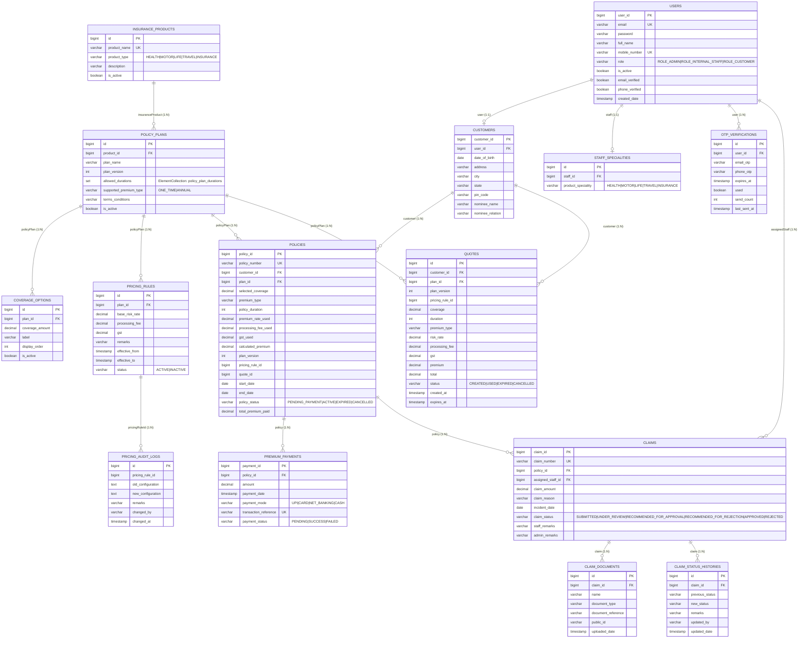

# Domain Model

The domain model is implemented as **15 JPA entities** under `com.insurance.demo.model`. The diagram below shows the entities, table names, and cardinalities as implemented (fetch types annotated where non-default).

## Fetch strategy notes

Most associations default to `LAZY`. Four `@ManyToOne` associations are currently mapped `EAGER`:

| Entity | Association | Field |
|--------|-------------|-------|
| `PremiumPayment` | `Policy` | `policy` |
| `CoverageOption` | `PolicyPlan` | `policyPlan` |
| `PricingRule` | `PolicyPlan` | `policyPlan` |
| `PolicyPlan` | `InsuranceProduct` | `insuranceProduct` |

All four are marked `@JsonIgnore`, so they never appear in JSON serialization. See [`../performance.md`](../performance.md) for the impact of these and the recommended change to `LAZY`.

## Supporting enums (11)

`ClaimStatus`, `Gender` (declared, currently unused by entities), `PaymentMode`, `PaymentStatus`, `PolicyStatus`, `PremiumType`, `PricingRuleStatus`, `ProductType`, `QuoteStatus`, `Role`, `RoundingRule`.

## Key uniqueness constraints

- `users.email` (unique index `user_valid_email`)
- `users.mobile_number` (unique index `user_valid_phone`)
- `customers.user_id` (1:1)
- `insurance_products.product_name`
- `policies.policy_number`
- `premium_payments.transaction_reference`
- `claims.claim_number`

## See also

- [`../database.md`](../database.md) — full schema, foreign keys, indexes
- [`imp-doc/03-database/er-diagrams.md`](../../imp-doc/03-database/er-diagrams.md)
- [`imp-doc/07-diagrams/class-diagrams.md`](../../imp-doc/07-diagrams/class-diagrams.md)
