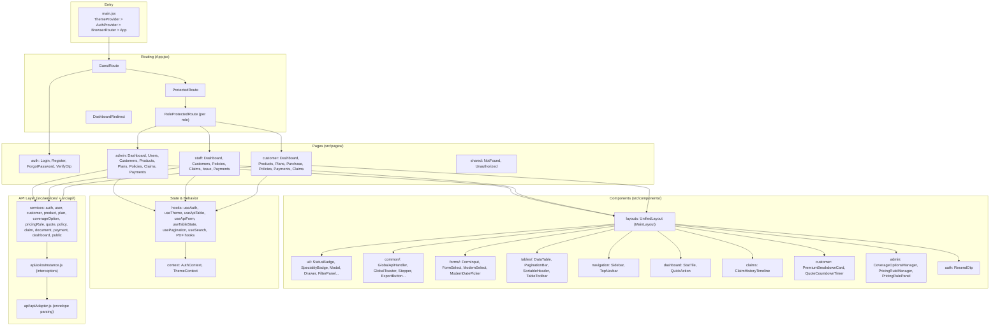

# Frontend Architecture

The frontend is a **React 19 single-page application** (`insurance-policy-claim-management-app-ui`) built with Vite 8, React Router 7, Bootstrap 5, and Axios. It has **no external state-management library** (no Redux/Zustand) and **no lazy-loaded routes** — a deliberate choice to keep navigation instant.

## Frontend layers



## Data flow

```
Page (useEffect / event)
  → custom hook (useApiTable | useApiForm | useSearch …)
  → service (services/*.js) e.g. policyService.getMyPolicies()
  → axiosInstance
      request interceptor: Bearer token, NProgress start, FormData handling
      response interceptor: parse ApiResponseDTO/PageResponseDTO envelope
      401 → auth:unauthorized event; 403 → auth:forbidden event; 5xx → api:error event
  → component renders (DataTable, StatusBadge, toast notifications)
```

## Routing & guards

| Guard | Purpose |
|-------|---------|
| `GuestRoute` | Public pages (`/`, `/login`, `/register`, `/forgot-password`, `/verify-otp`); redirects authenticated users to their role home |
| `ProtectedRoute` | Requires a token (`ss_token` in `localStorage`); otherwise redirects to `/login` preserving `state.from` |
| `RoleProtectedRoute` | Enforces a specific role for a route block; wrong role redirects to the user's role home or `/unauthorized` |
| `DashboardRedirect` | `/dashboard` → role home (`/admin/dashboard`, `/staff/dashboard`, `/customer/dashboard`) |

Roles are defined in `src/utils/roles.js`: `ROLE_ADMIN`, `ROLE_INTERNAL_STAFF`, `ROLE_CUSTOMER`.

## State management

- **AuthContext** — `{ token, user, isAuthenticated, login, logout }`, persisted to `localStorage` (`ss_token`, `ss_user`).
- **ThemeContext** — light/dark theme via `data-theme` on `<html>`, persisted to `ss_theme`.
- All other state is local component/hook state. Table pages use the reusable hooks (`useApiTable` for server-side pagination, `useTableState` for client-side).

## Data table strategy

Server-driven list pages (`useApiTable`) read the `PageResponseDTO<T>` envelope and drive `DataTable` + `PaginationBar` with `sort=field,dir` and filter params. The table uses a **stale-while-loading** strategy (old rows stay visible, dimmed, while the next page loads).

## PDF generation

`hooks/PdfDownload/*` use jsPDF + autoTable to produce client-side reports: Policy Summary, Claim Summary, Payment Receipt, and Customer Details.

## Notable implementation notes

- No external state library; no code-splitting/lazy routes (documented decision — see [`../decision-records.md`](../decision-records.md)).
- The API layer normalizes the backend `ApiResponseDTO<T>` / `PageResponseDTO<T>` envelopes via `apiAdapter.js`, so services receive parsed payloads.
- Duplicate upload helper exists (`claimService.uploadDocuments` vs `claimDocumentService.uploadClaimDocuments`) — see [`../performance.md`](../performance.md).
- `src/pages/customer/profile/CustomerProfilePage.jsx` and `src/pages/shared/PlaceholderPage.jsx` are orphaned (not wired to any route).

## See also

- [`01-system-architecture.md`](01-system-architecture.md)
- [`imp-doc/02-architecture/frontend-architecture-overview.md`](../../imp-doc/02-architecture/frontend-architecture-overview.md)
- [`imp-doc/04-workflows/project-overview.md`](../../imp-doc/04-workflows/project-overview.md)
