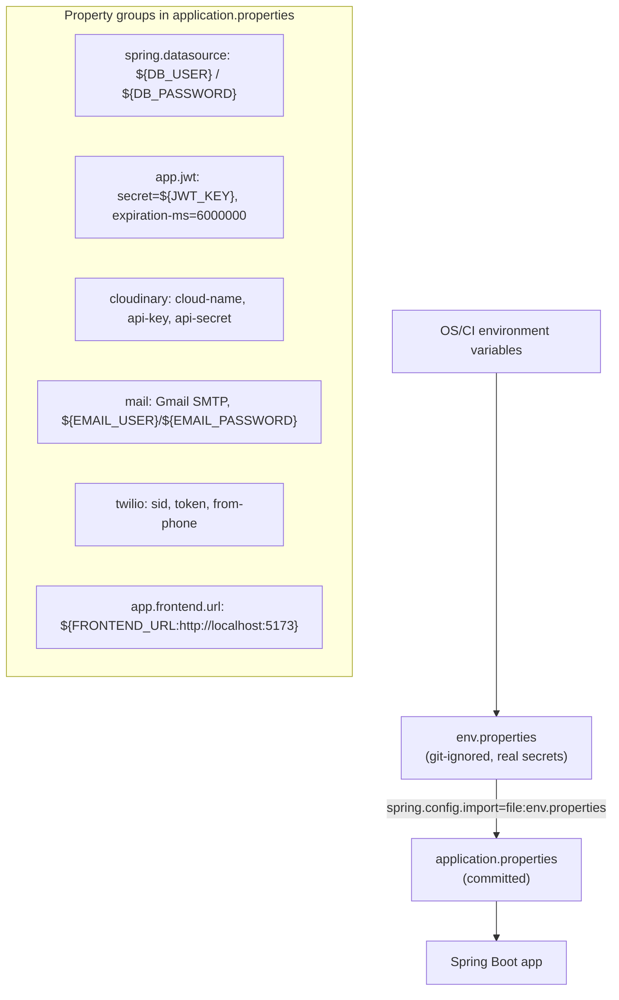

# Deployment Architecture

## Runtime topology (current)

```mermaid
flowchart LR
    subgraph "Developer machine"
        FE["React SPA :5173<br/>npm run dev"]
        BE["Spring Boot API :8081<br/>mvnw spring-boot:run"]
        DB[("MySQL 8 :3306<br/>insurance_db")]
    end

    EXT["Cloudinary"]:::ext
    EXT2["Gmail SMTP"]:::ext
    EXT3["Twilio"]:::ext

    FE -- "/api proxy → :8081" --> BE
    BE --> DB
    BE -- "claim docs" --> EXT
    BE -- "OTP emails" --> EXT2
    BE -- "SMS OTP" --> EXT3

    classDef ext fill:#f0f4ff,stroke:#4a7;;
```

## Configuration flow



## Ports & endpoints

| Component | Location | Notes |
|-----------|----------|-------|
| Frontend (dev) | `http://localhost:5173` | Vite dev server |
| Backend API | `http://localhost:8081/api` | `server.port=8081` |
| Swagger UI | `http://localhost:8081/swagger-ui.html` | springdoc; `/v3/api-docs` |
| MySQL | `localhost:3306/insurance_db` | `ddl-auto=update` |

> **Port note:** some older docs and the root `README.md` previously referenced `:8080` for the backend API. The application actually listens on **8081** (see `application.properties`). The Vite dev proxy and Swagger links already use `8081`.

## Secrets handling

- `env.properties` is **git-ignored** and holds real credentials (`DB_USER`, `DB_PASSWORD`, `JWT_KEY`, Cloudinary, Gmail, Twilio).
- It is imported at runtime via `spring.config.import=file:env.properties`.
- For CI/CD, the same variables can be injected from the environment; a `env.properties` file next to the jar is the documented local approach (see [`../deployment.md`](../deployment.md)).

## Scaling / production roadmap (future)

The current topology is a single-node developer deployment. The diagrams below are the **recommended production topology**, treated as future work (nothing in this repo is deployed there yet):

```mermaid
flowchart LR
    LB["Load balancer"]
    FE2["Frontend (static build, CDN)"]
    BE2["API instances (horizontal scale)"]
    DB2[("MySQL (managed, read replica)"]
    RC[("Redis (cache + sessions)")]:::future
    ELK["Elasticsearch + Logstash + Kibana (log aggregation)"]:::future

    LB --> FE2
    LB --> BE2
    BE2 --> DB2
    BE2 --> RC
    BE2 --> ELK

    classDef future fill:#fdf6e3,stroke:#b58900,stroke-dasharray:5 5;
```

Recommended adoption order (see individual docs for detail):

1. **Lazy fetching + transaction hygiene** before scaling reads — [`../performance.md`](../performance.md).
2. **Caching** (Caffeine in-process first; Redis when multi-instance) — [`../caching.md`](../caching.md).
3. **Structured logging + correlation IDs** feeding ELK — [`../logging-strategy.md`](../logging-strategy.md).
4. **Actuator** exposure of `/health` in the load-balanced pool.

## See also

- [`../deployment.md`](../deployment.md) — step-by-step build/run guide
- [`../decision-records.md`](../decision-records.md) — the reasoning behind these recommendations
- [`imp-doc/05-deployment/deployment-guide.md`](../../imp-doc/05-deployment/deployment-guide.md)
