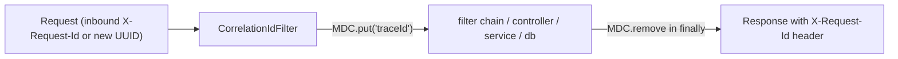
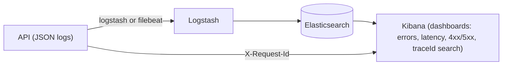

# Logging & Observability Strategy

> **Status: recommendation.** None of this is implemented in the current codebase; it is the target design for a production-quality observability posture. Current state is described in [`logging.md`](logging.md).

## Goals

1. Follow any request end-to-end (correlation ID).
2. Structured, machine-parseable logs (JSON) that a log aggregator can index.
3. Business-relevant event logging for audit + operations, without duplicating DB audit trails.
4. Kept dev noise (SQL, DEBUG) out of the default configuration.

## 1. Correlation ID (request tracing)

A `OncePerRequestFilter` (e.g. `CorrelationIdFilter`) that:

- Reads an inbound `X-Request-Id` header if present, otherwise generates a UUID.
- Puts it in **MDC** (`traceId`) so every log line in the request includes it.
- Echoes it back in the **response header** `X-Request-Id`.
- Clears the MDC in `finally` (important for thread pools).



Registered before `JwtAuthenticationFilter` in `SecurityConfig` (or as a plain servlet filter).

## 2. Structured JSON logging

Spring Boot 4 has **native structured logging** — no extra dependency needed:

```properties
logging.structured.format.console=json
```

Produces one JSON object per event (`@timestamp`, `logger`, `level`, `message`, `traceId` from MDC, stack traces as structured fields). A file appender can be added with:

```properties
logging.structured.format.file=json
logging.file.name=logs/app.log
```

> Alternative: `logstash-logback-encoder` provides the same shape and is the standard when adopting a full ELK stack. Prefer Boot-native JSON at capstone scope; adopt the encoder only if an ingest pipeline requires it.

## 3. Log levels & profiles

Split the base config from dev convenience settings (this also fixes the `show-sql`/`DEBUG` noise):

| Setting | Base (runtime) | `application-dev.properties` |
|---------|----------------|------------------------------|
| `logging.level.com.insurance.demo` | INFO | DEBUG |
| `spring.jpa.show-sql` / `format_sql` | off | true |
| `logging.structured.format.console` | json | plain (readable console) |

Dev profile selected with `-Dspring-boot.run.profiles=dev` (or `SPRING_PROFILES_ACTIVE=dev`).

## 4. Recommended event logging

Add structured, leveled logs at the key business boundaries (message includes IDs; never includes secrets/PII beyond what is already displayed):

| Event | Logger / message |
|-------|------------------|
| Registration + OTP sent | INFO `user registered` (userId, email) |
| Login success / failure | INFO / WARN `login succeeded/failed` |
| Quote generated | INFO `quote generated` (quoteId, planId, premium) |
| Policy purchased / issued | INFO `policy purchased` (policyNumber, customerId) |
| Payment recorded (success/fail) | INFO / WARN `payment recorded` (policyNumber, amount, status) |
| Claim raised / transitioned | INFO `claim <status>` (claimNumber, actor) |
| Pricing rule changed | INFO `pricing rule updated` (ruleId, planId) |
| 5xx errors | ERROR full stack in `GlobalExceptionHandler` before returning 500 |
| Auth/JWT failures | WARN as today (already present in `JwtAuthenticationFilter`) |

Convention: the **DB audit tables** (`claim_status_histories`, `pricing_audit_logs`) remain the source of truth for domain history; logs capture operational observability.

## 5. ELK pipeline (future)



At capstone scale this is optional; JSON logs + correlation IDs already make the stream greppable and tool-ready.

## 6. Minimal implementation checklist (when approved)

- [ ] Add `CorrelationIdFilter` + register in `SecurityConfig`
- [ ] `logging.structured.format.console=json` in base config
- [ ] Add `application-dev.properties` with DEBUG/show-sql/plain console
- [ ] Add INFO event logs in `AuthServiceImpl`, `PolicyServiceImpl`, `PremiumPaymentServiceImpl`, `ClaimServiceImpl`, `PricingRuleServiceImpl`, `PremiumCalculationServiceImpl`
- [ ] Add ERROR logging for 500s in `GlobalExceptionHandler`
- [ ] Optional: file appender `logs/app.log`

## See also

- [`logging.md`](logging.md) — what exists today
- [`performance.md`](performance.md), [`security.md`](security.md) — related hardening
- [`architecture/05-deployment-architecture.md`](architecture/05-deployment-architecture.md) — ELK topology
